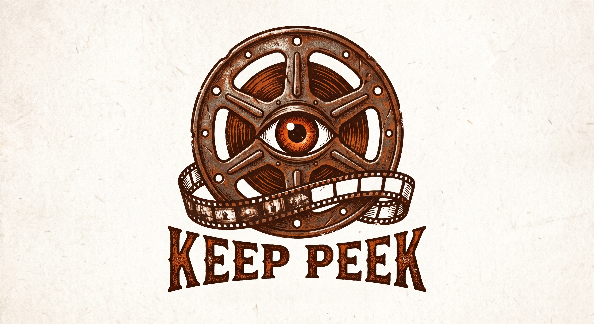

<div align="center">
	
</div>

> **Status:** KeepPeek is currently a proof of concept (POC) and is not yet production-ready.

KeepPeek is a local-first network video recorder (NVR) and Media Gateway for IP cameras. The
focused Rust service records camera streams as MP4, serves the Svelte browser interface, and lets
independent viewers, inference services, and integrations consume or publish media and events.

## Documentation

The [KeepPeek Book](https://xnorpx.github.io/keeppeek/) is the primary documentation.
The public protocol is
documented separately in the [`api/` directory](api/README.md).
The [evidence export lifecycle](docs/evidence-exports.md) documents durable history, duplicate
handling, deadlines, retention, authorization, and download integrity.
The [recording integrity guide](docs/recording-integrity.md) documents coverage, retention,
gap evidence, pagination, metrics, and alert inputs.

## Stop KeepPeek

Stop all KeepPeek server processes for the current user on macOS or Linux:

```sh
./stop.sh
```

On Windows, stop the registered KeepPeek service and any standalone server processes:

```bat
.\stop.bat
```

Both commands succeed when KeepPeek is already stopped.

## License

Copyright (C) 2026 Marcus Asteborg.

KeepPeek is licensed under the [GNU Affero General Public License version 3](LICENSE) only
(`AGPL-3.0-only`).

The KeepPeek server, first-party viewer, and other original KeepPeek code use this license. Public
API definitions and documentation under [`api/`](api/README.md), plus bindings generated solely
from them, are licensed under the [MIT License](api/LICENSE). Forked crates under
[`crates/`](crates/README.md) retain their original upstream licenses. See the book's
[open-source and licensing chapter](https://xnorpx.github.io/keeppeek/open-source-and-licensing.html)
for details.
