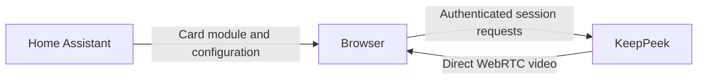

# Home Assistant card

Use `custom:keeppeek-card` to put live KeepPeek cameras in a Home Assistant Lovelace dashboard.
Home Assistant serves the card module and dashboard configuration, but the browser connects
directly to KeepPeek for session creation and WebRTC video. No Home Assistant backend integration,
media proxy, or embedded iframe is required.



The card supports live video, a visual editor, camera selection, grid and single-camera layouts,
focus, and shared connections. It inherits Home Assistant theme colors and adapts to dashboard
width. Audio, PTZ, event ribbons, timeline playback, and Home Assistant entity discovery are not
implemented in this card. Use the KeepPeek application for the corresponding supported features.

## Prepare KeepPeek

1. Confirm that the selected cameras play in KeepPeek.
2. Create a dedicated **User** credential with the intended camera access in KeepPeek's access
   settings. See [Authentication and access control](./authentication.md).
3. Make the KeepPeek endpoint and its advertised WebRTC addresses reachable from the browser
   that displays Home Assistant. Home Assistant Cloud does not relay the card's media.
4. Add the exact Home Assistant origin to the existing KeepPeek `config.toml`:

```toml
[direct_card]
allowed_origins = [
  "https://home.example.net",
  "https://homeassistant.local:8123"
]
```

An origin consists of the scheme, host, and port, without a path or trailing slash. Include each
origin used to open the dashboard. Restart KeepPeek after editing this configuration. See the
[Configuration reference](./configuration-reference.md) for the server's configuration contract.

Use browser-trusted HTTPS for normal deployments. The card permits HTTP only for local development
on `localhost`, `127.0.0.1`, or `[::1]`. Keep credentials out of the endpoint URL. A private VPN is
preferable to exposing the recorder publicly.

KeepPeek allows credentialless CORS on `/create` and `/delete` for configured origins. The card
sends its Bearer key in the `Authorization` header and never uses browser cookies. Browser
preflights must allow `POST`, `OPTIONS`, `Authorization`, `Content-Type`, and `Content-Encoding`;
do not substitute a wildcard origin or a Home Assistant media proxy.

## Install the card

The distribution contains one self-contained JavaScript module, `keeppeek.js`, and a metadata
file, `keeppeek-card.json`, with its version, SHA-256 checksum, and byte counts. The module bundles
its runtime, icons, and CSS; it does not fetch third-party scripts or fonts.

### HACS installation

1. Choose a [KeepPeek release](https://github.com/xnorpx/keeppeek/releases) containing the card
   artifacts. Earlier releases without `keeppeek.js` cannot install the card.
2. In HACS, add `https://github.com/xnorpx/keeppeek` as a custom **Dashboard** repository.
3. Download the selected release. If HACS does not register the resource automatically, add
   `/hacsfiles/keeppeek/keeppeek.js` as a **JavaScript module** dashboard resource.
4. Reload the dashboard and select **KeepPeek** in the card picker.

The HACS manifest selects the release artifact and hides default-branch downloads. A locally
successful build does not make that artifact available through HACS. Custom-repository installation
is separate from inclusion in the HACS default store.

### Manual installation

1. Obtain `keeppeek.js` and `keeppeek-card.json` from the intended release, or build them locally.
2. Verify the module's SHA-256 against the metadata file.
3. Put `keeppeek.js` in the `www/` directory inside Home Assistant's configuration directory.
   Restart Home Assistant if this is the first time you created `www/`.
4. Register `/local/keeppeek.js?v=VERSION` as a **JavaScript module** resource, replacing `VERSION`
   with the artifact's version.
5. Reload the dashboard and add the card.

From the KeepPeek repository root, build the artifacts with:

```sh
bun run --cwd ui build:home-assistant
```

The output directory is `target/home-assistant-card/dist/`. Building from the checkout allows
testing in real Home Assistant before publishing a release.

## Configure a dashboard

For a YAML-mode dashboard, put the dedicated key under `keeppeek_lovelace_token` in Home
Assistant's `secrets.yaml`, then use this configuration:

```yaml
type: custom:keeppeek-card
endpoint: https://keeppeek.example.net
token: !secret keeppeek_lovelace_token
title: Entrances
sources:
  - source_id: "192.168.1.20"
    title: Front door
    quality: auto
  - source_id: "192.168.1.21"
    title: Driveway
    quality: low
layout: grid
columns: 2
aspect_ratio: "16:9"
show_name: true
```

Replace the example IDs with stable source IDs advertised by KeepPeek. Camera display names and
Home Assistant entity IDs are not substitutes. Home Assistant resolves `!secret`; the card does
not parse YAML or resolve secret references itself. Home Assistant's `secrets.yaml` is distinct
from KeepPeek's companion `secrets.toml`.

In the visual editor, enter the endpoint and access key, then select **Load sources** to discover
available cameras. For storage-mode dashboards, enter the key through this editor instead of
using a YAML secret tag. The existing key is never read back into the form: an empty password
field with a configured placeholder preserves it. Enter a replacement or use the clear action
to change it explicitly.

| Option              | Default           | Behavior                                                                                    |
| ------------------- | ----------------- | ------------------------------------------------------------------------------------------- |
| `sources`           | Required          | Between 1 and 16 unique source objects.                                                     |
| `sources[].quality` | `auto`            | Select `auto`, `low`, or `high` from the server's available variants.                       |
| `sources[].title`   | Camera name or ID | Optional title below the video.                                                             |
| `title`             | `KeepPeek`        | Optional card heading.                                                                      |
| `layout`            | `grid`            | `grid` displays the selected sources; `single` provides a camera selector.                  |
| `columns`           | `2`               | Integer from 1 to 4, limited to the visible camera count; the grid stacks below 440 pixels. |
| `aspect_ratio`      | `16:9`            | `16:9`, `4:3`, or `1:1`; video is contained rather than cropped.                            |
| `show_name`         | `true`            | Show camera names below the video.                                                          |
| `view`              | `live`            | Only live video is supported.                                                               |

Source IDs and titles must be nonblank and at most 160 characters. The editor preserves source
titles, quality selections, and unrelated Home Assistant layout metadata across edits. The
[detailed card reference](https://github.com/xnorpx/keeppeek/blob/main/docs/home-assistant.md)
lists all validation limits and transport details.

## Understand the security boundary

The key necessarily reaches the browser. A YAML `!secret` reference keeps configuration organized,
but does not conceal the resolved key from a person who can inspect Home Assistant's dashboard
configuration or runtime. Dashboard editors and installed third-party frontend modules are part
of this trust boundary. Use a dedicated User key, not an Administrator key, unless every viewer
should have that authority.

The card keeps credentials in memory and does not put them in URLs, browser storage, rendered
diagnostics, or console output. That does not prevent Home Assistant from storing its dashboard
configuration or browser developer tools from showing the authenticated request header.

The `sources` list is a display filter, not authorization. KeepPeek's trusted-local policy still
applies: a browser classified as local is an Administrator even when it sends a User key. Narrow
`access.local_networks` when dashboard viewers must be authenticated and restricted. CORS neither
changes that policy nor prevents a copied key from being used by another client.

Rotating, disabling, revoking, or expiring the credential invalidates its sessions according to
server policy. Authentication failure stops automatic card retries; update the key and reconnect.

## Connections and troubleshooting

Cards in the same browser document share a connection when their normalized endpoint and key
match. Identical source and quality selections also share one subscription. Different credentials
never share media. Limits are eight connection identities per dashboard, 64 consumers per
identity, and 16 distinct source/quality subscriptions per connection.

Hidden tabs, offscreen cards, removed cards, and changed selections release obsolete demand.
Removing the final consumer closes the peer and calls `/delete`. Reconnects have bounded waits
and at most eight automatic attempts, and restore only current subscriptions. Theme changes do
not reconnect. Lovelace can temporarily detach cards while rebuilding its responsive columns;
those moves may require a clean reconnect before video resumes.

| Symptom                             | Check                                                                                                   |
| ----------------------------------- | ------------------------------------------------------------------------------------------------------- |
| The card is missing from the picker | Confirm the installed module and **JavaScript module** resource URL, then reload.                       |
| Connection fails                    | Check the endpoint, certificate, exact allowed origin, and browser **Local Network Access** permission. |
| Access denied                       | Check the dedicated key and its enabled/expiry state in KeepPeek.                                       |
| Unknown source ID                   | Use **Load sources** and select an ID visible to this credential.                                       |
| One camera is offline               | Check that camera in KeepPeek; other cards and sources should continue.                                 |
| Video does not play                 | Check browser codec support and reachability of KeepPeek's advertised WebRTC addresses.                 |

Browsers can report CORS denial, an unreachable server, certificate failure, and denied Local
Network Access as the same fetch error. The card lists the relevant checks without claiming to
identify the exact cause. Do not disable browser security checks to work around it.

## Upgrade or roll back

Select the new version in HACS, or replace the manual module and update the resource's `?v=`
suffix. Reload all open dashboard tabs to release old module instances. Keep the card and server
on compatible releases because the protocol is pre-1.0. For rollback, restore the previous HACS
version or manual artifact and reload. Do not register multiple versions of the resource at once.

## Test locally and in CI

The lightweight preview uses the real KeepPeek server and synthetic cameras, but emulates the
Home Assistant dashboard shell. From the repository root:

```sh
bun run --cwd ui test:e2e:prepare
bun run --cwd ui demo:home-assistant
```

The demo prints its local URL. It does not use the operator's configuration or cameras.

### Test inside real Home Assistant

With Docker running and the repository prerequisites, including Playwright Chromium, installed:

```sh
bun run --cwd ui test:home-assistant-container
```

This prepares the binaries and module, pulls the official Home Assistant `2026.9.1` image pinned
by an immutable multi-architecture digest, and runs the tests. To reuse prepared artifacts:

```sh
bun run --cwd ui test:home-assistant-container:run
```

Each runtime scenario onboards a temporary user in actual Home Assistant. The container serves
the built module and resolves YAML secret references. KeepPeek, the two synthetic RTSP cameras,
and Chromium run on the host, so WebRTC media avoids Docker NAT. Tests cover fresh decoded frames
on desktop and mobile, three cards sharing one session/subscription, reconnect, navigation cleanup,
themes, source discovery, credential redaction, and saved changes in the real visual editor.

The container uses two CPUs, 2 GiB of memory, a loopback-only HTTP port, and a Docker-managed
configuration volume without privileged or device access. Tests remove their own containers,
volumes, temporary files, and fixture processes. They never seed internal authentication storage.

On macOS, this suite has been exercised with ARM64 Docker Desktop as a development test. That is
not a supported Home Assistant production deployment recommendation. The
[official macOS installation guide](https://www.home-assistant.io/installation/macos/) describes
Home Assistant OS in a VM; the
[container installation guide](https://www.home-assistant.io/installation/linux/#install-home-assistant-container)
targets Docker Engine on Linux.

### CI and release verification

The **Home Assistant Container** Ubuntu job is required by the UI gate. It reuses the Linux
KeepPeek and card build artifacts and the pinned Home Assistant image. Its evidence includes
screenshots, sanitized server logs, onboarding notices, and JUnit results, but excludes raw
configuration, authentication storage, and credential-bearing browser traces.

The normal `./check.sh` remains Docker-free and typechecks the container suite. Run both it and
the container command when changing the integration. The container tests record Home Assistant's
exact setup-only WebSocket close notice separately; other runtime errors fail the tests.

Local real-Lovelace tests do not prove HACS delivery. A release check must still install the
published module through HACS, exercise it in a disposable Home Assistant instance, and verify
upgrade and rollback. A configured CI job is not evidence of a successful hosted run; check the
workflow result for the commit being released.
