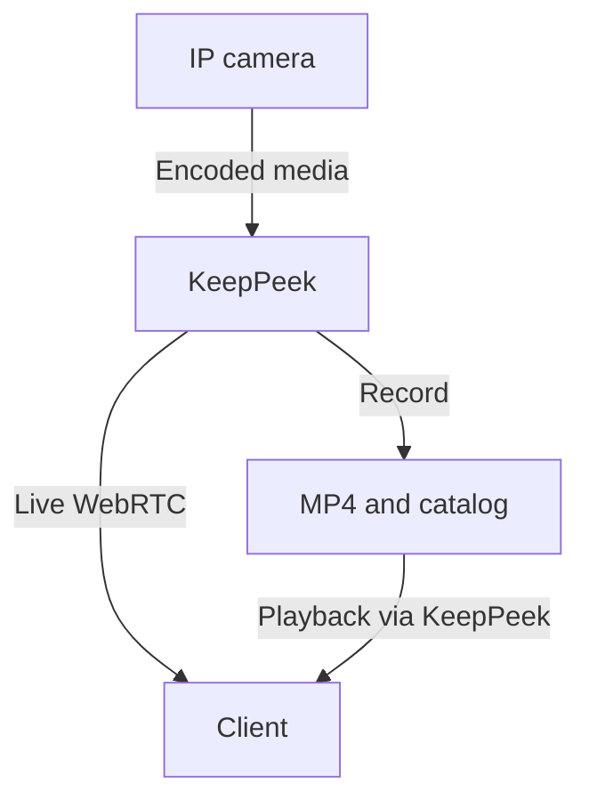
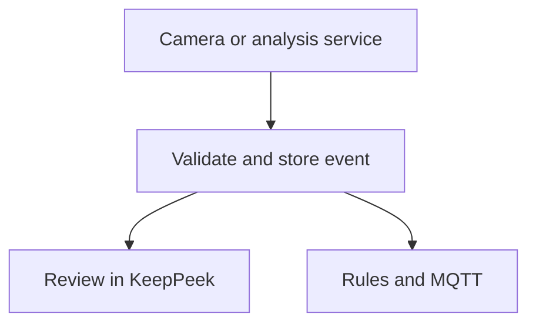

# How KeepPeek works

KeepPeek puts recording, live media, event storage, and investigation in one local service. The
browser is a client of that service. Closing a tab ends its viewing work; it does not stop the
server's configured recording policy.

This chapter explains the current boundaries. [Users and design choices](./users-and-design-choices.md)
contains the product rationale, while the feature chapters provide operational instructions.

## Media and event paths

The camera supplies encoded media. KeepPeek understands codecs and timing well enough to route,
package, and record those streams without decoding and re-encoding their video in the core. The
browser or an external service performs the decoding it needs. Camera control, native events, and
media can use different protocol connections, so success on one path does not prove the others
are healthy.

Supported native adapters and optional analysis services publish events through a separate path:

The server separates camera/media work, storage work, WebRTC sessions, and integration delivery.
Health and queue evidence make stalls and pressure visible. Optional analysis and notification
delivery do not become a prerequisite for ordinary recording. Resource exhaustion or failure of
the recorder's own storage and network still needs operational attention.

## Persistent data and live state

| Data                                 | Owner and purpose                                                                                 | Operational consequence                                                                                           |
| ------------------------------------ | ------------------------------------------------------------------------------------------------- | ----------------------------------------------------------------------------------------------------------------- |
| Application configuration            | The existing `config.toml` holds supported settings, policies, layouts, and access configuration. | Use validated saves or configuration import and preserve the file across upgrades.                                |
| Reusable private strings             | The companion `secrets.toml` supplies supported secret references.                                | Preserve references and protect configuration archives and private restore material.                              |
| Encoded recordings                   | MP4 files in the configured storage paths.                                                        | Retention, recording policy, storage pressure, and file integrity determine what remains.                         |
| Recording and event catalog          | Indexed recording identity, coverage, events, and related durable investigation state.            | Recover it consistently with the media and the documented archive procedures.                                     |
| Images and exports                   | Feature-owned data under configured paths and retention policies.                                 | A playable recording does not imply that an event thumbnail or export is retained.                                |
| Notification and MQTT runtime state  | Bounded process memory for pending work and related runtime history or deduplication.             | A restart does not replay this work. Persisted rules and provider configuration are separate from delivery state. |
| Active connections and subscriptions | The running server and each client connection.                                                    | Reconnect and resolve current capabilities; a stored preference does not prove a stream is live.                  |

The [configuration reference](./configuration-reference.md) is the authority for serialized fields,
defaults, and paths. Do not create separate settings files for layouts or permissions. For a
consistent recovery plan, use [Backup and restore](./backup-and-restore.md); configuration export
and a full recording archive serve different purposes.

## Control, media, and access

HTTP creates and deletes API sessions and provides dedicated administration and diagnostic
operations. WebRTC carries typed control messages, data messages, and media. Clients must use the
negotiated capabilities and source identities instead of assuming that every camera has the same
streams, codecs, events, or controls.

Authentication identifies the caller; authorization determines the operations and cameras that
caller may use. The same restrictions apply through a dashboard, deep link, or integration. A
hidden UI control is not the security boundary. See [Authentication](./authentication.md) for
local trust, named credentials, roles, camera grants, reverse proxies, and revocation.

The server exposes configuration export/apply, backups, recording coverage, logs, and metrics on
dedicated HTTP routes. Their methods and authentication requirements are defined by the
[HTTP contract](https://github.com/xnorpx/keeppeek/blob/main/api/openapi.yaml) and implementation;
they are not a general REST replacement for the WebRTC control protocol. Custom clients should
start with the [API overview](https://github.com/xnorpx/keeppeek/blob/main/api/README.md) and verify
runtime support for each command they need. The API is pre-1.0 and does not yet promise stable
compatibility across versions.

## Recording truth and investigation

Live frames, stored coverage, event timestamps, and exported evidence answer different questions.
A connected camera can fail to record; a retained event can outlive its image or video; a
successful seek does not prove that the surrounding day has no gaps.

Keep combines recorded coverage, selected time, camera identity, and event context. Health screens
explain stream progress and recorder evidence. Maintenance inspects persisted files and catalog
state. Keep these layers separate when diagnosing an incident so that a browser playback problem
does not become an unnecessary archive repair.

Start with [Recording and evidence](./recording-and-evidence.md) and
[Camera and stream health](./camera-health.md). Use [Recording maintenance](./recording-maintenance.md)
when stored-data evidence warrants it.

## Extension boundaries

External services consume media and publish supported events without becoming part of the core
recorder. Camera-native adapters provide another event source. Notifications and MQTT consume
committed events and maintain their own delivery evidence. Home Assistant's card connects the
browser directly to KeepPeek rather than proxying video through Home Assistant.

Some broader protocol scenarios are implemented only in part. Live [participant groups](./groups.md)
currently have declarations and a UI explanation without a runtime handler. Consult the feature's
availability statement before designing a deployment around it.

Implementation entry points include
[`src/app.rs`](https://github.com/xnorpx/keeppeek/blob/main/src/app.rs) for startup,
[`src/server.rs`](https://github.com/xnorpx/keeppeek/blob/main/src/server.rs) for request handling,
[`src/webrtc.rs`](https://github.com/xnorpx/keeppeek/blob/main/src/webrtc.rs) for sessions and media,
and [`src/storage`](https://github.com/xnorpx/keeppeek/tree/main/src/storage) for recording and
catalog behavior. Development and verification instructions are in [Contributing](./contributing.md).
