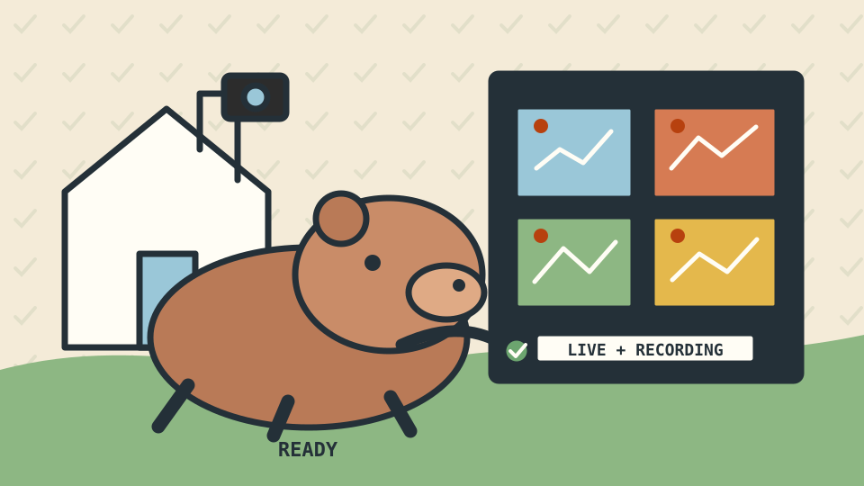
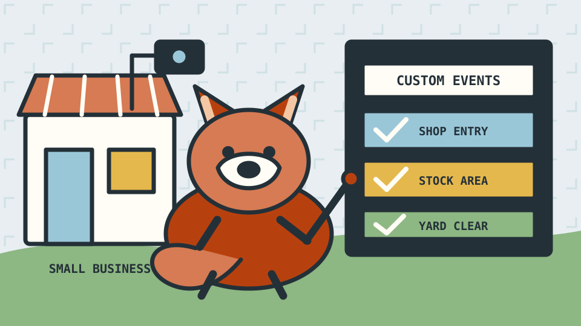
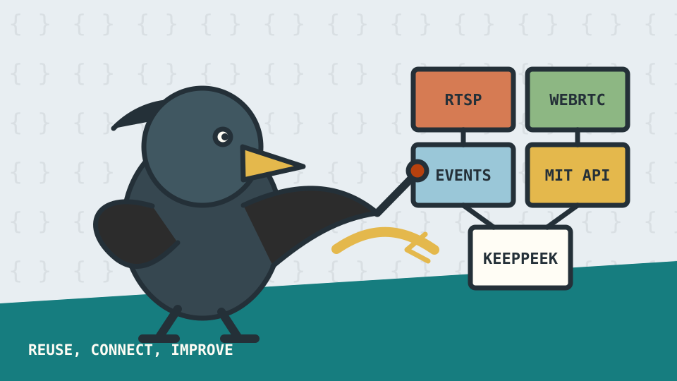
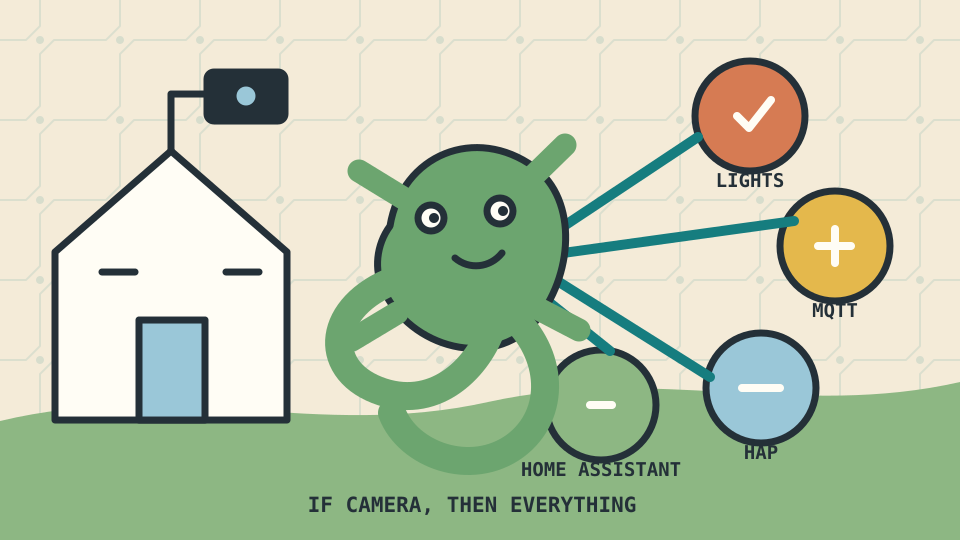
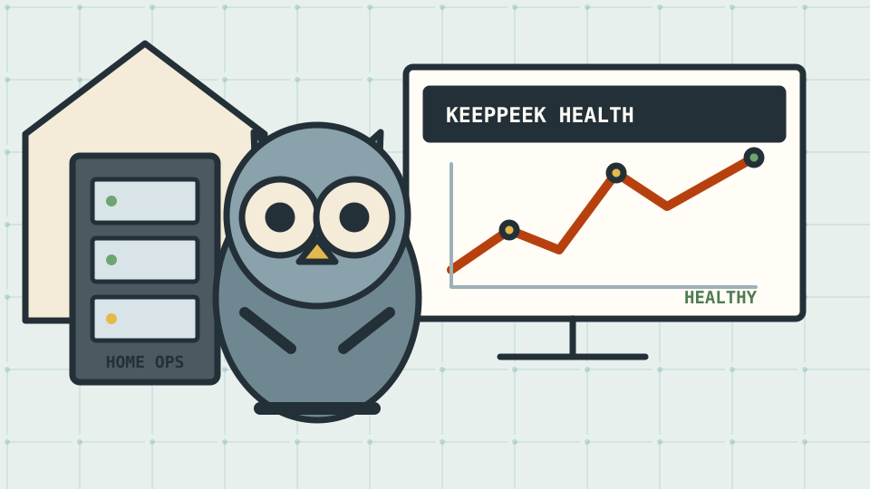
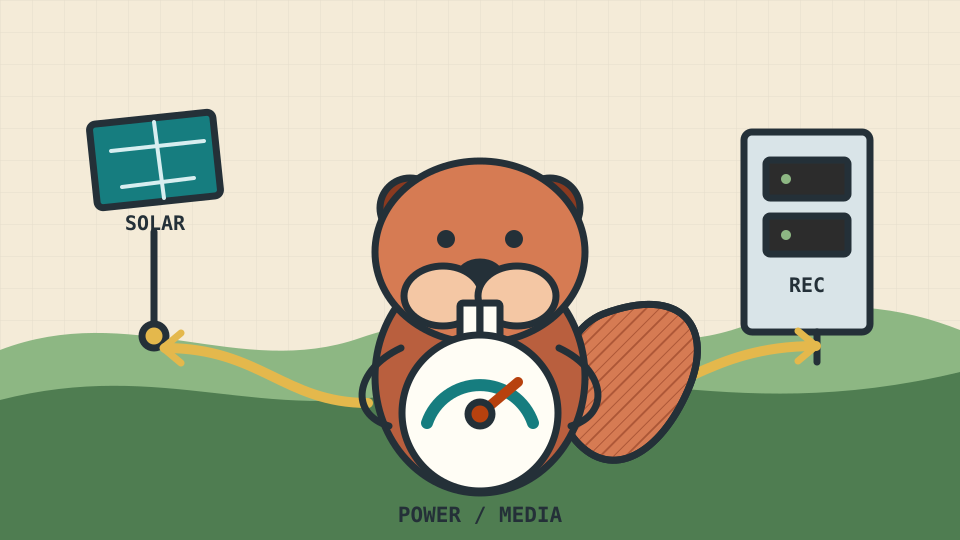
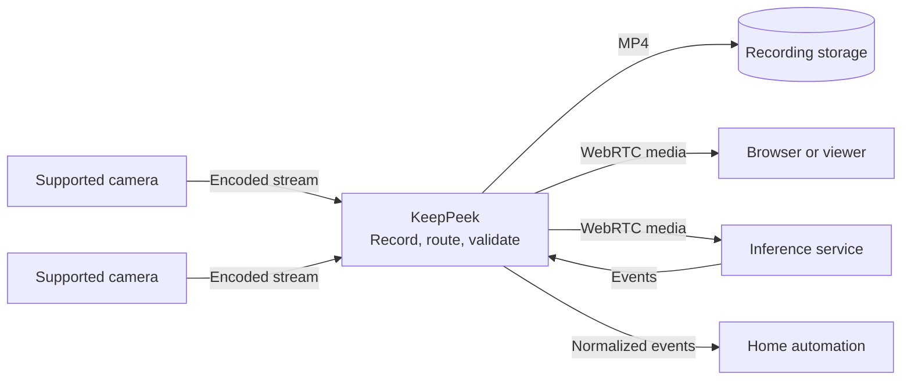

# Users and design choices

KeepPeek is a local-first network video recorder and media gateway. Its core job is to ingest
camera media, record it reliably, make live and stored media available, and provide a stable place
for events and integrations to meet. It can use analytics events produced directly by a camera,
events from an optional external service, or no analytics at all.

That narrow center is deliberate. Inference frameworks, models, accelerators, and licensing change
much faster than a recorder should. KeepPeek therefore accepts camera-native events and makes media
available through an open protocol instead of deciding which models every installation must run.

## At a glance

| User                                        | Starting point                                                                                     | What they value                                                             | KeepPeek's role                                                          |
| ------------------------------------------- | -------------------------------------------------------------------------------------------------- | --------------------------------------------------------------------------- | ------------------------------------------------------------------------ |
| **Software Consumer**                       | [Common cameras](#cameras-brands-and-protocols) and a problem to solve, not an integration project | Sensible defaults and dependable results                                    | A complete first-party recording and viewing experience                  |
| **Small Business Security**                 | A shop, workshop, office, or yard with needs generic analytics do not fully cover                  | Relevant alerts, dependable evidence, and a solution fitted to the business | A reliable recorder plus a boundary for tailored inference and workflows |
| **Open Source Enthusiast**                  | Existing tools and a willingness to connect them                                                   | Reuse, inspectability, and replaceable components                           | A composable open core rather than another closed ecosystem              |
| **Home Automation Enthusiast**              | Home Assistant, MQTT, HAP, automations, and devices that should cooperate                          | Local orchestration, useful events, and stable identities                   | A camera and event source for the automation system already in place     |
| **Residential Sysadmin**                    | A home server, NAS, container host, or automation stack                                            | Reliability, diagnostics, and repeatable operation                          | A native service with stable interfaces and health evidence              |
| **Residential Power Optimization Engineer** | Cameras, networks, and compute that can be arranged deliberately                                   | Control, measurement, and efficient placement of work                       | An observable media plane that can feed the right hardware               |

## Software Consumer

> _I just want it to work._



### Profile

- **Starting point:** A set of [common cameras](#cameras-brands-and-protocols) and an expectation
  that recording, live view, and review form one product.
- **Primary goal:** Install it, add cameras, and trust that footage will be available when needed.
- **Constraints:** Little interest in protocols, model runtimes, or maintaining an integration
  stack.

### How they use KeepPeek

1. **Set up:** Follow a guided camera workflow with safe defaults.
2. **Operate:** Use the Svelte web application for live viewing and recording review.
3. **Investigate:** Receive a clear diagnosis and a next action instead of raw protocol state.
4. **Extend:** Choose an optional free or paid service only when it adds something useful.

### What success looks like

Core recording works without a cloud account, an AI subscription, or decisions about model and
accelerator compatibility.

### Product implications

The first-party experience must hide optional architecture until it matters, without removing the
open interfaces that let other users go further.

<!-- Add the shortest realistic path from download to a trusted first recording. -->

## Small Business Security

> _Custom detection for the way the business actually works._



### Profile

- **Starting point:** A shop, workshop, office, warehouse, or yard with existing cameras and a
  specific operational risk.
- **Primary goal:** Combine dependable recording with alerts and search events designed around the
  way the business operates.
- **Constraints:** Privacy, false alarms, existing equipment, available compute, response time, and
  a solution that staff can operate without becoming AI specialists.

### How they use KeepPeek

1. **Establish the baseline:** Deploy KeepPeek for local recording, live viewing, health, and
   portable MP4 evidence.
2. **Define the need:** Identify the events, objects, zones, schedules, and responses that matter to
   the business rather than starting with a generic model feature list.
3. **Add tailored inference:** Run a separate service that subscribes to selected WebRTC streams and
   publishes normalized events back to KeepPeek.
4. **Connect the workflow:** Route useful events into the KeepPeek timeline, notifications, Home
   Assistant, MQTT, webhooks, or another business system.

### What success looks like

The business receives relevant, reviewable events without making recording dependent on the custom
model. The inference service can evolve with the business while KeepPeek remains the stable media
and evidence layer.

### Product implications

Custom business logic belongs in an external protocol plugin, not a private fork of the recorder.
That keeps camera credentials and storage ownership inside KeepPeek while allowing a tailored free
or paid service to use the hardware, models, and support arrangement appropriate for the customer.

> **Need a tailored solution?** Contact KeepPeek to discuss custom AI, inference, integrations, and
> deployment for your specific business needs.

<!-- Add the preferred business contact link and a concrete engagement example. -->

## Open Source Enthusiast

> _Because someone else already wrote it._



### Profile

- **Starting point:** A collection of proven open-source tools, libraries, models, and devices.
- **Primary goal:** Reuse the best available component for each job and replace it when something
  better appears.
- **Constraints:** Avoid proprietary lock-in and duplicated implementations.

### How they use KeepPeek

1. **Set up:** Combine KeepPeek with existing cameras and familiar self-hosted infrastructure.
2. **Operate:** Use the included viewer or another client that implements the public protocol.
3. **Investigate:** Inspect the server, wire contract, and generated bindings.
4. **Extend:** Build or adopt an independent detector, transcoder, event forwarder, or viewer.

### What success looks like

The recorder remains a useful shared foundation while every fast-moving or specialized component
can come from somewhere else.

### Product implications

The [licensing model](./open-source-and-licensing.md#licensing-model) protects improvements to the
server while allowing independent clients and services to use their own licensing and business
model.

<!-- Add examples of existing projects that could be connected rather than rewritten. -->

## Home Automation Enthusiast

> _Because the porch light should have opinions._



### Profile

- **Starting point:** A local automation system built around Home Assistant, MQTT, HAP/HomeKit,
  notification services, and a growing collection of devices.
- **Primary goal:** Turn camera events and recording health into useful household actions without
  making the automation controller proxy video.
- **Constraints:** Stable device identities, local control, understandable event semantics, and
  automations that recover cleanly after either system restarts.

### How they use KeepPeek

1. **View:** Put selected live streams, events, and timeline review in a Home Assistant dashboard.
2. **React:** Forward normalized camera-native or external analytics events through MQTT or
   webhooks.
3. **Present:** Use an independent HAP bridge when selected cameras should appear in Apple Home.
4. **Observe:** Scrape Prometheus metrics and include recording or camera health in automations.

### What success looks like

A meaningful camera event can turn on a light, send a notification, or update a dashboard while
KeepPeek continues recording independently. Reconnects do not silently retarget an automation to a
different camera, and media does not take an unnecessary trip through the automation hub.

### Product implications

KeepPeek needs stable source IDs, normalized event types, backfill after disconnects, direct browser
media, and clear integration boundaries. It should participate in a home automation system without
trying to replace one.

<!-- Add one delightfully excessive but genuinely useful automation. -->

## Residential Sysadmin

> _Unnecessarily professional._



### Profile

- **Starting point:** A self-hosted environment with monitoring, backups, and perhaps Home
  Assistant, MQTT, or a reverse proxy.
- **Primary goal:** Operate cameras like a small but well-run production service.
- **Constraints:** Limited maintenance time and no separate operations team.

### How they use KeepPeek

1. **Set up:** Install one native service or container and validate each camera before trusting it.
2. **Operate:** Use the web interface for normal work and inspect health evidence, reason codes, and
   bounded logs when something changes.
3. **Investigate:** Distinguish camera, transport, recording, and external-service failures.
4. **Extend:** Attach integrations without patching the recorder or sharing its storage internals.

### What success looks like

The system can be monitored and recovered using explicit server, storage, camera, stream, ingress,
recording, and WebRTC evidence instead of guesses based on whether a video tile happens to be
playing.

### Product implications

KeepPeek exposes stable health reason codes, bounded logs, and documented interfaces. Rust supports
a predictable native service, while the open API and external-service boundary keep upgrades and
failures isolated.

<!-- Add a representative home-lab deployment and recovery story. -->

## Residential Power Optimization Engineer



### Profile

- **Starting point:** A mixed set of cameras and compute devices, each with different power and
  performance characteristics.
- **Primary goal:** Put capture, storage, decoding, and inference where each task runs best.
- **Constraints:** Power, heat, bandwidth, accelerator availability, privacy, and equipment already
  owned.

### How they use KeepPeek

1. **Set up:** Run KeepPeek close to the cameras and storage.
2. **Operate:** Record camera-native streams without requiring an inference workload on the server.
3. **Investigate:** Use explicit health and media evidence to find transport, recording, or
   downstream-service problems.
4. **Extend:** Subscribe to WebRTC media from whichever device should decode or analyze it.

### What success looks like

Recording stays dependable while optional work can move between a server, GPU host, desktop, or
repurposed edge device without redesigning the recorder.

### Product implications

The server must remain efficient and observable, while its media boundary must not assume that
inference runs in the same process or even on the same machine.

<!-- Add a concrete household, hardware layout, and power budget. -->

## Cameras, brands, and protocols

KeepPeek assumes that a home or small business may contain cameras from several generations and
manufacturers. Compatibility is therefore organized around working protocols and verified media,
not a logo on the enclosure. A discovered camera is a candidate, not proof that authentication,
streaming, controls, and events all work.

### Brand integration paths

| Camera family                               | Integration path                                                                                            | Current meaning                                                                                                                                              |
| ------------------------------------------- | ----------------------------------------------------------------------------------------------------------- | ------------------------------------------------------------------------------------------------------------------------------------------------------------ |
| **Reolink**                                 | Dedicated `reo-proto` backend for Baichuan over TCP or UDP, with ONVIF and RTSP fallback paths              | First-class discovery, authentication, main/sub media, supported controls, and native camera events                                                          |
| **Dahua and compatible OEM/rebrand models** | ONVIF discovery and profile queries with RTSP media through Retina or explicit stream URLs                  | A supported standards-based family with coverage for common H.264/AAC and H.265/G.711 stream patterns; each OEM model and firmware still requires validation |
| **Tapo (supported models)**                 | ONVIF discovery and profile queries where available, with RTSP media through Retina or explicit stream URLs | A supported mainstream vendor through the standards path; exact capabilities still depend on model and firmware                                              |
| **Hikvision**                               | SADP discovery, followed by ONVIF and RTSP where the device exposes them                                    | SADP identifies candidates; it is not a separate Hikvision media backend                                                                                     |
| **Other ONVIF cameras**                     | ONVIF discovery and device/profile queries, then RTSP media                                                 | Support depends on the device's implementation of the standards and must be validated per model                                                              |
| **Generic or unknown cameras**              | Explicit main and/or sub RTSP URLs                                                                          | Recording can work without a recognized brand; metadata, controls, and native events may be limited                                                          |

### Support a pragmatic subset, not every camera

KeepPeek does not aim to support every camera ever sold. The camera market contains too many
firmware variants, incomplete protocol implementations, cloud-only products, and models that reuse
a brand name while behaving differently. Claiming universal compatibility would create a large,
fragile surface and make failures harder to diagnose.

The practical goal is excellent support for a well-known subset: dedicated integration where that
creates real value, as with Reolink; tested standards paths for selected Dahua-family and Tapo
models; and a clear ONVIF or RTSP route for other cameras that implement those protocols correctly.
A brand row means KeepPeek deliberately tests and maintains a useful path for that vendor family.
It does not mean every model, firmware version, codec, control, cloud feature, or native analytics
event is supported.

Compatibility is described at three levels:

1. **Supported vendor and model:** The documented firmware and configuration pass discovery or
   manual setup, authentication, main/sub streaming, keyframe detection, MP4 recording, and
   independent playback validation.
2. **Protocol-compatible camera:** The camera exposes usable ONVIF and RTSP behavior, but its exact
   model has not yet earned a maintained compatibility claim.
3. **Manual RTSP camera:** KeepPeek can record a validated stream URL even when discovery, controls,
   metadata, and native camera events are unavailable.

New camera support should be added from measured evidence and a maintainable protocol path, not by
collecting one-off exceptions for every device. This keeps setup predictable for common cameras
while leaving an honest manual path for experienced users.

### Protocol responsibilities

| Responsibility                  | Protocol or component                                                                | What KeepPeek uses it for                                                                                 |
| ------------------------------- | ------------------------------------------------------------------------------------ | --------------------------------------------------------------------------------------------------------- |
| **Discovery**                   | ONVIF WS-Discovery, Reolink discovery, Hikvision SADP, and bounded local port probes | Find candidate devices and collect safe identity hints                                                    |
| **Device queries and control**  | ONVIF SOAP plus supported Reolink HTTP or Baichuan commands                          | Read device information, profiles, capabilities, imaging state, and supported PTZ controls                |
| **Generic media ingest**        | RTSP/RTP through Retina over TCP or UDP                                              | Receive standards-based camera media, including explicit main and sub URLs                                |
| **Reolink media ingest**        | Baichuan through `reo-proto` over TCP or UDP                                         | Receive complete Reolink video and audio frames without requiring RTSP                                    |
| **Native camera events**        | Currently the Reolink Baichuan alarm path                                            | Normalize supported motion, person, animal, and vehicle events and attach camera snapshots when available |
| **Viewer and service delivery** | WebRTC with RTP and reliable/unreliable data channels                                | Forward live media, control, events, and publications without exposing camera credentials                 |

WebRTC is the client-facing media gateway protocol, not a requirement imposed on cameras. Cameras
can continue speaking their native protocol to KeepPeek while browsers and independent services
use one consistent downstream API.

### Media and transport policy

KeepPeek accepts H.264 and H.265 video and supported AAC, G.711 A-law, G.711 mu-law, and ADPCM
audio. It can retain main and sub profiles and records camera-native streams without re-encoding.
When backend selection is automatic, Reolink uses `reo-proto` and other cameras use Retina. TCP is
the conservative default; UDP remains available when a camera requires it or validation shows it
is the better path. Explicit RTSP URLs take precedence over URLs discovered through ONVIF.

Discovery alone is never the final compatibility test. The camera setup workflow verifies
credentials, requested profiles, incoming frames and keyframes, finalized MP4 output, and
independent FFmpeg decoding before recommending a backend or adding a camera to the live
configuration.

### How this fits the users

- **Software Consumer:** Gets discovery and safe automatic defaults where possible, plus a
  validated manual RTSP path when the camera is not recognized.
- **Small Business Security:** Can retain an existing mixed camera fleet and add custom inference
  only to the streams and locations that need it.
- **Open Source Enthusiast:** Can reuse ONVIF, RTSP, Retina, and vendor-specific protocol work and
  add another adapter without changing the WebRTC client contract.
- **Home Automation Enthusiast:** Gets stable camera and event identities across supported vendors
  without making the automation hub understand each camera protocol.
- **Residential Sysadmin:** Gets one inventory and one observable recording path across a mixed
  fleet, with the selected backend visible in diagnostics.
- **Residential Power Optimization Engineer:** Can choose main or sub media, compare transports,
  and keep camera-native inference on the camera when that is the most efficient location.

<!-- Add a table of models only after each model and firmware combination has passed validation. -->

## Key design choices

### Keep inference outside the server

KeepPeek does not build object detection, face recognition, license-plate recognition, image
description, or model management into the server. That does not mean inference must happen in a
separate assisted service. A camera with built-in motion, person, vehicle, or other analytics can
send those events directly to KeepPeek, which validates and stores them and presents them beside
recorded media.

KeepPeek supports three independent modes:

1. **Recording only:** Record and view media without enabling analytics anywhere.
2. **External analytics:** Forward media to an optional service and accept the events it publishes.
3. **Camera-native analytics:** Use events produced by the camera without another inference service.

The repository includes a
[Python object-detection service demo](https://github.com/xnorpx/keeppeek/tree/master/examples/object_detection_service)
for the external analytics path. It uses `aiortc` to subscribe to encoded KeepPeek video over
WebRTC, decodes selected frames with the user-installed FFmpeg executable, runs inference, and
publishes normalized events back to KeepPeek. It is a reference implementation and CI example,
not a supported detector product.

#### Forward encoded streams, not inference JPEGs

KeepPeek does not provide a one-image-at-a-time inference API as its detector boundary. A common
integration with an image-oriented service such as
[CodeProject.AI](https://github.com/codeproject/CodeProject.AI-Server) uploads one JPEG for each
inference request. That is convenient for a caller that already owns an image, but it is inefficient
when the source is a continuous H.264 or H.265 camera stream.

For an ordinary encoded camera stream, a server-generated snapshot pipeline would be:

```text
camera stream -> KeepPeek video decode -> JPEG encode -> HTTP upload -> detector JPEG decode -> model
```

That path requires KeepPeek to bundle video decoders, convert full-resolution frames into pixels,
encode and allocate a new JPEG for every sample, and transfer it only for the detector to decode it
again. Repeating that work across several cameras and inference frames per second adds CPU use,
memory traffic, latency, and another codec and licensing surface to the core service.

KeepPeek instead uses the media gateway it already has:

```text
camera stream -> KeepPeek encoded forwarding -> detector video decode and sampling -> model
```

Forwarding encoded access units is much cheaper for the core than decoding pixels and producing
JPEGs. The inference service keeps one decoder running near the model, chooses its own sampling
rate, drops stale frames, and can batch work across cameras. This preserves timing and stream
continuity while letting the service select an H.264 or H.265 decoder suited to its hardware.

JPEG remains useful after inference. A service or camera can attach a deliberately selected
snapshot to a durable event, but KeepPeek does not turn every candidate inference frame into a
JPEG. Event evidence is bounded output, not the transport used to feed the model.

**User fit:** Consumers avoid hidden image work; small businesses can run efficient continuous
inference; open-source developers keep decoding beside model scheduling; home automation
enthusiasts receive normalized events without decoding video; sysadmins keep image codecs out of
the recorder; power optimizers avoid repeated decode, JPEG encode, and JPEG decode work.

<!-- Add measured CPU, memory-bandwidth, and latency comparisons for representative camera counts. -->

Inference changes quickly and brings hardware drivers, large model files, model-specific licenses,
and different privacy decisions. Keeping it out of the recorder lets camera firmware or an external
model change without coupling its lifecycle to recording and live viewing. It also avoids making
extra AI compute and a cloud account mandatory costs of running an NVR.

**User fit:** The consumer can use intelligence already present in a camera; a small business can
commission inference for its specific risks; the open-source enthusiast can swap model stacks; the
home automation enthusiast consumes the resulting normalized events; the sysadmin gets a smaller
failure domain; the power optimizer chooses the best compute target.

<!-- Add examples of camera-native events and external inference services KeepPeek should support. -->

### Keep recording and media routing at the center

KeepPeek owns the durable and slow-changing responsibilities: camera ingest, recording, stable
media identity, timeline access, health evidence, authorization, and validation of events received
from cameras or published back by services. Specialized inference can happen inside a camera or in
a replaceable service around that center; transcoding likewise remains outside the core.

This boundary keeps the most important promise narrow: footage should still be recorded when an
optional service is overloaded, incompatible, or offline. External services receive media through
the gateway instead of opening camera sessions or writing KeepPeek's database and recording
directories directly.

**User fit:** Consumers get one accountable recorder; small businesses keep custom models
independent from evidence; open-source enthusiasts compose services; home automation enthusiasts
get a stable event source; sysadmins retain one recording authority; power optimizers can place
each workload independently.

<!-- Add the explicit responsibilities that must never move out of the core. -->

### Why WebRTC fits KeepPeek



[WebRTC](https://webrtc.org/) is a mature, widely implemented protocol suite rather than one
vendor's media stack. It is built into browsers, and interoperable implementations are available
for most common service languages. Examples include:

- Rust: [str0m](https://github.com/algesten/str0m), which KeepPeek uses;
- Python: [aiortc](https://github.com/aiortc/aiortc);
- C++: [libwebrtc](https://webrtc.googlesource.com/src/);
- Node.js and TypeScript: [werift](https://github.com/shinyoshiaki/werift-webrtc).

An independent viewer, inference service, or protocol plugin can therefore choose an implementation
that fits its language and deployment instead of adopting KeepPeek's Rust stack. The author of
KeepPeek is also well versed in WebRTC protocols and browser behavior. That experience reduces risk
in the difficult parts of a media gateway: SDP negotiation, ICE, RTP packetization, encryption,
congestion handling, SCTP, and interoperability between native and browser clients.

WebRTC also gives KeepPeek two complementary delivery paths inside one session:

- **RTP over UDP** carries latency-sensitive audio and video without forcing every frame through an
  ordered reliable stream.
- **Data channels over SCTP** carry ordered reliable protobuf control plus reliable or discardable
  binary payloads. They can also deliver encoded media when RTP is not the right binding for a
  client.

This combination provides flexibility without inventing separate protocols for viewers,
publishers, transcoders, and inference services. It also gives browsers clean integration through
`RTCPeerConnection`, negotiated media tracks, and data channels rather than a custom framing and
playback stack.

The protocol boundary separates camera access from compute placement. An inference client can run
beside KeepPeek, on a GPU machine elsewhere on the private network, or on a repurposed device. An
older iOS device, for example, could run a small client application that embeds a compatible WebRTC
implementation, subscribes to an encoded stream, and runs a suitable local model without receiving
camera credentials or direct access to the recording store. Results return through the same API as
events.

**User fit:** Consumers receive browser-native live playback; small businesses can attach custom
inference without exposing camera credentials; open-source developers can choose a language-native
implementation; home automation enthusiasts get direct media and event paths; sysadmins manage one
observable boundary; power optimizers can move workloads without moving storage.

### Fit into home automation instead of replacing it

KeepPeek should be a focused recorder and media gateway inside a larger home or small-business
system, not another general-purpose automation hub. Its open API, stable source identities,
normalized events, and observability endpoints let established tools do the jobs they already do
well.

| Integration                          | Connection boundary                                                                                          | Intended role                                                                                                                                  |
| ------------------------------------ | ------------------------------------------------------------------------------------------------------------ | ---------------------------------------------------------------------------------------------------------------------------------------------- |
| **Home Assistant**                   | A Lovelace card connects directly to KeepPeek over WebRTC; an optional integration can expose entities       | Put live cameras, events, timelines, and recording health in an existing dashboard without proxying media through Home Assistant               |
| **MQTT**                             | A data-only event forwarder subscribes to normalized KeepPeek events and publishes them to the user's broker | Feed automations with camera-native or external analytics events, optional snapshots, and disconnect backfill without decoding video           |
| **HomeKit Accessory Protocol (HAP)** | An independent bridge translates selected KeepPeek capabilities into HomeKit accessories                     | Present compatible camera streams, events, doorbells, and controls to Apple Home while keeping HAP-specific behavior outside the recorder core |
| **Prometheus**                       | The monitoring system scrapes `GET /metrics`                                                                 | Build dashboards and alerts for server, storage, camera, stream, recording, and WebRTC health                                                  |

Home Assistant and MQTT designs build on the public API and normalized event model. HAP is an
intended bridge boundary rather than a currently implemented server feature. A HAP bridge can be
free, community-maintained, or commercial without requiring HomeKit code or credentials inside the
KeepPeek process.

**User fit:** The consumer can choose integrations by name; a small business can connect security
events to operational workflows; the open-source enthusiast can reuse mature ecosystem projects;
the home automation enthusiast gets stable events and direct media; the sysadmin can connect
familiar dashboards, brokers, and monitoring; the power optimizer can place each bridge on suitable
hardware.

<!-- Add concrete setup links as each integration becomes available. -->

### Use Rust for the server

A recorder is a long-running, concurrent parser of untrusted network and media data. Rust provides
native performance and control over allocation without a garbage collector, while its ownership and
type systems prevent broad classes of memory and concurrency errors. It also supports native
services on Linux, macOS, and Windows and has reusable libraries for the protocols KeepPeek needs.

The trade-off is a steeper contribution path and longer compile times than some managed languages.
That cost is accepted in the core because predictable resource use and memory safety matter more
than optimizing for the fastest first prototype.

**User fit:** Consumers benefit from reliability without needing to know the language; small
businesses get a dependable evidence service; open-source contributors get compiler-checked
interfaces; home automation enthusiasts get a dependable event source; sysadmins get a predictable
native process; power users get low overhead.

<!-- Add real resource measurements when representative benchmarks exist. -->

### Keep the core small and focused

KeepPeek is intended to be a recorder and media gateway, not a bundled appliance stack. The core
service should not need a gigabyte or more of memory merely to start and perform ordinary recording
and forwarding. That baseline is different from the configurable in-memory cache used for
pre-event recording. KeepPeek retains recent encoded frames so an event-triggered recording can
include what happened before the event began.

The cache grows with the number of buffered streams, their bitrates, the enabled main and sub
profiles, and the configured pre-event duration. A longer window across many high-bitrate cameras
can therefore use substantial memory by design. Keeping those frames encoded makes the cache much
cheaper than retaining decoded images, but it does not make the cache free. A hard total-RAM
guarantee must wait for representative measurements and must always state the camera, bitrate,
profile, and pre-event-cache assumptions.

Keeping inference runtimes, model weights, video encoders and decoders, and a packaged desktop
browser out of the server protects its binary size, memory footprint, startup time, and attack
surface. An optional detector or transcoder pays for its own dependencies and resources without
making every KeepPeek installation pay the same cost.

**User fit:** The consumer avoids unused runtime costs; a small business can scale custom inference
separately; the open-source enthusiast can compose specialized tools; the home automation
enthusiast keeps orchestration in the existing hub; the sysadmin gets a service suited to modest
hardware; the power optimizer can account for each workload.

<!-- Replace the qualitative target with measured binary, container, idle RSS, and loaded RSS data. -->

### Run on Linux, macOS, and Windows

The recording, media gateway, health, and public API behavior should remain consistent across
Linux, macOS, and Windows. Distribution should follow the convention that makes each platform feel
native rather than forcing one packaging model everywhere.

| Platform    | First-class distribution                                                                                                                                                                                                     |
| ----------- | ---------------------------------------------------------------------------------------------------------------------------------------------------------------------------------------------------------------------------- |
| **Linux**   | A minimal multi-architecture Docker image for `linux/amd64` and `linux/arm64`, published to GHCR with a persistent configuration volume. Native archives remain useful, but Docker is the primary polished Linux deployment. |
| **macOS**   | A signed and notarized `KeepPeek.app` in a drag-to-install DMG, with a per-user `launchd` service. The current release target is Apple Silicon.                                                                              |
| **Windows** | Authenticode-signed x86-64 and ARM64 binaries plus a signed NSIS installer that can register, upgrade, and remove the Windows service.                                                                                       |

Public macOS and Windows release installers should be signed, timestamped where supported, and
verified by the release workflow before publication. Checksums remain useful for every platform,
including Linux images and native archives.

> **An operations-friendly combination:** A focused Rust service is straightforward to build across
> platforms, first-class Docker images make Linux deployment repeatable, and the optional
> Prometheus `GET /metrics` endpoint plugs into standard dashboards and alerts. Together these make
> KeepPeek a strong choice where portability, container deployment, and conventional observability
> matter.

The Svelte interface runs in the browser and provides the same administration, live view, and
recording workflow regardless of which operating system hosts the server. Platform-specific code
should stay behind narrow boundaries so a feature does not quietly become available on only one
host.

**User fit:** Consumers avoid operating-system lock-in; small businesses can deploy on existing
hardware; open-source contributors can port and test explicit platform boundaries; home automation
enthusiasts can place bridges beside their existing controllers; sysadmins can use the machine
already running the home; power optimizers can choose hardware and operating system independently.

<!-- Add installation and service-management links for each supported platform. -->

### Store recordings as MP4

KeepPeek stores encoded video and supported audio in ordinary `.mp4` files rather than a
proprietary media container or database blob. Finalized segments can be copied, inspected, and
played with established tools such as VLC, FFmpeg, and `ffprobe`, provided that the tool supports
the codecs used by the camera. Basic access to a recording should not require KeepPeek to remain
installed or an export into a private intermediate format.

The files use fragmented ISO MP4. Each file starts with its initialization metadata and continues
with keyframe-aligned media fragments. This structure lets KeepPeek flush recording progress,
index exact byte ranges for timeline seeks, and serve only the required fragments while the file
itself remains a standard media object. Active segments use a temporary `.mp4.active` suffix and
become `.mp4` files when finalized without re-encoding or remuxing them.

The recording catalog stores identity, time, paths, events, and fragment indexes; encoded media
stays in the MP4 files on disk. The catalog makes review faster, but it does not hold footage
hostage inside a KeepPeek-specific database format.

MP4 is a container, not a codec. An H.265 recording still requires an H.265-capable VLC build,
browser, or other player. Choosing MP4 improves interoperability without forcing KeepPeek to
bundle the video decoders and encoders deliberately kept outside the core service.

**User fit:** The consumer can open a finalized segment in VLC; a small business can hand over
portable evidence; the open-source enthusiast can reuse the MP4 ecosystem; the home automation
enthusiast can attach standard evidence files to downstream workflows; the sysadmin gets files that
fit normal backup workflows; the power optimizer can inspect recordings with standard tools.

<!-- Add tested VLC, FFmpeg, and operating-system playback combinations. -->

### Keep video codecs out of the core service

KeepPeek is codec-aware but does not bundle a video decoder or encoder. It understands enough H.264
and H.265 structure to receive encoded camera frames, identify configuration and keyframes, write
MP4, and forward or repacketize media. It does not decode those frames into pixels or re-encode them
inside the core service.

Bundling codec implementations would introduce patent and distribution questions that vary by
codec, build, use, and jurisdiction. It would also bring substantial native dependencies, security
surface, CPU or accelerator policy, and binary and memory cost into every installation. Keeping
that machinery outside the core avoids silently inheriting the licensing and packaging choices of
a particular FFmpeg or codec-library build.

On desktop, the first-party experience relies on Chrome or Chromium and the operating system's
media stack for video decoding and rendering. The UI asks the browser which RTP and MP4 codecs it
actually supports and selects a compatible camera stream. Svelte provides the application UI;
the browser provides the desktop runtime, media pipeline, accessibility primitives, and hardware
decode path, so KeepPeek does not need to ship an Electron-style browser or codec pack.

Browser support is still a real boundary. H.264 is the broad compatibility path, while H.265
availability depends on the browser build, operating system, and hardware. When a camera-native
stream cannot be decoded by the viewer, the user can select an H.264 substream or run an independent
transcoding service that publishes a compatible variant back through the media gateway. The
transcoder owns its codec dependencies, resource cost, and licensing decisions.

**User fit:** The consumer opens the interface in Chrome or Chromium without a KeepPeek codec
bundle; a small business can use standard workstations or commission a specific transcoder; the
open-source enthusiast can choose codec tooling deliberately; the home automation enthusiast can
consume event metadata without decoding video; the sysadmin keeps codec packages out of the
recorder; the power optimizer can use viewer-side hardware decoding.

<!-- Add a tested browser, operating-system, hardware, and codec compatibility matrix. -->

### Use Svelte for the first-party interface

KeepPeek needs a responsive browser interface for live state, timelines, health, and configuration,
but it does not need a second application server. Svelte 5 and SvelteKit can produce a static
client, use compiled reactivity for frequently changing media state, and consume generated
TypeScript protobuf bindings without introducing a separate client state framework.

The browser becomes the cross-platform user interface while Rust remains responsible for server
truth. The trade-off is a separate frontend toolchain, but that separation also keeps presentation
changes out of the media process and makes the interface approachable to web contributors.

**User fit:** Consumers get the complete graphical product; small businesses can adapt focused
operational views; open-source contributors can work in a familiar web stack; sysadmins get the
same UI on every host; home automation enthusiasts can use direct dashboard clients; advanced users
remain free to implement another client against the API.

<!-- Add the UI qualities that Svelte must continue to protect as the application grows. -->

### Make setup AI-assistable without making AI a dependency

KeepPeek should be easy for an AI assistant to configure, but the running recorder should not need
an assistant or model. The repository's KeepPeek Camera Setup Skill turns camera discovery,
authentication checks, stream tests, MP4 validation, transport selection, and final verification
into an explicit, reusable workflow.

The Skill is constrained rather than magical: credentials stay outside the conversation, generated
configuration is staged, media is independently validated, and camera-side changes require human
approval. Structured configuration, stable capability messages, reason codes, metrics, and focused
command-line tools make those steps understandable to both people and assistants.

**User fit:** Consumers can receive guided setup; small businesses get a repeatable custom
deployment process; open-source contributors can improve the workflow; home automation enthusiasts
get repeatable integration setup; sysadmins get a documented runbook; power users can automate
repeatable experiments without turning the recorder into an AI appliance.

<!-- Add the intended first-run assistant experience and its human approval points. -->

## Connecting users to choices

| User                                        | Most relevant choices                                                       | What those choices enable                                                               |
| ------------------------------------------- | --------------------------------------------------------------------------- | --------------------------------------------------------------------------------------- |
| **Software Consumer**                       | First-party Svelte UI, common cameras, MP4, browser decoding, setup Skill   | Install, record, review, and diagnose without assembling an integration stack           |
| **Small Business Security**                 | Stable recording core, encoded-stream inference, open API, protocol plugins | Commission tailored analytics and workflows without making evidence depend on the model |
| **Open Source Enthusiast**                  | AGPL server, MIT API, documented WebRTC, replaceable external services      | Reuse, inspect, replace, and improve each component                                     |
| **Home Automation Enthusiast**              | Stable identities, normalized events, Home Assistant, MQTT, HAP, Prometheus | Connect cameras to local dashboards, alerts, and automations without proxying media     |
| **Residential Sysadmin**                    | Rust, small core, native packaging, Docker, health evidence, standard MP4   | Operate and recover a predictable service using familiar infrastructure                 |
| **Residential Power Optimization Engineer** | Encoded forwarding, external inference, browser codecs, flexible placement  | Put storage, decoding, inference, and integrations on the most suitable hardware        |

## Boundaries and non-goals

- KeepPeek is not a model host, training environment, detector marketplace, or GPU manager.
- KeepPeek does not expose periodic server-generated JPEGs as its native inference API.
- Camera-native analytics events must work without an additional assisted AI service.
- Recording and ordinary viewing must not require camera AI, an external AI service, or a cloud
  service.
- A protocol plugin does not receive direct access to internal databases, recording paths, or
  camera credentials.
- The core service does not bundle a video decoder, encoder, codec pack, or desktop browser runtime.
- MP4 storage improves file portability but does not guarantee that every player can decode every
  camera codec.
- A numeric memory limit is not a published guarantee until representative workloads are measured.
  Baseline service overhead should remain modest, while total memory also includes the configured
  encoded pre-event cache and scales with stream count, bitrate, enabled profiles, and retention
  duration.
- The MIT API permits independent commercial clients and services; it does not exempt private
  modifications to the AGPL server.
- KeepPeek does not try to replace Home Assistant, an MQTT broker, HomeKit, or a monitoring system.
- AI-assisted setup must remain reproducible by a person and must not expose secrets or silently
  change camera settings.

<!-- Add product ideas that were deliberately rejected because they cross these boundaries. -->
