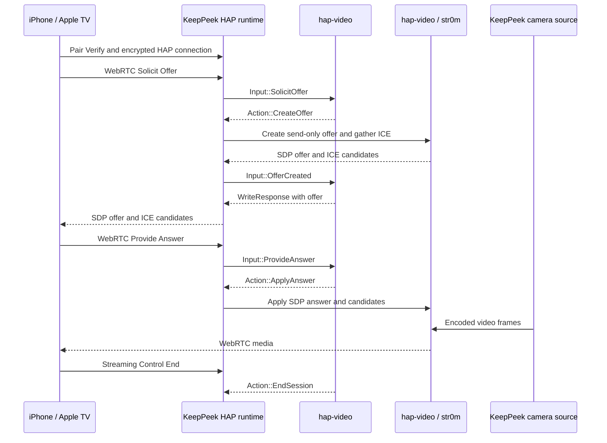

# hap-video

`hap-video` is KeepPeek's implementation of the accessory side of the HomeKit
Accessory Protocol (HAP), Apple's 2026 Camera WebRTC Stream Management service,
and the str0m-backed WebRTC session core.

The crate parses HAP input, emits responses and typed actions, and owns str0m's
offer/answer, ICE, DTLS-SRTP, RTP, and negotiated media state. It does not open
sockets, publish Bonjour services, persist keys, generate randomness, or run
threads. Those OS and application responsibilities belong to KeepPeek.

## Current limitation

SFrame end-to-end media encryption is not supported. SFrame offer requests and
session key updates receive protocol error responses. str0m still provides
WebRTC DTLS-SRTP transport encryption.

## HomeKit roles

| Component           | HomeKit role                     | Responsibility                                                 |
| ------------------- | -------------------------------- | -------------------------------------------------------------- |
| KeepPeek            | Standalone IP camera accessories | Advertises cameras, authenticates controllers, and sends media |
| iPhone or iPad      | Controller                       | Adds the accessory and requests camera streams                 |
| Apple TV or HomePod | Controller and home hub          | Runs automations and coordinates remote access                 |
| Apple Home          | Home and user management         | Distributes authorized access across the user's Apple devices  |

Apple TV is not a general-purpose broker to which KeepPeek registers arbitrary
clients. Controllers authenticate directly with the KeepPeek HAP accessory. The
Apple Home ecosystem coordinates home members, home hubs, and remote access.

## How Apple Home learns about a camera

1. A KeepPeek runtime advertises `_hap._tcp.local` through Bonjour/mDNS.
2. The user chooses **Add Accessory** in Apple Home and scans that camera's setup
   QR code or enters its setup code.
3. Apple Home performs HAP Pair Setup. KeepPeek stores the controller's long-term
   public key and administrator permission.
4. The controller performs Pair Verify whenever it opens a new HAP connection.
5. The connection switches to encrypted HAP records.
6. The controller reads `/accessories` and discovers one camera at AID 1.

Each configured camera has its own accessory identity, setup material, pairing
database, Bonjour advertisement, HAP listener, Camera WebRTC service, supported
video and audio tiers, and sensor UUID. The listener context maps AID 1 to that
camera's configured source.

Accessory and controller identities must be persistent. If KeepPeek changes its
accessory key or loses its controller pairing database, the user normally has to
remove and add the accessory again.

## Enable the KeepPeek runtime

HomeKit is opt-in. Add this section to KeepPeek's `config.toml` and restart:

```toml
[homekit]
enabled = true
bind = "0.0.0.0"
port = 32000
name = "KeepPeek"
```

`port` is the base listener port. Cameras use consecutive ports beginning at
that value. On the first enabled start, KeepPeek creates owner-readable files in
the `homekit/` directory beside `config.toml`:

| File                      | Contents                                                     |
| ------------------------- | ------------------------------------------------------------ |
| `accessories.json`        | Active camera state and setup artifact index                 |
| `<camera-hash>.json`      | Camera identity, pairing records, sensor UUID, and HAP state |
| `<camera-hash>-setup.txt` | Manual setup code and `X-HM://` setup URI                    |
| `<camera-hash>-setup.svg` | Scannable setup QR for that camera                           |

Scan every camera QR separately. Keep these files private and back up the whole
directory; deleting one camera's JSON file is a factory reset for that camera.
Legacy bridge state in `homekit.json` is left untouched when upgrading.

The runtime provides mDNS discovery, setup artifacts, HAP TCP, Pair Setup, Pair
Verify, encrypted records, pairing administration, `/accessories`,
characteristic reads, WebRTC characteristic writes, and live encoded video.
Opus audio and SFrame remain unsupported.

## Stream negotiation

In Apple's 2026 camera flow, the camera accessory creates the initial WebRTC
offer. The controller supplies the answer.



The controller addresses the Solicit Offer characteristic at AID 1 on one
camera's listener. That listener selects the source before handling
[`Action::CreateOffer`](src/webrtc.rs). The adapter generates a session
identifier, creates a send-only str0m session, and returns the resulting offer to
[`WebRtcDevice`](src/webrtc.rs).

After ICE and DTLS connect, the adapter subscribes the session to the selected
KeepPeek camera source and writes its encoded frames to str0m. Streaming Control
ends the subscription and releases the WebRTC transport. Reoffer performs
controller-initiated renegotiation for an active session.

## Adding controllers and clients

The correct operation depends on what "client" means:

- To add another person, invite their Apple Account in Apple Home. Apple handles
  authorization for that home.
- To add an Apple TV, assign it to the same Apple Home. KeepPeek does not register
  the Apple TV itself.
- A custom iOS application uses Apple's HomeKit framework and asks the user for
  access to their Home. It does not connect to Apple TV as a custom server.
- An administrator HAP controller can add or remove another controller's public
  key through `/pairings`. [`Pairings`](src/pairings.rs) implements the accessory
  side of those requests.
- Each camera stores up to 256 controller identities. Every controller connection
  has independent Pair Setup/Verify state, encryption keys, record counters, and
  event subscriptions.
- A custom non-Apple client cannot use Apple TV as a generic video broker. It can
  use KeepPeek's existing API, or implement a HAP controller and pair directly
  with the KeepPeek accessory.

`hap-video` is accessory-side only. It does not provide a HomeKit controller
library.

## Runtime adapter responsibilities

A runnable KeepPeek HomeKit accessory uses the following adapters around this
crate:

| Adapter               | Status            | Responsibility                                                                                    |
| --------------------- | ----------------- | ------------------------------------------------------------------------------------------------- |
| Discovery and setup   | Implemented       | Publish `_hap._tcp`, maintain a setup code, and generate the setup QR payload                     |
| HAP connection        | Implemented       | Accept TCP connections, parse requests, route endpoints, and write responses                      |
| Persistence           | Implemented       | Store the accessory identity, controller pairings, permissions, and stable camera identities      |
| Entropy               | Implemented       | Generate SRP secrets, ephemeral keys, and setup material outside the protocol crate               |
| Characteristic router | Implemented       | Drive each camera's `WebRtcDevice` and return HAP write responses                                 |
| WebRTC transport      | Implemented       | Own offer, answer, reoffer, ICE, DTLS-SRTP, RTP, and session state with str0m                     |
| Media bridge          | Video implemented | Subscribe to the selected KeepPeek source and deliver encoded H.264/H.265 frames; Opus is pending |
| Notifications         | Implemented       | Publish active-session and streaming-enabled characteristic events to subscribed controllers      |

The HTTP codec recognizes the required HAP endpoints in
[`src/http.rs`](src/http.rs). Pair Setup, Pair Verify, encrypted records, pairing
administration, the accessory database, and WebRTC signaling are implemented as
separate state machines so the runtime can drive each without hidden I/O.

KeepPeek's [`src/webrtc.rs`](../../src/webrtc.rs) owns UDP, polling, camera
subscriptions, and threads. Its browser path accepts offers from KeepPeek
clients. Its HomeKit path uses `hap-video::Str0mSession` to create a send-only
offer and then applies the controller answer. Both paths use the same camera
frame fan-out.

## Integration status

The integration order is:

1. Complete: stable accessory identity, pairing storage, setup code, QR
   generation, mDNS advertisement, and HAP TCP.
2. Complete: Pair Setup, Pair Verify, encrypted records, `/pairings`,
   `/accessories`, and characteristic reads.
3. Complete: connect `WebRtcDevice` actions to `Str0mSession` and map each
   standalone AID-1 listener to the KeepPeek main-stream source.
4. Complete: create offers, apply answers and reoffers, drive ICE/DTLS-SRTP, and
   deliver encoded H.264/H.265 frames.
5. Next: validate discovery, pairing, and live video with Apple Home on the local
   network.
6. Add Opus audio, then exercise home-hub sessions.

The implementation is ready for physical Apple Home interoperability testing.

## Provenance

See [UPSTREAM.md](UPSTREAM.md) and [THIRD_PARTY.md](THIRD_PARTY.md) for the
protocol implementation's upstream references and attribution.
