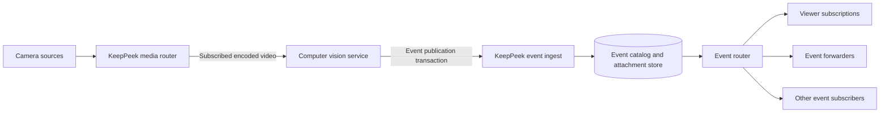
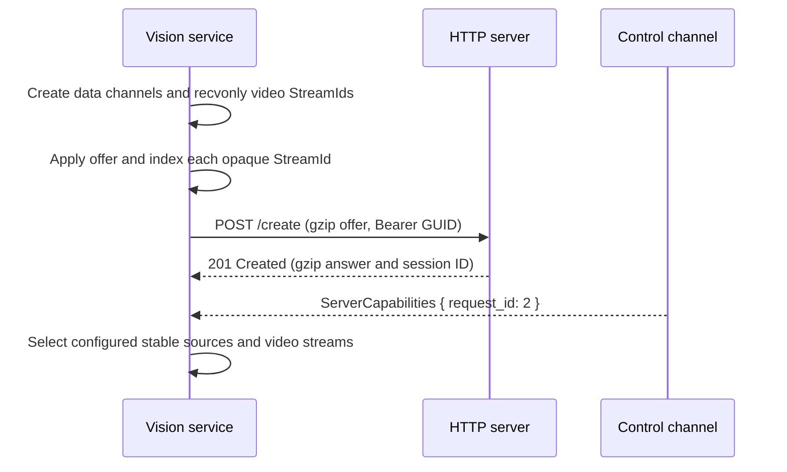
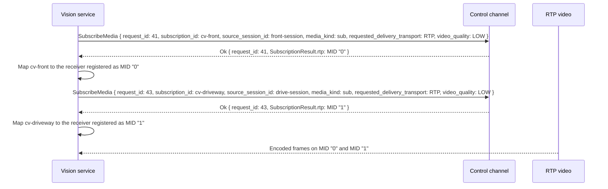
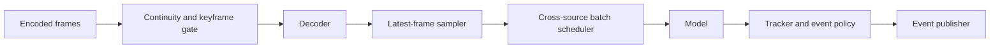
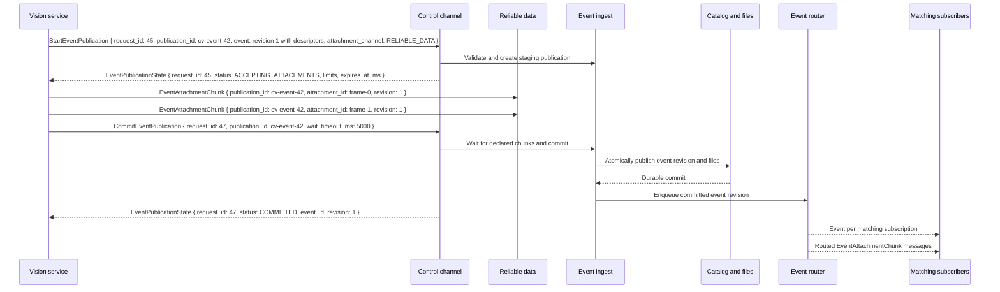
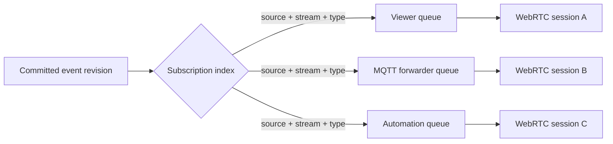

# Computer Vision Service Scenario

This scenario defines a headless computer-vision service that subscribes to one or more KeepPeek
video streams, decodes selected frames, runs object detection or picture-description models, and
publishes durable events back to KeepPeek. KeepPeek owns event validation, storage, and fanout;
the model service never writes the recording database or event directories directly.

The same service shape supports several workloads:

- Object detection that creates and updates person, vehicle, animal, or motion events.
- Picture description that emits text for selected frames.
- Story generation that emits summary text plus an ordered set of JPEG frames.
- Specialized models that add confidence, bounding boxes, zones, or structured payload fields.

## System boundary

KeepPeek remains the media and event authority. The computer-vision service is a replaceable
consumer and producer: it consumes encoded video, produces event revisions, and can restart
without interrupting recording or live viewing.

The service is responsible for decode, sampling, inference, tracking, event formation, JPEG
encoding, and publication retry. KeepPeek is responsible for source authorization, event
identity and revision validation, attachment limits, atomic persistence, timeline queries,
capability updates, and subscriber routing.

This repository owns the vendor-neutral API, server-side enforcement, conformance fixtures, and
small implementation examples. Detector products, model services, provider integrations, and
deployment tooling remain independent API clients outside this repository. An example demonstrates
interoperability; it does not define a supported detector product or product roadmap.

## Discover and subscribe to media

The service establishes the standard HTTP/WebRTC session and creates all three pre-negotiated
data channels. Its initial offer includes one `recvonly` video transceiver or native RTP section
for each configured concurrent input; there is no later renegotiation. After applying or creating
the offer, it records every exact MID in a session-local `StreamId` registry. It may omit every
audio section and both `sendonly` media sections because it consumes video and publishes events
rather than media.

The service maps stable `source_id` values from configuration to the current
`source_session_id`. A source restart changes the session ID and requires a new media
subscription, but it does not change event or model identity. Sources without a stable ID are
not eligible for durable computer-vision events.

KeepPeek configuration declares the output event types and attachment capabilities accepted from
each model profile before the service publishes. Those configured outputs appear in
`SourceCapability.event_types`; this initial protocol does not let a model invent an unadvertised
event type dynamically. A configuration or model-profile change updates capabilities before the
new output is accepted.

For each selected source, the service requests one video stream. RTP is preferred when an
available codec can be decoded locally. Media over `reliable-data` or `unreliable-data` is a
fallback when RTP is unavailable. The service generally selects a low or substream rendition for
continuous inference and uses the event attachment policy, not a second continuously decoded main
stream, to control JPEG cost.

Each accepted subscription retains its source ID, source-session ID, stream ID, codec, and
delivery binding. The example `StreamId` values are opaque strings: their characters and order do
not identify the cameras. The service uses `subscription_id -> StreamId` and
`StreamId -> receiver` maps and rebuilds both after reconnecting. Capability removal,
source-session replacement, codec change, or
subscription error tears down only that source pipeline. Other source pipelines continue.

## Decode and inference pipeline

Each source has a small ingress and decode state, while model execution can be shared across
sources:

The encoded queue and decoded-frame queue are bounded. When inference is slower than input, the
sampler replaces stale unprocessed frames with newer frames instead of building latency. Video
continuity loss resets the decoder to its keyframe gate. A data-channel codec configuration
revision is applied before its frames; an RTP decoder follows negotiated codec and parameter-set
changes.

The sampler preserves the source presentation timestamp and selects at most the configured
inference frame rate. A shared scheduler can batch frames from several sources for GPU or
accelerator efficiency, but it applies per-source fairness so a busy camera cannot starve another
camera. Batches carry source and stream identity through preprocessing and postprocessing.

The model layer returns typed detections or descriptions rather than publishing directly. A
result can contain object class, confidence, bounding box, segmentation or keypoint payloads,
description text, and model provenance such as model name and version. The tracker converts raw
frame results into event lifecycles and suppresses frame-by-frame duplicate events.

## Form event revisions

The tracker generates a globally unique event ID when a logical event starts. Revision one
creates it. Later revisions can update confidence or text, close the event with an end timestamp,
or add story frames. Revisions are strictly increasing for one event ID.

| Model output               | Event shape                                                                                            |
| -------------------------- | ------------------------------------------------------------------------------------------------------ |
| Object or motion detection | Event type, confidence, bounding box, optional zone and structured object payload                      |
| Picture description        | Event type such as `scene_description`, normalized text, model provenance, and optionally one JPEG     |
| Motion snapshot            | One required `snapshot` attachment with `minimum_count: 1` and `maximum_count: 1`                      |
| Story                      | Summary text and multiple `story-frame` JPEG descriptors ordered by ordinal and timestamped at capture |

The service chooses event-level frames deliberately. It does not encode every inference frame as
a JPEG. A motion event normally selects the clearest frame near peak confidence. A story selects
a bounded set of visually distinct frames that cover the event interval. Attachment ordinals
define presentation order; capture timestamps preserve their relation to the recording timeline.

JPEGs are encoded within the configured model-profile dimensions and the byte limits returned by
`EventPublicationState`. The descriptor byte length is the encoded length, not the decoded image
size. Text is treated as untrusted model output: it is length-limited, valid UTF-8, and never used
as an event ID, path, topic, or query.

## Publish an event atomically

Text-only events may use envelope-only `PublishEvent`. Any event with attachments uses the
two-phase event publication transaction so subscribers cannot observe metadata whose pictures
failed to store.

The service starts a publication with a complete event-revision snapshot and descriptor list.
KeepPeek validates the active source, stable source ID, associated stream, event type, revision,
content types, attachment counts, and requested channel. The service waits for
`ACCEPTING_ATTACHMENTS`, then uploads every attachment over the accepted binary channel and sends
commit with a bounded `wait_timeout_ms`. Attachment-bearing publications always request
`RELIABLE_DATA`.

An attachment-count mismatch is a model-policy error, not a transport retry. For example, a
motion profile advertising exactly one snapshot must fix or discard a result containing zero or
two snapshot descriptors before starting another publication.

The commit response is the service's durability boundary. Before `COMMITTED`, it may retry the
same commit request after a timeout. After `COMMITTED`, repeating commit returns the same state.
The service must not generate a new event ID merely because a response was lost.

KeepPeek stores the publication ID and a versioned SHA-256 fingerprint of the canonical event
metadata and JPEG bytes with the current event revision. An exact retry after an API reconnect or
server restart returns `COMMITTED` without another catalog revision or live fanout. Reusing the
same event revision with different metadata, attachment bytes, or publication ID returns a revision
conflict.

If inference is cancelled, the source disappears, or encoding fails before commit, the service
sends `AbortEventPublication`. On process death, KeepPeek expires and removes staged bytes at the
state's `expires_at_ms`. A revision conflict causes the service to reload or abandon its local
event state using `EventPublicationError.current_revision` rather than overwriting a newer stored
revision. The service publishes only against the source-session and stream mapping held by its
active media subscription; a source-session replacement aborts any staging publication for the
old mapping.

## Event ingest and storage

The current event catalog has one mutable event row and one thumbnail filename. Supporting model
text, revisions, and stories requires normalizing event history and attachments rather than
adding more JPEG columns.

| Store            | Minimum fields                                                                                                                   |
| ---------------- | -------------------------------------------------------------------------------------------------------------------------------- |
| Event identity   | Event ID, stable source ID, optional stream ID, origin, event type, current revision                                             |
| Event revision   | Event ID, revision, start/end timestamps, confidence, bounding box, zone, text, structured payload, model provenance             |
| Event attachment | Event ID, revision, attachment ID, type, content type, ordinal, capture timestamp, caption, byte length, checksum, relative path |

Recommended keys are `(event_id, revision)` for immutable revision records and
`(event_id, revision, attachment_id)` for attachments. Timeline indexes cover stable source ID,
stream ID, event type, and start/end timestamps. The event identity row points to the current
revision, while older revisions remain available for diagnostics and idempotency.

Attachment bytes are staged under a publication-specific temporary directory on the same volume
as the final attachment store. Commit validates all declared lengths and content types, fsyncs
completed staging files, atomically renames them into a revision-specific final directory, and
commits the catalog transaction. A crash before the database commit can leave unreferenced final
files; startup reconciliation removes those files. A committed catalog row never points to a
staging path.

The server acknowledges `COMMITTED` only after the event revision and attachment rows are durable
and every final file exists. Attachment retention removes files and their catalog references
together. A timeline query always returns the current revision's text and descriptors; optional
JPEG transfer reads the referenced attachment rows in ordinal order.

## Event router and pub/sub

The event router is the only live fanout path. It receives committed event revisions from camera
ingest, KeepPeek detection, computer-vision publications, and other approved producers. Producers
do not enumerate subscribers and do not send directly to viewers or MQTT forwarders.

The router indexes active `EventSubscriptionRequest` values by stable source ID, optional stream
ID, event type, and attachment route. Empty filters are wildcards. A committed event matches a
subscription only when every nonempty source, stream, and type filter matches. A subscriber gets
one `Event` containing its subscription ID and the complete descriptor list for attachment
routes accepted by that subscription.

Metadata fanout follows commit order within one subscription. Attachments can arrive before or
after their control envelope because SCTP streams are independently ordered, so event ID,
revision, and attachment ID remain the join keys. Reliable routes send every chunk; unreliable
routes may drop replaceable images but never change the reliable event envelope.

Each subscriber has a bounded queue and independent send budget. A slow viewer or disconnected
forwarder cannot block event ingest, catalog commit, another subscriber, or the computer-vision
publisher. If a reliable subscriber cannot keep up, KeepPeek closes that event subscription or
API session and records the failed delivery. The client reconnects and uses
`QueryStoredMediaTimeline` to backfill persisted events and JPEGs.

A successful event-subscription replacement invalidates deliveries selected by the previous
filters and removes their queued envelopes and attachment chunks. A source-session replacement
closes API sessions whose explicit event filters named that source; wildcard subscriptions remain
eligible for the replacement source. Reconnected clients establish fresh subscriptions and use the
returned backfill boundary to cover the transition.

Subscriber acknowledgements confirm receipt of `Event`; they do not control event commit
and cannot roll it back. Attachment delivery has no database side effects. Router queue contents
are disposable because the catalog and attachment store are the recovery source of truth.

When a configured computer-vision output introduces or removes an event type or attachment
capability, KeepPeek updates the affected `SourceCapability` entries and sends a complete
`ServerCapabilities` snapshot before routing that output type. Existing wildcard subscriptions
continue to match. Clients with explicit filters can update their subscriptions after the
capability change and use timeline backfill for any event committed during the transition.

## Multiple streams and service replicas

One process can subscribe to many streams, but its model scheduler and publication staging limits
are bounded independently. Configuration sets maximum active streams, decoders, in-flight model
batches, staged publications, and attachment bytes. Admission rejects or delays a new source
pipeline before those limits are exceeded.

Two service replicas must not independently process the same source and model profile unless
duplicate detections are intentional. The initial design assigns each `(source_id, media_kind,
model_profile)` tuple to one service instance through static configuration or an external lease.
Event payload provenance records model name, version, profile, and service instance for diagnosis;
it does not replace the globally unique event ID.

## Failure and recovery

The design isolates failures at explicit boundaries:

- Media loss resets only the affected decoder and waits for a keyframe.
- Model overload drops stale sampled frames and reports lag instead of increasing latency without bound.
- Model failure produces no event publication; recording and other source pipelines continue.
- Attachment encoding or upload failure aborts the publication, leaving no visible partial event.
- Database or filesystem failure rejects commit and prevents router fanout.
- Lost commit responses are retried with the same publication ID.
- Service restart recreates media subscriptions and resumes new detections; persisted event revisions prevent accidental overwrite.
- Slow subscribers are disconnected or backfilled without applying pressure to event producers.

An open detection whose tracker state is lost on service restart is closed by a configurable
server-side stale-event policy or by a recovery revision from persisted service state. It is not
left open forever silently.

## Security and resource controls

The service authenticates with a dedicated named Administrator credential and uses encrypted
transport outside an explicitly trusted local network. A User credential may read media but cannot
publish events. Per-source and per-event-type credential scopes are not implemented, so use a
separate credential for each third-party model service and revoke it when the service is removed.

KeepPeek validates source ownership, event type, monotonic revision, UTF-8 and text length,
bounding-box values, descriptor counts, content types, per-file bytes, aggregate event bytes,
chunk counts, and publication expiry. Filenames and paths are server-generated from safe IDs;
model text and payload values never become paths.

Atomic attachment publication admits at most four active publications and 64 distinct publication
IDs per API session, with 64 active publications and 256 retained IDs across the server. Committed,
aborted, and expired IDs remain terminal tombstones until their API session closes, so an ID cannot
be reused with different content. A client that reaches its connection's ID quota closes that
session and reconnects before it starts another atomic publication. Envelope-only `PublishEvent`
does not use this attachment-publication registry.

The vision service enforces its own decode dimensions, model input limits, JPEG dimensions and
quality, GPU memory budget, and per-source frame rate. It does not log frame pixels, JPEG bytes,
access keys, or unrestricted model descriptions.

## Observability

Service metrics include active source pipelines, encoded and decoded queue depth, sampled and
dropped frames, decode resets, inference batch size and latency, per-source processing lag,
detections by type, active trackers, JPEG encode time and bytes, publication stage/commit latency,
commit retries, and model failures.

Server Prometheus metrics use the `keeppeek_external_analysis_` prefix. Gauges report active API
sessions, media subscriptions, event subscriptions, staged publications and bytes, and current
event-delivery queue depth and reserved bytes. Lifetime counters report subscription admissions,
rejections, matches and sheds; publication starts, durable commits, aborts, expiry, rejections and
storage failures; and delivery queue admissions and drops. Queue depth and reserved bytes also have
lifetime high-water gauges. Durable publication latency is retained in a bounded 256-sample window
and exported in milliseconds with only `quantile="p50"` and `quantile="p95"` labels. Metrics never
use source, event, publication, subscription, credential, or payload values as labels.

Logs correlate source ID, stream ID, event ID, revision, and publication ID without dumping image
or model payload contents.

The deterministic conformance test also scans server, camera, client, browser, and metrics output.
It rejects raw, hexadecimal, base64, or decimal disclosure of fixed access-key, structured-payload,
JPEG-comment, and source-frame probes. It also rejects complete ICE password or username lines.

## Acceptance scenarios

The implementation is complete when these behaviors pass end to end:

1. One service decodes two camera streams concurrently without stale-frame queue growth.
2. A motion detection commits one event and exactly one required JPEG.
3. A picture description commits text without requiring an image.
4. A story commits ordered JPEGs and the timeline returns the same descriptor order and bytes.
5. No subscriber receives an event before its database and attachment commit succeeds.
6. Viewer and MQTT subscriptions filtered to the source and stream both receive the committed event.
7. One stalled subscriber does not delay commit or another subscriber.
8. A service crash before commit leaves no visible event and staged files are reaped.
9. A lost commit response is retried without creating a duplicate revision.
10. A disconnected subscriber backfills the event, text, and all retained JPEGs from the timeline.
