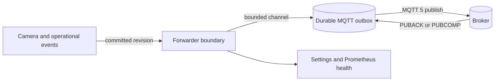

# MQTT 5 Event Forwarder

KeepPeek can publish committed event revisions and selected operational health transitions to an
MQTT 5 broker. The forwarder is a supervised integration runtime with its own bounded ingestion
queue, durable outbox, broker connection, and health state. Camera ingest and recording never
perform broker I/O.

MQTT 5 is required. MQTT 3.1 and 3.1.1 are not negotiated, accepted as fallbacks, or supported.
A broker that rejects protocol level 5 leaves the integration degraded with an actionable protocol
error.

## Architecture

The event producer first commits its event revision to KeepPeek storage. It then hands a normalized
snapshot to the forwarder through a bounded local channel. A dedicated outbox worker persists the
publication in `mqtt-forwarder.db`; a separate publisher worker owns MQTT connection, retry, and
acknowledgement processing.



The publisher sends one durable item at a time. Network stalls cannot consume unbounded memory or
block camera workers on broker I/O. Configuration changes replace only the broker session; camera
workers continue unchanged.

## Configuration

Settings can configure, test, observe, and disable the integration. The same configuration is
stored under `[event_forwarder.mqtt]` in `config.toml`:

```toml
[event_forwarder.mqtt]
enabled = true
broker_url = "mqtts://broker.home.example:8883"
client_id = "keeppeek"
instance_id = "home-nvr"
forwarder_id = "mqtt"
topic_prefix = "keeppeek"
username = "keeppeek"
password = "{secret:MQTT_PASSWORD}"
tls_ca_path = "/etc/keeppeek/mqtt-ca.pem"
qos = 1
retain_events = false
retain_health = true
outbox_max_mb = 64
retry_min_ms = 250
retry_max_ms = 30000
```

| Setting                         | Meaning                                                                 | Default                 |
| ------------------------------- | ----------------------------------------------------------------------- | ----------------------- |
| `enabled`                       | Starts broker delivery while retaining queued work when disabled        | `false`                 |
| `broker_url`                    | `mqtt://` or `mqtts://` authority; URL credentials are rejected         | `mqtt://127.0.0.1:1883` |
| `client_id`                     | Stable MQTT 5 client identity                                           | `keeppeek`              |
| `instance_id`                   | Stable KeepPeek identity used in topics and payloads                    | `home-nvr`              |
| `forwarder_id`                  | Stable integration identity used by the status topic                    | `mqtt`                  |
| `topic_prefix`                  | Static root without `/`, `+`, or `#` at either end                      | `keeppeek`              |
| `username` / `password`         | Optional broker credentials; the password is write-only in Settings     | unset                   |
| `tls_ca_path`                   | Optional PEM CA trust for `mqtts://`; system trust is used when omitted | unset                   |
| `qos`                           | MQTT 5 QoS `0`, `1`, or `2`                                             | `1`                     |
| `retain_events`                 | Retain event snapshots on their event-type topic                        | `false`                 |
| `retain_health`                 | Retain forwarder connection/delivery status                             | `true`                  |
| `outbox_max_mb`                 | Maximum durable pending publication bytes                               | `64`                    |
| `retry_min_ms` / `retry_max_ms` | Bounded exponential reconnect delay                                     | `250` / `30000`         |

The Settings UI sends management operations over the authenticated WebRTC control channel using
the existing `StateStoreCommand` envelope and the `keeppeek.integrations.mqtt` namespace. It does
not add public HTTP endpoints. MQTT management requires the Administrator role.

A connection test uses a unique temporary client ID, publishes a non-retained test status, and
completes a graceful MQTT 5 disconnect. It cannot evict the live client or leave a false retained
Last Will.

## Topics

Every dynamic topic segment is percent-encoded. A source ID such as `front/door` becomes
`front%2Fdoor`, so it remains one MQTT topic level and cannot inject `/`, `+`, or `#` semantics.

| Purpose          | Default topic                                                    | Retained by default |
| ---------------- | ---------------------------------------------------------------- | ------------------- |
| Event revision   | `keeppeek/{instance_id}/sources/{source_id}/events/{event_type}` | No                  |
| Forwarder status | `keeppeek/{instance_id}/forwarders/{forwarder_id}/status`        | Yes                 |

Camera outage and recovery records use the event topic with event types such as `camera_offline`,
`stream_stale`, `decode_unavailable`, and `recording_interrupted`. The status topic reports the
server-owned forwarder connection and delivery health.

## Event payload

Every event publication is a complete, versioned snapshot. Revision `1` creates an event; later
revisions update or end it. Consumers deduplicate with `(instance_id, event_id, revision)`.

```json
{
  "schema_version": 1,
  "instance_id": "home-nvr",
  "event_id": "motion-42",
  "revision": 2,
  "transition": "ended",
  "source_id": "front-door",
  "media_kind": "sub",
  "origin": "camera",
  "event_type": "motion",
  "timestamp_ms": 1786800006500,
  "start_timestamp_ms": 1786800000000,
  "end_timestamp_ms": 1786800006500,
  "confidence": 0.94,
  "zone": "porch",
  "bounding_box": {
    "x": 0.31,
    "y": 0.16,
    "width": 0.22,
    "height": 0.71
  },
  "payload": {
    "icon_key": "motion",
    "bounding_box_attachment_id": "snapshot-0",
    "canonical_attachment_id": "snapshot-0"
  },
  "attachments": [
    {
      "attachment_id": "snapshot-0",
      "attachment_type": "thumbnail",
      "content_type": "image/jpeg",
      "ordinal": 0,
      "byte_len": 24576,
      "timestamp_ms": 1786800000000,
      "status": "available"
    }
  ]
}
```

Optional fields are omitted rather than synthesized. Attachment descriptors report normalized
metadata and local availability; this MQTT profile does not publish image bytes.

Operational health uses the same envelope. Its `payload` includes bounded diagnostic evidence:

```json
{
  "schema_version": 1,
  "instance_id": "home-nvr",
  "event_id": "camera-offline-front-door-1786800100000",
  "revision": 3,
  "transition": "ended",
  "source_id": "front-door",
  "origin": "keeppeek",
  "event_type": "camera_offline",
  "timestamp_ms": 1786800165000,
  "start_timestamp_ms": 1786800100000,
  "end_timestamp_ms": 1786800165000,
  "payload": {
    "severity": "critical",
    "cause": "transport_unavailable",
    "explanation": "No configured camera stream is connected",
    "affected_streams": ["main", "sub"],
    "recording_interrupted": true,
    "evidence_source": "camera_health",
    "duration_ms": 65000
  }
}
```

## MQTT 5 properties

JSON publications set these MQTT 5 properties:

- Payload Format Indicator: UTF-8 (`1`)
- Content Type: `application/json`
- Correlation Data: stable event ID for event revisions, forwarder ID for status
- User Property: `schema-version=1`

The connection uses `clean_start = false`, a 24-hour session-expiry interval, one in-flight
publication, and a retained Last Will whose state is `disconnected`. A graceful shutdown publishes
the same disconnected status and polls the MQTT 5 DISCONNECT packet before closing.

QoS controls broker acknowledgement semantics. QoS 1 is the default. QoS 0 has no broker
acknowledgement and therefore cannot provide the default at-least-once guarantee. QoS 2 improves
transport deduplication, but application consumers must still deduplicate by event ID and revision
because process crashes can occur around receipt persistence.

## Delivery and recovery

The outbox key is `event:{instance_id}:{event_id}:{revision}`. An event revision remains pending
until the matching MQTT 5 acknowledgement is observed. A bounded receipt ledger retains the most
recent 100,000 delivered keys so reconnect overlap and producer retries remain duplicate-safe after
outbox deletion and process restart.

The default outbox limit is 64 MiB. Capacity is checked in the same immediate transaction that
inserts a publication. The in-memory ingestion channel holds at most 256 commands. If the limit is
reached, the forwarder enters `outbox_full`, refuses additional forwarding work visibly, and leaves
camera/event persistence operating independently.

Connection retries start at 250 ms and double to a 30-second ceiling. After the broker restarts,
the publisher reconnects and drains the same durable rows in sequence. The default QoS 1 path is
at least once: a crash after broker acknowledgement but before the local receipt commit can publish
the same `(event_id, revision)` again.

## Security

- Use `mqtts://` outside explicitly trusted local development networks.
- A custom CA file must be PEM encoded and is accepted only with `mqtts://`.
- Broker credentials are separate fields; credentials embedded in the URL are rejected.
- Settings never returns a password. It reports only `password_configured`.
- Password values are stored in owner-only `secrets.toml` as `MQTT_PASSWORD`; `config.toml` keeps
  only `{secret:MQTT_PASSWORD}`.
- `KEEPPEEK_SECRET_MQTT_PASSWORD` can provide an environment override.
- Broker URLs, credentials, certificate paths, event text, and payload bytes are not copied into
  connection-health errors.
- Authentication failures report `MQTT broker rejected the configured credentials.`
- TLS failures report `MQTT TLS validation failed; verify the broker hostname and CA trust.`

Plain local development configuration is intentionally supported:

```toml
[event_forwarder.mqtt]
enabled = true
broker_url = "mqtt://127.0.0.1:1883"
```

## Health and metrics

Settings shows connection state, redacted detail, pending item/byte counts, last received and
forwarded timestamps, retry count, and the configured outbox limit. `/metrics` exports:

- `keeppeek_mqtt_forwarder_enabled`
- `keeppeek_mqtt_forwarder_connected`
- `keeppeek_mqtt_forwarder_outbox_items`
- `keeppeek_mqtt_forwarder_outbox_bytes`
- `keeppeek_mqtt_forwarder_outbox_limit_bytes`
- `keeppeek_mqtt_forwarder_retries_total`
- `keeppeek_mqtt_forwarder_duplicates_total`
- `keeppeek_mqtt_forwarder_last_received_timestamp_seconds`
- `keeppeek_mqtt_forwarder_last_delivered_timestamp_seconds`
- `keeppeek_mqtt_forwarder_oldest_unacknowledged_timestamp_seconds`

## Home Assistant

A Home Assistant automation can react to any motion revision:

```yaml
automation:
  - alias: KeepPeek front-door motion
    triggers:
      - trigger: mqtt
        topic: keeppeek/home-nvr/sources/front-door/events/motion
    conditions:
      - condition: template
        value_template: >-
          {{ trigger.payload_json.schema_version == 1
             and trigger.payload_json.transition == 'created' }}
    actions:
      - action: light.turn_on
        target:
          entity_id: light.porch
```

The retained forwarder status can be exposed as a sensor:

```yaml
mqtt:
  sensor:
    - name: KeepPeek MQTT forwarder
      unique_id: keeppeek_mqtt_forwarder
      state_topic: keeppeek/home-nvr/forwarders/mqtt/status
      value_template: "{{ value_json.state }}"
      json_attributes_topic: keeppeek/home-nvr/forwarders/mqtt/status
```

Use a dedicated broker account with publish access limited to the configured topic prefix. Home
Assistant only needs subscribe access to the topics its automations consume.
