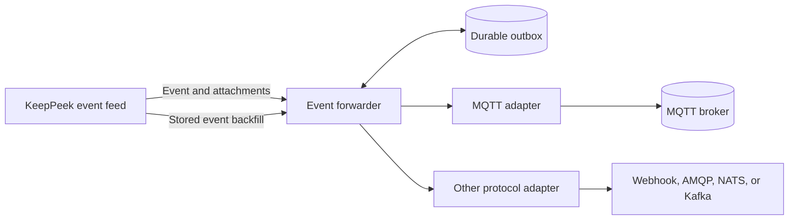
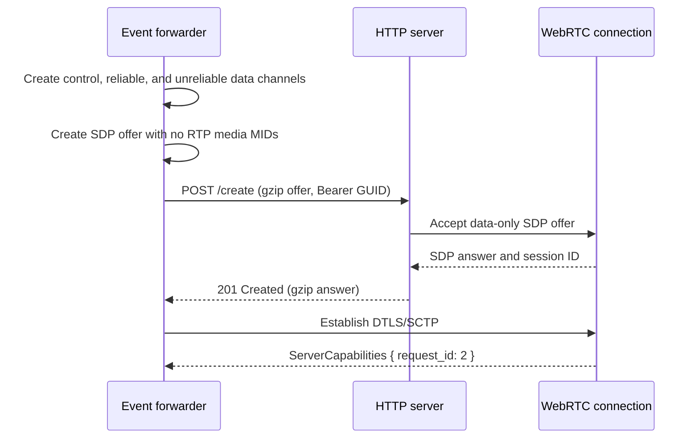
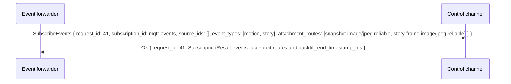
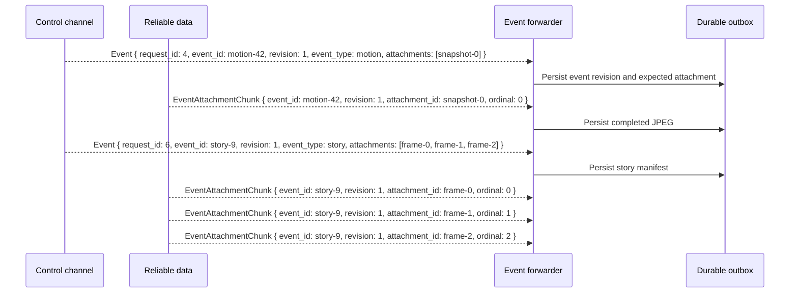
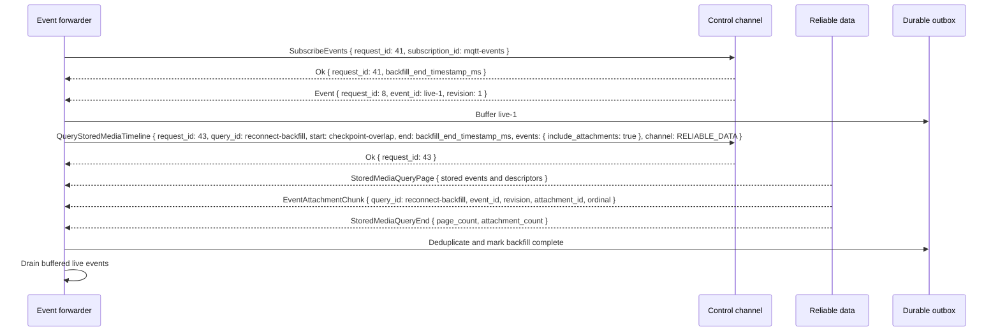

# Event Forwarder Scenario

This scenario defines a small headless service that forwards KeepPeek detections to MQTT or
another event protocol. It receives structured events, optional text, and optional attachments
such as JPEGs. It never subscribes to audio or video and never opens a stored-media playback
cursor.

MQTT is the concrete example below. The connection, normalization, persistence, deduplication,
and backfill behavior is shared by webhook, AMQP, NATS, Kafka, or other sink adapters.

## Responsibilities

The forwarder has four responsibilities:

1. Subscribe to selected live event types and attachment routes.
2. Normalize live and stored events into one downstream shape.
3. Persist an outbox before acknowledging live events.
4. Deliver at least once and backfill disconnect gaps from the stored event timeline.

Media is explicitly out of scope. The forwarder does not offer RTP MIDs, send stream
`SubscriptionRequest` messages, decode JPEGs, or request MP4 fragments. JPEG payloads remain
opaque bytes from KeepPeek to the downstream sink.



## Connect without media

The forwarder creates the three required pre-negotiated data channels but omits every optional
audio and video MID from its SDP offer. The offer therefore contains the SCTP application section
and no RTP media sections. `control-channel` carries capabilities and event envelopes;
`reliable-data` carries requested text or JPEG attachments. The forwarder may create
`unreliable-data` without routing anything to it.



The forwarder indexes `SourceCapability` entries by stable `source_id`, while retaining the
current `source_session_id` for diagnostics. It reads each `EventType` and its attachment
capabilities before building a subscription. A capability with `minimum_count: 1` and
`maximum_count: 1` requires one motion snapshot. A story-frame capability can advertise a larger
range or a zero maximum when the source has no fixed story length.

Durable forwarding requires a nonempty stable source ID. By default, the forwarder skips an
ephemeral source that exposes only `source_session_id` and reports it as unsupported. A
best-effort deployment may opt into session-ID topics, but those topics cannot preserve identity
across source reconnects.

## Subscribe to events

One `EventSubscriptionRequest` can select multiple stable sources, streams, and event types.
Empty source, stream, and event-type lists select all advertised values and continue to include
newly connected sources. The forwarder requests only attachment pairs it understands. A
metadata-only deployment sends no attachment routes.

The MQTT profile requests `image/jpeg` and optional `text/plain` attachments on
`reliable-data`. KeepPeek either accepts each exact route or rejects the subscription; the
forwarder never assumes a fallback channel or content type.



The subscription ID is stable for the lifetime of the WebRTC connection. On a capability change,
the forwarder compares the complete snapshot with its requested filters. It replaces the
subscription only when a selected source, event type, or attachment route changed.

## Event shapes

Every live `Event` is a complete event snapshot for one revision. Revision one creates the
event. A higher revision can close it, change normalized fields, add text, or add story frames.
The downstream idempotency key is `(KeepPeek instance, event_id, revision)`, not only `event_id`.
The descriptor list is complete for the accepted routes at that revision, so it also defines the
exact set of attachments the forwarder expects.

| Shape        | Envelope                                                   | Attachments                                               |
| ------------ | ---------------------------------------------------------- | --------------------------------------------------------- |
| Text only    | Typed event fields and optional `text`/structured payload  | None                                                      |
| Motion event | Event fields, object details, and one snapshot descriptor  | One `image/jpeg` at ordinal `0`                           |
| Story event  | Event fields, summary text, and an ordered descriptor list | Multiple `image/jpeg` story frames with ordinals `0..n-1` |

A story frame is an independent attachment, not one concatenated image blob. Each frame has its
own attachment ID, capture timestamp, optional caption, byte length, and chunk sequence. This lets
an MQTT consumer display the first frame immediately, detect a missing frame, or process the
story incrementally while preserving its intended order.
Ordinal defines display order. Capture timestamps are informational and are not required to be
monotonic when a source deliberately tells a different story order.

For readability, the sequence labels below show only fields relevant to each transition; every
wire message contains the complete fields defined in [webrtc.proto](../api/webrtc.proto).



Control and reliable data streams are ordered independently. The forwarder accepts attachment
chunks before or after their `Event` and joins them by subscription ID, event ID, event
revision, and attachment ID. It enforces the advertised byte length when present, limits total
spool size, and rejects inconsistent chunks rather than forwarding a corrupt JPEG.

## Normalized record

All sink adapters consume the same internal record. It contains the typed event fields,
extensible payload, and complete attachment descriptors. It never contains base64 JPEG data.
`instance_id` is configured for the KeepPeek connection and added locally; it is not repeated in
each WebRTC message.

```json
{
  "schema_version": 1,
  "instance_id": "home-nvr",
  "event_id": "story-9",
  "revision": 1,
  "source_id": "front-door",
  "source_session_id": "front-door-session-17",
  "media_kind": "sub",
  "origin": "camera",
  "event_type": "story",
  "start_time": 1786800000000,
  "end_timestamp_ms": 1786800006500,
  "attachment_deadline_ms": 1786800036500,
  "confidence": 0.94,
  "zone": "porch",
  "text": "A person walked from the gate to the front door.",
  "bounding_box": {
    "x": 0.31,
    "y": 0.16,
    "width": 0.22,
    "height": 0.71
  },
  "payload": {
    "object_class": "person"
  },
  "attachments": [
    {
      "attachment_id": "frame-0",
      "attachment_type": "story-frame",
      "content_type": "image/jpeg",
      "ordinal": 0,
      "timestamp_ms": 1786800000000,
      "status": "pending"
    },
    {
      "attachment_id": "frame-1",
      "attachment_type": "story-frame",
      "content_type": "image/jpeg",
      "ordinal": 1,
      "timestamp_ms": 1786800003200,
      "status": "pending"
    }
  ]
}
```

Missing optional fields are omitted rather than synthesized. Unknown structured payload fields
are retained. Sink adapters may add transport metadata, but they do not rename or reinterpret the
normalized event fields.

## MQTT mapping

The MQTT adapter uses configurable topic templates. Every dynamic topic segment is percent-encoded
so source or event IDs cannot inject MQTT wildcards or extra hierarchy levels.

| Purpose          | Default topic                                                                                   | Payload                                                                       |
| ---------------- | ----------------------------------------------------------------------------------------------- | ----------------------------------------------------------------------------- |
| Event revision   | `keeppeek/{instance_id}/sources/{source_id}/events/{event_type}`                                | Normalized JSON record                                                        |
| Attachment       | `keeppeek/{instance_id}/sources/{source_id}/events/{event_id}/{revision}/attachments/{ordinal}` | Raw attachment bytes                                                          |
| Delivery result  | `keeppeek/{instance_id}/sources/{source_id}/events/{event_id}/{revision}/delivery`              | JSON `complete` or `partial` result with delivered and missing attachment IDs |
| Forwarder status | `keeppeek/{instance_id}/forwarders/{forwarder_id}/status`                                       | Small JSON status document                                                    |

Event and attachment publications default to QoS 1 with `retain = false`. Status defaults to QoS
1 with `retain = true` and uses the MQTT last-will mechanism to report an unclean disconnect.
MQTT v5 publications set Content Type, Payload Format Indicator for JSON or text, and Correlation
Data containing the event ID. MQTT 3 clients receive the same topic and payload structure without
properties.

The adapter publishes the event manifest before its attachments. The manifest lists every
expected attachment, so consumers know whether a motion event is complete after one JPEG or a
story is complete after several. MQTT has no multi-message transaction. After every expected
attachment is acknowledged, or after the configured attachment deadline expires, the adapter
publishes the delivery-result topic. Consumers requiring a complete story wait for that bounded
result rather than waiting forever. A later event revision is a new manifest and does not mutate
a previously consumed MQTT packet.

MQTT QoS does not guarantee arrival order across different topics. Consumers must not infer state
from seeing the manifest or an attachment first. The delivery-result message, keyed by event ID
and revision and listing delivered and missing attachment IDs, is the authoritative completion
state. A consumer buffers any attachment that arrives before its manifest and resolves both when
the delivery result arrives.

## Delivery semantics

The forwarder provides at-least-once delivery when its durable outbox is enabled and KeepPeek has
retained the corresponding event in its timeline catalog. It does not claim exactly-once delivery.
MQTT QoS 1, reconnect replay, and process crashes can produce duplicates.

The outbox uses these deduplication keys:

- Event: `(instance_id, event_id, revision)`
- Attachment: `(instance_id, event_id, revision, attachment_id)`

The forwarder persists an `Event` before returning its protocol `Ok`. Attachment chunks are
spooled to bounded files and atomically promoted only after complete reassembly and validation.
The event and each attachment remain in the outbox until the sink acknowledges them. Checkpoints
advance after the event manifest, all attachments completed before the deadline, and the final
complete or partial delivery result are acknowledged.

`max_attachment_wait_ms` is a configurable per-event-revision deadline that starts when the
envelope is durably stored. At expiry, the forwarder deletes incomplete temporary chunks, marks
their attachment IDs missing, publishes a partial delivery result, and continues processing other
events. A late complete attachment may still be published and followed by an updated complete
delivery result. One incomplete story never blocks unrelated events or the whole outbox.

If the spool limit is reached, the forwarder stops accepting new work, reports unhealthy status,
expires incomplete attachments to free bounded temporary space, and reconnects after capacity is
available. It does not acknowledge and silently drop events. Recovery depends on stored-event
backfill, so operators must size event and thumbnail retention longer than the maximum expected
outage.

## Reconnect and backfill

The forwarder subscribes to the live event feed before starting a backfill query and buffers new
live events in its outbox. The accepted `EventSubscriptionDelivery.backfill_end_timestamp_ms` is
the exclusive end of the reconnect query. The query starts at the last committed timestamp minus
a configurable overlap, uses the same source and event filters, sets `include_attachments: true`
when attachments are enabled, and uses `reliable-data`.

Stored results use the same `Event` message and `EventAttachmentChunk` transfers as their live
equivalents, so they normalize to identical records and attachment keys.
One stored motion event yields at most one JPEG; a stored story can yield
multiple JPEGs ordered by ordinal. The forwarder deduplicates backfill results against its outbox
and buffered live events, completes the query, then drains the remaining live buffer in event-time
order. The overlap is at least the checkpoint batching interval plus one millisecond and defaults
to 60 seconds. A larger overlap only creates duplicates, which event ID and revision remove; it
does not change downstream results.



On first start, the backfill range is a configured finite duration rather than the entire event
history. If KeepPeek does not retain an event or its JPEG, the forwarder delivers the available
metadata and records the missing attachment; it does not block unrelated events indefinitely.

## Other sink adapters

Sink adapters preserve the normalized record and attachment IDs while mapping transport-specific
acknowledgements:

| Sink           | Suggested mapping                                                                                                                                                         |
| -------------- | ------------------------------------------------------------------------------------------------------------------------------------------------------------------------- |
| HTTP webhook   | POST the JSON event, then attachment requests or one bounded multipart body for a complete motion/story event. Treat only configured success statuses as acknowledgement. |
| AMQP           | Publish the event and each attachment with persistent messages, event ID correlation, and publisher confirms.                                                             |
| NATS JetStream | Use event and attachment subjects derived from the MQTT topic shape and wait for stream acknowledgements.                                                                 |
| Kafka          | Key event revisions by event ID and attachments by event ID plus attachment ID; use producer acknowledgements and idempotence where available.                            |

An adapter may be disabled or retried independently, but one slow sink must not consume unbounded
memory. Multiple required sinks keep an outbox item until all have acknowledged it. Best-effort
sinks are explicitly configured and do not weaken required-sink delivery.

## Configuration and security

A deployment configures a KeepPeek URL and access-key secret reference, stable forwarder and
instance IDs, source, stream, and event filters, accepted attachment types, outbox location and
limit, attachment wait deadline, backfill overlap, and sink-specific connection settings.
Credentials are loaded from environment variables, files with restricted permissions, or a
platform secret store; they are never included in event payloads, MQTT topics, client telemetry,
or logs.

KeepPeek and broker connections use TLS outside explicitly trusted local development networks.
The forwarder validates content type, chunk counts, declared byte lengths, and configured maximum
attachment size before writing or publishing bytes. It treats text as UTF-8 only when the
advertised content type says so and never attempts to decode an `image/jpeg` merely to forward it.

Useful health signals include connection state, capability revision, last received and forwarded
event timestamps, outbox item and byte counts, incomplete attachments, duplicate count, backfill
lag, sink retry count, and oldest unacknowledged event age. Logs identify events by IDs and sizes,
not by dumping text payloads or image bytes.

## Shutdown

For a graceful shutdown, the forwarder stops accepting new sink work, unsubscribes the event
subscription, persists its current checkpoint, closes the WebRTC session with `POST /delete`, and
waits for bounded in-flight sink acknowledgements. Unacknowledged outbox items remain on disk for
the next start.
