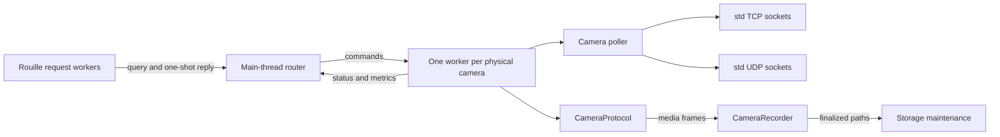

# Event-Loop Runtime

## Purpose

KeepPeek uses one process-level router and one worker thread per physical camera. The runtime separates socket readiness, protocol state, recording, HTTP request handling, and global storage maintenance. It uses no async runtime, async functions, futures, or async channels.

The design supports Retina, reo-proto, and future camera protocols through the same SANS-I/O interface. Protocol state machines consume explicit inputs and emit owned actions. They do not own sockets, wait for readiness, write recordings, use channels, or read time implicitly.

## Ownership

The process main thread owns the router, authoritative camera status, and camera join handles. It does not perform camera socket I/O, HTTP request processing, MP4 writes, or retention scans.

## Platform Support

The runtime supports Linux, macOS, and Windows using the same thread and message model. `polling::Poller::notify()` wakes epoll/poll on Linux, kqueue on macOS, and IOCP on Windows even before camera sockets are registered. Filesystem paths use `PathBuf`, networking uses standard-library TCP and UDP sockets, and platform dependencies remain behind target-specific Cargo sections.

Windows timer-resolution requests use the `windows` crate, request 1 ms timing for the process runtime, and are balanced during shutdown and early error returns. Default configuration paths use `%APPDATA%` on Windows, `~/Library/Application Support` on macOS, and `$XDG_CONFIG_HOME` or `~/.config` on Linux.

The CI build-and-test matrix runs natively on `ubuntu-latest`, `macos-latest`, and `windows-latest`. Platform support is not inferred from a Unix-host cross-compile alone.

Each physical camera worker owns:

- One `polling::Poller`.
- All enabled main and substream protocol sessions.
- All nonblocking `std::net::TcpStream` and `UdpSocket` values for that camera.
- Partial-write queues and reconnect deadlines.
- Stream statistics and camera-local recording pipelines.

RTSP profiles may use distinct sockets and protocol sessions, but one physical-camera worker multiplexes them.

## Router Messages

Standard-library MPSC channels carry commands and events. A facade sender also calls `Poller::notify()` after enqueueing a message. Notifications are wakeups, not data, and may be coalesced. Every awakened event loop therefore drains its channel through `TryRecvError::Empty`.

HTTP queries carry a `sync_channel(1)` sender. The router replies from cached state. HTTP request workers use bounded waits and map a stopped or unavailable router to a structured service error rather than waiting indefinitely.

High-rate media frames never travel through the router. Workers report lifecycle changes, errors, and periodic metric snapshots only.

## Protocol Contract

`CameraProtocol` is an object-safe state-machine interface. Inputs include startup, explicit time advancement, application commands, TCP connection results, TCP data and write completion, and UDP datagrams. Owned outputs include socket creation or closure, transmit buffers, deadlines, media frames, state transitions, and command results.

Stable socket and stream identifier newtypes decouple protocol state from operating-system handles. Output buffers use owned bytes so callers never retain a borrow into protocol state. A protocol factory creates a clean state machine after reconnect.

The worker transport driver:

1. Executes socket actions using standard TCP and UDP sockets.
2. Registers nonblocking sockets with `polling`.
3. Drains readable sockets until `WouldBlock`.
4. Preserves unwritten bytes after partial writes.
5. Deregisters a socket before dropping or replacing it.
6. Feeds I/O results and explicit time updates back into the protocol.

Retina adapts `RtspClient::handle_input` and `poll_output`. Reo-proto adapts `BcSession`. Reo-proto UDP discovery, heartbeats, and datagram handling run in the camera worker instead of a separate pump thread.

## Recording

Media emitted by a protocol goes directly to the worker's `CameraRecorder`. Recording retains the short-term idle buffer, keyframe-aligned segment rotation, H.264/H.265 handling, AAC handling, and medium/long-term layout. Live WebRTC guards and review leases bypass the idle delay for only the streams with active viewers.

`storage.write_buffer_bytes` controls each active MP4 file's userspace byte buffer. A value of zero uses direct pass-through behavior. Positive values trade memory for fewer writes to the operating system. The recorder writes initialization metadata first and flushes each completed keyframe-aligned `moof`/`mdat` fragment before publishing its byte range. Finalization flushes the final fragment before rename without remuxing. This option does not provide an `fsync` or power-loss durability policy.

Global finalized-file movement and size-limit enforcement stay in a storage-maintenance thread. Camera workers finish and finalize their recorders before maintenance shuts down.

## HTTP API

Rouille exposes only the checked-in HTTP contract: `POST /create`, `POST /delete`, `GET /logs`, and `GET /metrics`. Session creation is the sole SDP offer/answer exchange, deletion tears down the creator-owned session, logs use Server-Sent Events, and metrics use Prometheus text exposition.

Commands, state, camera configuration, typed health, live subscriptions, and stored-media queries run as protobuf messages over the negotiated WebRTC data channels. `HealthCommand.get` returns process and host CPU/memory/load, disks, network interfaces, temperatures, recording catalog and demand, WebRTC delivery, configured cameras, per-stream ingress rates and counters, and current health findings.

Each live subscription selects exactly one camera source at a time. `low` selects the substream, `high` selects the main stream, and `auto` starts on the substream while str0m estimates server-to-client capacity using TWCC or REMB. Auto mode upgrades after sustained headroom and downgrades more quickly under pressure. Source changes wait for a keyframe and preserve one outbound RTP stream; KeepPeek does not transmit main and sub concurrently to the same viewer.

Camera loops publish their existing ten-second ingress reports into a shared registry. Reports remain keyed by camera and stream so separate RTSP main/sub loops cannot overwrite each other. Configured cameras remain present when capability discovery fails; after the report warm-up they are classified offline rather than disappearing from health output.

Disconnected cameras remain visible in typed health and capability snapshots. Unsupported control commands fail closed over the control channel.

## Shutdown

Shutdown proceeds in ownership order:

1. Stop accepting new HTTP requests.
2. Notify the main-thread router.
3. Notify every camera worker.
4. Let workers drain pending protocol work and finalize active MP4 files.
5. Join camera workers and preserve panic visibility.
6. Stop storage maintenance.
7. Return from the process main thread.

## Migration

- [x] Establish typed router messages, facade wakeups, and cached status queries.
- [x] Move the router onto the process main thread.
- [x] Replace the handwritten HTTP server with Rouille.
- [ ] Add the common protocol contract and fake protocol tests.
- [ ] Add the poll-driven camera transport driver.
- [ ] Adapt Retina and reo-proto.
- [ ] Move recording pipelines into camera workers.
- [x] Add configurable MP4 byte buffering.
- [ ] Remove the central media-frame channel and protocol-specific socket loops.
- [ ] Add multi-camera TCP/UDP integration and shutdown coverage.
