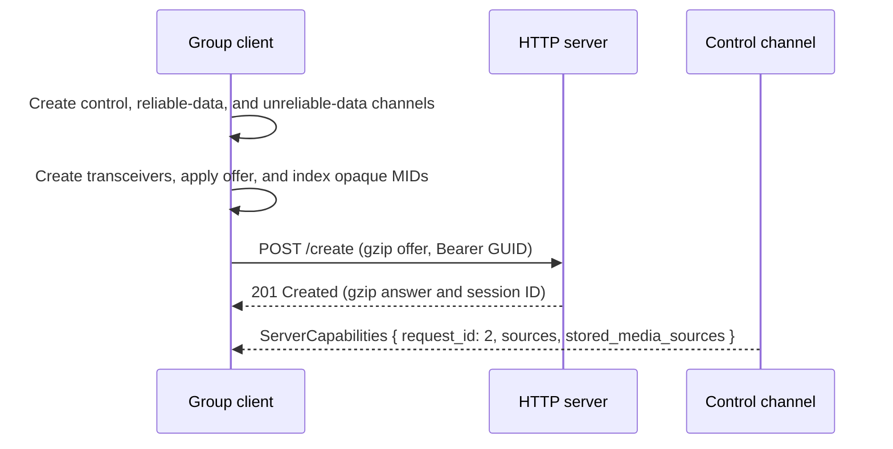
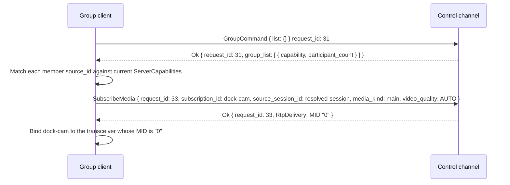
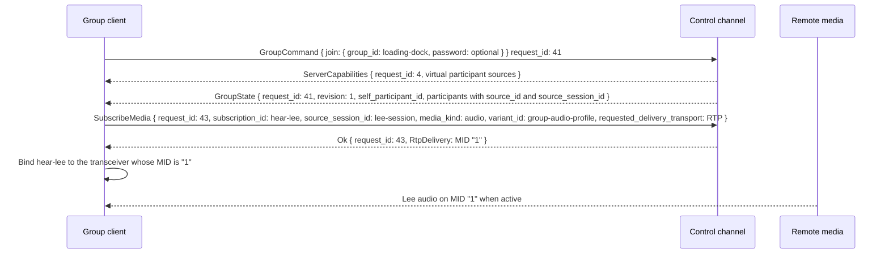
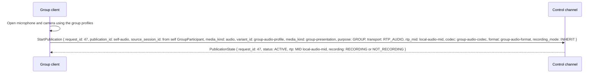

# Group Client Scenarios

A group is a named, server-defined collection of streams. It bundles static camera streams into a
saved view and can optionally host live participants who exchange audio, and optionally video, with
each other. One model covers several product shapes:

| Shape                 | Group configuration              | Client behavior                                                       |
| --------------------- | -------------------------------- | --------------------------------------------------------------------- |
| Camera view           | Members only, no live capability | Subscribe to the group's cameras; joining is rejected                 |
| Walkie-talkie channel | Audio-only live capability       | Full-duplex voice; the client sends audio only while a button is held |
| Conference            | Audio and video live capability  | Continuous full-duplex media, everyone may speak                      |
| Monitored channel     | Members plus a live capability   | Watch the cameras and talk about them in one context                  |

KeepPeek owns group definitions, participant identity, recording policy, and
media fanout. Clients never discover, connect to, or form direct peer connections with each other,
and never choose another participant's source identity.

Every live group is full duplex. KeepPeek never arbitrates who may speak: all joined members may
publish simultaneously and overlapping speech is fanned out unchanged. Push-to-talk is a client-side
user interface choice, not a protocol feature, so a walkie-talkie client is an ordinary voice client
that sends audio only while its button is held.

Groups are defined by server configuration. Over this API a client can only list groups, join one,
and leave it. There is no create, edit, or delete command, so a client never has to reconcile a
group definition it changed with one another client changed at the same time. An optional password
is the only join restriction; there is no owner, moderator, or per-group permission model.

A group has no lifetime of its own. It exists for as long as it is configured, whether or not
anyone is joined, and survives a server restart. Participants come and go inside a group that
outlives them.

A group is not camera talkback. Camera talkback targets a device source. A group gives every joined
participant a server-owned virtual source, so other members subscribe to that participant's
individual stream through the ordinary media API.

## API assessment

The underlying media contract already supplies the media plane:

| Need                                    | Existing support                                                          |
| --------------------------------------- | ------------------------------------------------------------------------- |
| One local microphone publication        | One offered RTP `sendonly` audio `StreamId` or one media-data publication |
| One local camera publication            | One offered RTP `sendonly` video `StreamId` or one media-data publication |
| Multiple remote audio streams           | Offered RTP `recvonly` audio `StreamId` values or data delivery           |
| Multiple remote video streams           | Offered RTP `recvonly` video `StreamId` values or data delivery           |
| Codec, timestamps, and recording intent | `StartPublication`, `PublicationState`, and media-frame contracts         |
| Per-participant fanout                  | Ordinary exact `SubscriptionRequest` messages                             |

`GroupCommand`, `GroupCapability`, and `GroupState` add the missing layer: group discovery,
membership, fixed group media profiles, and the virtual participant sources
clients use with the normal subscription and publication API.

## Client surface

A walkie-talkie client presents a radio console; a conference client presents a media grid; a
monitoring client presents both. All render the same underlying state.

| Region             | Design                                                                                                                                                                                                                                         |
| ------------------ | ---------------------------------------------------------------------------------------------------------------------------------------------------------------------------------------------------------------------------------------------- |
| Group picker       | Lists groups from `ListGroups` with member count, participant count and capacity, password requirement, and recording policy. Offers a refresh.                                                                                                |
| Camera tiles       | Renders the group's static members, resolved through current `ServerCapabilities`. Offline members show as unavailable rather than disappearing.                                                                                               |
| Participant roster | Shows joined members, activity, local receiver mute, and connection health.                                                                                                                                                                    |
| Video grid         | Renders subscribed remote participant video in a video group. Layout and pinning are entirely client-local.                                                                                                                                    |
| Transmit control   | Provides a press-and-hold control and keyboard shortcut in a push-to-talk client, or microphone and camera toggles in a conference. Either way it only gates local capture. It stays disabled until publication and recording state are ready. |
| Recording status   | Shows `recording`, `not recording`, or `recording failed` from `PublicationState.recording` before the user speaks.                                                                                                                            |

Local receiver mute, camera-off, and layout change only local playback and capture. They never
alter membership, suppress another participant, or affect what another member hears. A client may
persist these
preferences in its private [shared state store](state-store.md) namespace, but capabilities and
group state remain the authority for actual media.

## Create the session

The client creates the three required data channels. For the normal RTP profile, its initial
SDP offer contains one `sendonly` audio transceiver, one `sendonly` video transceiver when it
intends to publish video, and enough `recvonly` transceivers of each kind for the camera members
and remote participants it expects. After applying the local offer, the client indexes the exact
browser- or native-client-assigned MID of every transceiver. That offer is the session's complete
RTP capacity; there is no renegotiation.



Group definitions are deliberately absent from `ServerCapabilities`. That snapshot is a complete
document every client must acknowledge, and it changes whenever a camera connects or disconnects.
Keeping groups out of it means a camera event never rewrites the group directory, and a
configuration edit never forces a capability snapshot onto every connected client.

## List groups and resolve members

The client lists groups to populate its picker, then resolves each group's members against the
current capability snapshot.



`ListGroups` returns a point-in-time directory rather than a subscription, so the picker refreshes
on open, on user request, and after a failed join. Each `GroupSummary` carries the group's
`GroupCapability` plus its current `participant_count`, which is the only value in a summary that
changes without a new `revision`.

A `GroupMember` names a stream by stable `source_id` and `media_kind`, never by
`source_session_id`. The client resolves each member to a live source session before subscribing,
exactly as the `keeppeek.media-intent.v1` schema requires. A member whose camera is offline has no
active source to resolve; the client shows it as unavailable and retries on the next capability
snapshot rather than removing it from the group. Group membership therefore never doubles as a
liveness signal.

Only static sources are members. Client publications, transcoded variants, and participant
endpoints exist only for the life of one connection, so a stored reference to one would dangle on
the next reconnect. A client that wants to share its own media does so by joining and publishing,
not by adding itself to the member list.

## Join a group

Joining assigns a server-owned participant identity and virtual source. KeepPeek sends a complete
capabilities snapshot containing visible participant sources before the group state references
their source sessions and streams. The client acknowledges that snapshot, replaces its roster, and
subscribes to each remote participant it wants to hear or see.



Before joining, the client reads the group's `GroupLiveCapability` from `ListGroups`: fixed audio
profile, optional video profile, allowed publication and subscription transports, participant
limit, recording policies, and
`participant_timeout_ms` so it can distinguish a temporarily silent remote from one whose endpoint
will soon be removed. It requests microphone and camera permission only after group selection or an
explicit local-media intent; opening the application alone does not capture media.

A group with no live capability is view-only, and `JoinGroup` returns `GROUP_ERROR_CODE_NOT_LIVE`.
The client renders such a group as cameras only and hides its capture controls entirely.

A group whose `password_required` is true rejects a join without a password using
`GROUP_ERROR_CODE_PASSWORD_REQUIRED` and a wrong one using `GROUP_ERROR_CODE_PASSWORD_INVALID`. The
client prompts only when the selected group requires it, re-prompts on either error, and does not
retry automatically. The password is never returned by any message, so the directory stays listable
without disclosing how to enter a group. It gates entry only; it is not a media key and does not
encrypt group media beyond the transport protection every session already has.

`group-audio-profile` and `group-video-profile` stand for the `GroupLiveCapability` variant IDs;
clients do not hardcode them. Every roster update with a higher revision adds subscriptions for new
participants and removes departed participants after the matching capability removal. A client
never subscribes to its own virtual source.

In a group with video, the successful audio and video subscription results must carry the same
nonempty `media_kind`. The client treats a mismatch as unsynchronized media and keeps the
streams separate rather than attempting lip-synced playout.

`audio_active` and `video_active` report whether KeepPeek currently accepts a participant's
corresponding medium. They are not speaking indicators or shared mute state. The client derives
visual speaking activity locally from decoded audio levels.

Offered RTP receive `StreamId` values and group capacity bound remote streams. A client that did
not include enough `StreamId` values in its initial offer uses an approved `UNRELIABLE_DATA` route
for overflow participants or limits its subscriptions. KeepPeek does not silently merge distinct
participants into an unauditable server mix and does not renegotiate SDP to add identifiers.

## Publish local media

After joining, the client starts one `PURPOSE_GROUP` audio publication, and in a video group one
`PURPOSE_GROUP` video publication, against the `GroupParticipant` row whose `participant_id`
equals `self_participant_id`. It uses that row's `source_session_id`, stream IDs, and variant
IDs. Codec and format must match the group profile exactly. Each publication sets an explicit
nonzero recording mode and the exact `rtp_mid` of its local send transceiver. The client waits for
the returned recording state before enabling capture. Audio and video belong to the same
presentation because they use the group's `media_kind`, not because their MIDs resemble one
another.



`ACTIVE` means the fixed binding is ready, not that the client has sent anything. Audio routes after
its first valid access unit and video only after its first valid keyframe; KeepPeek updates the
participant's active flags after those gates.

For required recording, the publication must report `RECORDING` before capture starts. A later
storage failure sets that medium's recording status to `FAILED`; for required recording it also
transitions `PublicationState.status` to `FAILED`, removes the variant, and stops capture rather
than silently continuing unrecorded. Audio and video policy can differ.

## Muting and push to talk

Once a publication is active, the client decides moment to moment whether to send. There is nothing
to request first and no permission to hold: a member that does not want to be heard simply
stops producing access units, or uses DTX, while keeping its publication and binding intact.

```mermaid
sequenceDiagram
    participant G as Group client
    participant A as Audio transport

    G->>G: Button pressed
    G->>A: Opus frames while the button is held
    G->>G: Button released
    G->>G: Stop packetizing; publication stays ACTIVE
```

A push-to-talk client is therefore an ordinary full-duplex member with a press-and-hold control, and
a conference client is the same member with a mute toggle. Neither behavior reaches KeepPeek, so
several members can speak at once and overlapping speech is delivered as-is.

The publication stays open between presses. Tearing it down and restarting it on each press would
pay codec negotiation and recording-path setup cost and clip the beginning of speech, so the client
keeps the binding warm and gates only its own capture.

Because remote playout is unaffected by local capture, a client using a speakerphone enables echo
cancellation rather than expecting the server to suppress remote audio while it speaks. A client
that prefers walkie-talkie behavior may mute remote playout locally while its button is held and
restore prior per-participant mute preferences on release; that is local signal processing only and
other members are unaffected.

## Media behavior

The common audio profile is mono Opus with a 48 kHz RTP clock and 20 ms packets, with speech
bitrate, DTX, and in-band FEC declared through codec parameters. A group with video selects one
fixed browser-compatible profile such as H.264 or VP8. The profile is fixed while the client is
joined and is never renegotiated during transmission.

The client captures with echo cancellation, noise suppression, and automatic gain control
appropriate to the device. It packetizes at the group's packet duration, maintains monotonically
increasing timestamps, and stops packetizing as soon as the user mutes or releases the control
rather than buffering microphone samples for later delivery.

Each remote stream receives a small adaptive jitter buffer, normally 20–60 ms. The client drops
late, duplicate, and out-of-window packets rather than increasing latency without bound. It mixes
remote participants locally with per-participant gain and mute controls, excludes local microphone
from remote playout, and limits final speaker output. The operational target is below 100 ms
mouth-to-ear on a healthy local network.

Microphone mute is local capture behavior: the client may use DTX or stop sending access units
while retaining its binding. Camera-off similarly stops local video frames while keeping the
binding; remote video resumes on a fresh keyframe. This draft has no server mute, moderator
controls, active-speaker state, hand raise, screen sharing, or server mixer.

When RTP `StreamId` values are insufficient or unavailable, the group can advertise data-channel
media. The client uses `UNRELIABLE_DATA` for interactive audio and video and follows normal frame
fragmentation, configuration, timestamp, and keyframe recovery rules. It never chooses reliable
ordered data for interactive group media.

## Recording and review

Recording live participant media is per publication and constrained by the group's independent
audio and video policies. `DISABLED` is live-only; `INHERIT` follows group and server policy;
`REQUIRED` fails closed if storage cannot retain the medium. A `PROHIBITED` policy reports
`NOT_RECORDING`. The client visibly exposes the effective recording state before capture begins.

Participant media can be privacy-sensitive. When recording is enabled, each participant remains a
distinct virtual source stream carrying participant and group identity. Stored-media timeline
queries use that participant virtual `source_id`, so later review or an authorized downstream mix
can select tracks without confusing attribution. A group never implicitly creates a composite
recording because several participant streams were routed together.

Recording a group's static camera members is unchanged and follows ordinary camera recording
policy. Adding a camera to a group does not alter how or whether that camera records.

## Desired state versus group authority

The client can use the [shared state store](state-store.md) for a preferred group, selected audio
device, local layout, or a declarative desire to rejoin after reconnection. These are private or
authorized coordination documents.

It must not use the store to claim membership, grant permission, assert that
a participant is speaking, or mark media as recorded. Those facts are granted only by successful
group commands, `GroupState`, `PublicationState`, and current capabilities. A stale preference never
creates a media authorization decision.

## Recovery

`GroupState` is the authoritative roster. The client accepts only a higher revision
for its current group and ignores stale state after leaving. It acknowledges unsolicited updates,
then reconciles ordinary media subscriptions with the current participant list.

If a participant disconnects, stops publishing, loses its publication, or times out, KeepPeek
removes the virtual source in a
capability snapshot, and sends a new roster. The client removes decoders and UI tiles after that
update. One remote subscription failure affects only that participant. Losing every participant
empties the roster but never removes the group.

If the local connection drops, the client stops capture immediately, loses its virtual source, and
rejoins after WebRTC reconnect, reconciling capabilities and group state before recreating its
publications and subscriptions. Old participant source sessions and leases are never reused. Because
a group outlives every connection, a reconnecting client rejoins the same `group_id` rather than
rediscovering an equivalent group. A microphone failure stops local capture and its publication. A
limited
`ConnectionUpdate` reduces optional remote subscriptions or jitter target; it never makes the client
exceed the fixed group profile bitrate.

A group whose definition changed while the client was away returns a higher `revision` from
`ListGroups`. The client replaces its cached definition and re-resolves members rather than merging,
so a camera removed from the group stops being rendered even if its subscription is still valid.

KeepPeek assigns participant identity; a client cannot choose a caller ID, virtual source,
membership, or target recipient, and cannot publish into another participant's
endpoint. Participant capacity and each client's offered receive MIDs bound resource use, and
independent subscriber queues stop one slow receiver from stalling a publisher. DTLS/SRTP protects
RTP media; WebRTC data channels protect data-channel media.

## Leave and shutdown

On group switch or shutdown, the client stops sending frames, sends `LeaveGroup`,
unsubscribes remote streams, and then stops its publications or closes the WebRTC session with
`POST /delete`. KeepPeek removes the virtual source, updates roster and capabilities for remaining
members, and finalizes or closes any recording path according to the selected
mode. The group itself is unaffected.

## Acceptance scenarios

The implementation is complete when these behaviors pass end to end:

1. `ListGroups` returns every configured group with its members and current participant count.
2. A client resolves a group's members through `ServerCapabilities` and subscribes to their cameras.
3. A member whose camera is offline stays listed and becomes subscribable when the camera returns.
4. Joining a view-only group returns `NOT_LIVE`.
5. Joining a password group without or with a wrong password returns the matching password error, and the correct password succeeds.
6. No list, summary, or state message ever contains a group password.
7. Two clients join and receive each other's individual audio streams.
8. Two clients join a video group and each publishes one audio and one video stream.
9. A third participant adds remote subscriptions without renegotiating existing send media.
10. A client cannot subscribe to a participant source before joining its group.
11. Several members speak at once and every stream is delivered without suppression or server mixing.
12. A client that stops sending audio keeps its publication `ACTIVE` and resumes without renegotiation.
13. Stopping local capture or releasing push-to-talk stops that member's audio without affecting others.
14. A client's local playout choices never change another participant's media.
15. KeepPeek rejects publications that conflict with the group profile or recording policy.
16. Remote video starts only after a valid keyframe while remote audio starts after a valid access unit.
17. A required-recording group does not enable capture until the publication reports `RECORDING`.
18. A recording failure closes only the affected audio or video publication.
19. Local receiver mute changes only local playout, not roster membership or another participant.
20. A disconnected participant is removed from the roster without affecting the others.
21. An empty group remains listed and joinable, and a server restart preserves every group.
