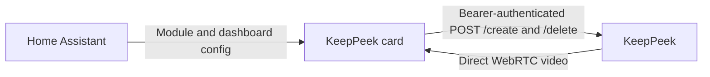

# Home Assistant Card

`custom:keeppeek-card` is a Lovelace live-camera card with a visual editor. Home Assistant serves
the JavaScript module and dashboard configuration. The browser connects directly to KeepPeek
for authenticated session creation, deletion, and WebRTC video. No backend integration,
iframe, or Home Assistant media proxy is required.



The package implements live video, shared connections, source selection, grid/single layouts,
focus, and a visual editor. Audio, event ribbons, timeline playback, PTZ, and Home Assistant
entity discovery are not implemented in this card. Use the KeepPeek application for those views.

## Installation

The release artifact is one self-contained ES module, `keeppeek.js`. It bundles Svelte, the
protobuf runtime, icons, and card CSS; it does not load third-party scripts or fonts at runtime.
`keeppeek-card.json` records the version, SHA-256 checksum, and raw/compressed byte counts.

### HACS

1. Choose a KeepPeek release that contains both card artifacts. Releases created before the
   card was added do not contain them.
2. In HACS, add `https://github.com/xnorpx/keeppeek` as a custom **Dashboard** repository.
3. Download that release and register `/hacsfiles/keeppeek/keeppeek.js` as a **JavaScript module**
   dashboard resource if HACS does not register it automatically.
4. Reload the dashboard and select **KeepPeek** in the card picker.

The root `hacs.json` selects `keeppeek.js` and hides the default-branch download because generated
JavaScript is a release asset, not a committed file. HACS default-store inclusion is separate
from custom-repository installation. A published release containing the artifact is required;
building the module locally does not make HACS installation available.

### Manual

1. Download `keeppeek.js` from the intended release and verify its SHA-256 against that release's
   `keeppeek-card.json`.
2. Place the module in Home Assistant's `www/keeppeek.js` directory entry. If creating `www/`
   for the first time, restart Home Assistant.
3. Register `/local/keeppeek.js?v=VERSION` as a **JavaScript module** resource. Replace `VERSION`
   with the downloaded card version.
4. Reload the dashboard and add the card.

To build the artifacts from this checkout:

```sh
bun run --cwd ui build:home-assistant
```

Outputs are in `target/home-assistant-card/dist/`. Set `KEEPPEEK_CARD_VERSION` to a semantic
version when producing a version-specific local artifact. The existing release workflow builds
the module for each recorder release and attaches it to the same draft or prerelease; the
normal release approval process still applies.

### Upgrade and Rollback

Use HACS to select the new version, or replace the manual module and change its `?v=` resource
suffix. Reload every open dashboard tab to release the previous module's sessions. Keep the card
and KeepPeek server on compatible releases because the protocol is pre-1.0. To roll back, select
the previous HACS version or restore the previous module and its version suffix, then reload.
Do not register multiple versions of the resource at once.

## Configuration

```yaml
type: custom:keeppeek-card
endpoint: https://keeppeek.example.net
token: !secret keeppeek_lovelace_token
title: Entrances
sources:
  - source_id: "192.168.1.20"
    title: Front door
    quality: auto
  - source_id: "192.168.1.21"
    title: Driveway
    quality: low
layout: grid
columns: 2
aspect_ratio: "16:9"
show_name: true
```

Use stable source IDs advertised by KeepPeek, not camera display names or Home Assistant entity
IDs. In the visual editor, enter the endpoint and key, then select **Load sources**. Discovery
uses the same direct connection manager and does not subscribe to video by itself.

| Field                 | Default        | Supported Values                                                                                                                                            |
| --------------------- | -------------- | ----------------------------------------------------------------------------------------------------------------------------------------------------------- |
| `endpoint`            | Required       | HTTPS base URL, at most 2048 characters, without user-info, query, or fragment. HTTP is allowed only for `localhost`, `127.0.0.1`, and `[::1]` development. |
| `token`               | Required       | Resolved KeepPeek access key. YAML `!secret` resolution belongs to Home Assistant, not the card.                                                            |
| `sources`             | Required       | 1 to 16 unique source objects.                                                                                                                              |
| `sources[].source_id` | Required       | Nonblank stable ID, at most 160 characters.                                                                                                                 |
| `sources[].title`     | Camera name/ID | Optional nonblank title, at most 160 characters.                                                                                                            |
| `sources[].quality`   | `auto`         | `auto`, `low`, or `high`, selected by KeepPeek's advertised variants.                                                                                       |
| `title`               | `KeepPeek`     | Optional card title, at most 160 characters.                                                                                                                |
| `layout`              | `grid`         | `grid` or `single`. Single mode provides a camera selector.                                                                                                 |
| `columns`             | `2`            | Integer from 1 to 4. The grid never allocates more columns than visible cameras and stacks below 440 pixels.                                                |
| `aspect_ratio`        | `16:9`         | `16:9`, `4:3`, or `1:1`; video is contained, not cropped.                                                                                                   |
| `show_name`           | `true`         | Show camera names below video.                                                                                                                              |
| `view`                | `live`         | Only `live` is supported.                                                                                                                                   |

The visual editor emits standard `config-changed` events and preserves unrelated Home Assistant
configuration, including `grid_options`. Its access-key input starts empty with a configured-state
placeholder. Unrelated edits preserve the existing key; entering a replacement or selecting the
clear action changes it explicitly. Source titles and quality survive layout edits.

## CORS, HTTPS, and Browser Permissions

Add the exact Home Assistant browser origin to the existing KeepPeek `config.toml`:

```toml
[direct_card]
allowed_origins = [
  "https://home.example.net",
  "https://homeassistant.local:8123"
]
```

An origin is scheme, host, and port, without a path or trailing slash. Include each origin from
which users actually open their dashboards. Restart KeepPeek after editing its direct-card
configuration, following the normal configuration workflow.

The server allows `POST` and `OPTIONS` on `/create` and `/delete`, with `Authorization`,
`Content-Type`, and `Content-Encoding`. It returns the exact allowed origin, never `*`.
The card uses `credentials: omit`; it does not use cookies, redirect credential-bearing requests,
or require `Access-Control-Allow-Credentials`. The offer body uses gzip; deletion uses JSON.
Both authenticated requests cause browser preflights.

Use browser-trusted HTTPS for Home Assistant and KeepPeek in normal deployments. The browser
must reach KeepPeek's advertised WebRTC candidates; serving the dashboard through Home Assistant
Cloud does not relay those candidates. Prefer a private VPN for remote viewing.

Modern Chromium browsers can also require **Local Network Access** permission for the Home
Assistant origin. Allow that permission when the browser prompts for this trusted dashboard.
A denied permission, a TLS problem, an unreachable endpoint, and CORS rejection can all appear
as an indistinguishable fetch error to JavaScript. The card names the origin and relevant checks
without claiming to identify the exact cause. It never disables browser security checks.

## Credentials and Security

Create a dedicated **User** credential for the dashboard, with the intended camera access, through
KeepPeek's access settings. See [access control](access-control.md). Do not use an Administrator
key unless every dashboard viewer should have its authority. The source list is a display filter,
not an access-control boundary.

The resolved key necessarily reaches Home Assistant's frontend. `!secret` keeps YAML organized;
it does not hide the key from someone who can inspect the dashboard configuration or browser
runtime. Dashboard editors and third-party frontend modules share this trust boundary. The card
itself keeps the key and its SHA-256 connection fingerprint in memory only. It does not write them
to URLs, browser storage, rendered HTML, console output, screenshots, or diagnostics. Browser
network tools can inspect the authenticated request header by design.

KeepPeek's trusted-local policy still applies. A browser classified as trusted-local is an
Administrator even when it sends a User key. Narrow `access.local_networks` when dashboard users
must be authenticated and restricted; do not assume the card changes that server policy. CORS is
not authentication and does not protect a copied key from use by another client.

Rotation, disable, revocation, expiry, and camera-access changes invalidate the credential's
sessions according to the server policy. An authentication failure stops the card's automatic
retries. Replace its key and reconnect. No raw server error body or exception is rendered.

## Connection Ownership

A browser-local manager shares one direct session per canonical endpoint and `SHA-256(token)`.
It bounds a dashboard to eight connection identities, 64 consumers per identity, and 16 distinct
source/quality subscriptions per connection. Cards requesting the same source and quality share
both the peer and its media subscription. Different credentials never share media.

The initial offer allocates 16 receive-only video transceivers and the three negotiated data
channels. KeepPeek is ICE Lite: there is no SDP rewriting, renegotiation, trickle ICE, or wait for
local ICE gathering. The complete offer is gzip-compressed; Fetch transparently decodes the
gzip-encoded HTTP response. Browser-assigned MIDs are opaque exact-string keys. Subscription IDs
map to the exact MID returned by KeepPeek, never to an assumed index or source-name convention.

Current `ServerCapabilities` snapshots are control-channel **notifications** and require no ACK.
Each snapshot replaces the previous one. Removed camera sessions or variants release their
bindings, and offline/unknown sources receive tile-specific states without stopping other cameras.

Card removal, a hidden tab, an offscreen card, and focus/source changes release obsolete demand.
Removing the final consumer closes the peer and calls direct `/delete`, including removal during
HTTP creation. Synchronous DOM moves preserve the consumer. Home Assistant theme and `hass`
updates do not recreate the peer. Resuming a hidden dashboard acquires a fresh live session.

Negotiation, HTTP, capabilities, and RPC waits are bounded to ten seconds per operation. A session
has at most 32 pending RPCs. Reconnect uses delays of 1, 2, 4, 8, 16, then 30 seconds, with at most
eight automatic attempts before an explicit retry. Every replacement session rebuilds MID and
subscription maps and replays only current demand. A failed delete is surfaced rather than hidden.

## Development and Verification

```sh
bun run --cwd ui test:e2e:prepare
bun run --cwd ui demo:home-assistant
```

The demo command prints its localhost URL. It starts two synthetic RTSP cameras and an isolated
KeepPeek process with fixture-only credentials, offers theme/card/editor controls, and removes
temporary fixture data when stopped. It chooses another preview port if the default is occupied.
It does not use the operator's configuration or cameras.

Run focused checks from `ui/`:

```sh
bun run test:unit -- run --project server src/lib/home-assistant/
bun run test:unit -- run --project client src/lib/home-assistant/
bun run build:home-assistant
bun run test:e2e:run -- --config playwright.home-assistant.config.ts
```

Set `KEEPPEEK_CARD_FRONTEND_PORT` to an unused port when another preview is running. The tests
load the release module into a Lovelace lifecycle harness, not a complete Home Assistant backend.
They verify real H.264 decoded frames on desktop/mobile, sharing, reconnect, cleanup, editor
discovery, CORS/authentication failures, and paired performance measurements. The artifact must
stay below 500 KiB gzipped and shared bootstrap p95 below ten seconds. Run the canonical
`./check.sh` from the repository root before considering a code change verified.

### Real Home Assistant Container

The separate container suite loads the current build in actual Home Assistant, not the lifecycle
harness. It does not need a published release or a HACS/GitHub account. With Docker running:

```sh
bun run --cwd ui test:home-assistant-container
```

This command prepares the native KeepPeek/test-camera binaries and the card module, pulls the
official Home Assistant `2026.9.1` image pinned by its multi-architecture SHA-256 digest, and runs
Playwright. Once the binaries and image are prepared, use the faster test-only command:

```sh
bun run --cwd ui test:home-assistant-container:run
```

Each runtime scenario creates a disposable Home Assistant container and configuration volume,
publishes an automatically selected loopback HTTP port, and onboards a fixture-only account
through the real UI. Home Assistant serves the actual module from `www/`, resolves YAML
`!secret` references, and hosts both YAML and editable storage dashboards. The storage dashboard
is seeded through the newly authenticated Home Assistant API, not through internal storage files.
KeepPeek, synthetic RTSP cameras, and Chromium run on the host so the media path avoids Docker NAT.

The tests verify two decoded camera streams, three cards sharing one active session/subscription,
reconnect, navigation cleanup, responsive layouts, theme changes, source discovery, credential
redaction, and changes saved through Home Assistant's own visual editor. Every test stops its
owned processes and removes its container, Docker volume, and temporary files. The container has
two CPUs, 2 GiB of memory, bounded processes/waits, and no privileged or device access.

The **Home Assistant Container** Ubuntu CI job reuses the existing Linux build artifact and is
required by the UI gate. Its evidence artifact includes screenshots, sanitized logs, setup notices,
and JUnit results. It excludes authentication storage, raw configuration, and browser traces.
The normal `./check.sh` remains Docker-free, but it typechecks the container suite; run both checks
when changing this integration.

Two Home Assistant lifecycle details are accounted for explicitly:

- At the end of onboarding, Home Assistant closes and revokes its temporary WebSocket connection.
  The exact `Connection lost` result with code `3`, only on `/onboarding.html` during setup, is
  recorded separately in `onboarding-notices.json`. All other runtime errors fail the test.
- Lovelace masonry resizing removes columns before asynchronously reattaching cards. This can
  cause a clean reconnect. The test requires resumed playback, one active peer, and no leaked
  sessions; a theme-only update must not recreate the peer.

The suite has been exercised on this project's macOS ARM64 Docker Desktop development setup.
That is a local test result, not a supported Home Assistant production deployment recommendation:
the official container guide targets Docker Engine on Linux. The Ubuntu CI job is the intended
reference environment; its hosted result is available only after the workflow runs.

### Release Installation

For HACS installation verification after publishing a release: install that exact version through
HACS in a disposable Home Assistant instance, add one single-camera card and a two-camera grid,
then add a duplicate card. Expect live video, one shared connection, and source discovery in the
editor. Navigate away and back, change theme, resize the dashboard, rotate the fixture key, and
upgrade/roll back the resource. Verify the documented error states and zero sessions after the
last card is removed. The local container test verifies real Lovelace compatibility but does not
replace this published-artifact download, upgrade, and rollback check.

## Sources

- [Home Assistant custom-card lifecycle and editor API](https://developers.home-assistant.io/docs/frontend/custom-ui/custom-card/)
- [HACS dashboard artifact rules](https://www.hacs.xyz/docs/publish/plugin/)
- [HACS manifest and release requirements](https://www.hacs.xyz/docs/publish/start/#hacsjson)
- [Svelte imperative mount and unmount](https://svelte.dev/docs/svelte/imperative-component-api)
- [Vite library build](https://vite.dev/guide/build.html#library-mode)
- [Chromium Local Network Access](https://developer.chrome.com/blog/local-network-access)
- [Home Assistant container installation](https://www.home-assistant.io/installation/linux/#install-home-assistant-container)
- [Home Assistant dashboard resources and YAML configuration](https://www.home-assistant.io/dashboards/dashboards/#adding-yaml-dashboards)
- [Home Assistant onboarding connection lifecycle](https://github.com/home-assistant/frontend/blob/dev/src/onboarding/ha-onboarding.ts)
- [Lovelace masonry layout lifecycle](https://github.com/home-assistant/frontend/blob/dev/src/panels/lovelace/views/hui-masonry-view.ts)
