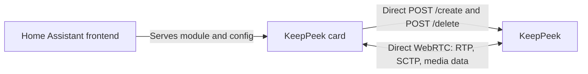
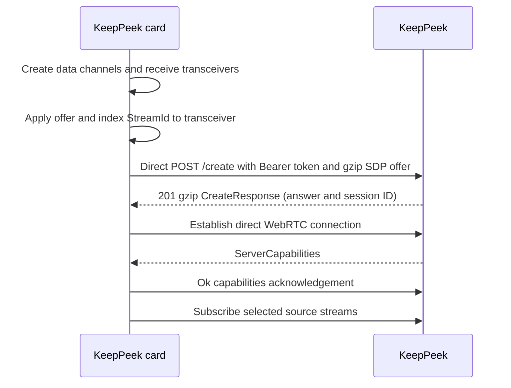

# Home Assistant Direct Card

This design provides a Lovelace card that connects directly from the browser to KeepPeek. The
card creates its own WebRTC session, receives live media and events directly, and opens stored
media directly. Home Assistant serves the JavaScript module and dashboard configuration only; it
is not a media, REST, WebRTC, snapshot, event, or timeline proxy.

The experience follows the useful part of direct-streaming Lovelace cards: native dashboard
configuration, low-latency browser playback, dense source grids, and inline event review. It does
not embed another application in an iframe.

## Direct Topology



After the module loads, all KeepPeek traffic is browser-to-KeepPeek. Home Assistant never receives
video, audio, JPEGs, MP4 fragments, event payloads, or the browser WebRTC session.

## Direct Token

The card uses one configured KeepPeek Bearer token. It sends that token in the browser's
`Authorization` header for `/create` and `/delete`.

```yaml
type: custom:keeppeek-card
endpoint: https://keeppeek.example.net
token: !secret keeppeek_lovelace_token
sources:
  - source_id: front-door
    title: Front door
  - source_id: driveway
view: live
layout: grid
show_events: true
show_timeline: true
```

The token reaches the browser. `!secret` keeps YAML tidy but does not make the resolved token
secret from a person who can inspect the dashboard or browser runtime. This is intentional for a
trusted local dashboard.

The card keeps the token only in memory. It never puts the token in URLs, query parameters, local
storage, session storage, rendered DOM, console output, screenshots, or diagnostics. The visual
card editor renders a redacted token field and preserves an existing configured value without
reading it back into visible UI.

Use a dedicated card token. In this pre-1.0 API every configured GUID has the same rights, so a
copied card token can also call `/logs` and `/metrics`. Removing it from KeepPeek configuration
or rotating it revokes future card session creation. KeepPeek stores the authenticated token
identity, not the raw token, with each session. During token configuration reload it closes
sessions whose token identity was removed; until that implementation is available, removal is
guaranteed to block reconnect but may not terminate an already established WebRTC session
immediately. Do not reuse an administrator token unless all dashboard viewers are meant to have
its access.

## CORS and HTTPS

KeepPeek configuration has an exact allowed-origin list:

```toml
[direct_card]
allowed_origins = [
  "https://home.example.net",
  "https://homeassistant.local:8123"
]
```

For an allowed origin, KeepPeek enables credentialless CORS for direct session bootstrap only:

- `Access-Control-Allow-Origin` is the exact configured origin, never `*`.
- Methods are `POST` and `OPTIONS`.
- Request headers are `Authorization`, `Content-Type`, and `Content-Encoding`.
- Browser cookies and `Access-Control-Allow-Credentials` are not used.

Because the card sends both `Authorization` and `Content-Encoding: gzip`, browsers issue an
`OPTIONS` preflight before `/create` and `/delete`. KeepPeek responds with the same exact allowed
origin, methods, and headers before the browser attempts the actual POST.

CORS is not token protection. Anyone with a copied token can use it as a normal KeepPeek client.
KeepPeek and Home Assistant use HTTPS with browser-trusted certificates in normal deployments.
Mixed-content cards and untrusted self-signed certificates are unsupported outside local
`localhost` development.

## Lovelace Package

The frontend package is an ES-module custom element registered as `custom:keeppeek-card`. It can
be installed through HACS or loaded as a Home Assistant dashboard resource under `/local/`.

- It registers metadata in `window.customCards` for the card picker.
- `setConfig` validates endpoint, token, source IDs, and display options before connecting.
- A visual editor selects sources, grid layout, live/timeline view, and event options.
- The Home Assistant `hass` object supplies dashboard context only; it never carries KeepPeek
  media.
- A browser-local `KeepPeekConnectionManager`, keyed by endpoint plus a token fingerprint, shares
  one direct WebRTC session across cards on the same dashboard and reference-counts subscriptions.

The token fingerprint is `SHA-256(token)` held only in memory. It is used solely as a map key and
is never rendered, logged, persisted, or sent to KeepPeek. Reconfiguring a card with a different
token creates a separate direct connection and releases the old token's subscriptions.

## Direct Session Lifecycle

The card creates its `RTCPeerConnection`, three negotiated data channels, and every receive
transceiver it wants for this session before generating an offer. It applies the offer with
`setLocalDescription`, uses each non-null browser-assigned `RTCRtpTransceiver.mid` as a
session-local `StreamId`, and sends the exact `localDescription` SDP without rewriting MID
values. It does not wait for `iceGatheringState` complete and does not send `onicecandidate` to
KeepPeek. That offer is the card's complete RTP capacity; KeepPeek is ICE Lite, always answers,
and does not renegotiate SDP or accept trickle ICE. The card gzip-compresses the JSON offer with
`CompressionStream`, then posts it directly to KeepPeek. The `201` body is also gzip-compressed
JSON, including the SDP answer; the card decompresses that whole body before applying
`answer.sdp`.



Each `SubscriptionResult.rtp.mid` is a `StreamId` looked up as an exact string in that registry.
The shared connection manager separately tracks `subscription_id -> StreamId` for every visible
card. It never uses MID spelling or transceiver order to infer a source, stream, quality, or
audio/video pairing, and it rebuilds both maps when reconnecting.

The `sources` list is a card UI filter, not access control. KeepPeek returns whatever the direct
token is allowed to see. On reconnect, the connection manager creates a fresh direct session and
replays only visible subscriptions. Removing the final card calls direct `/delete`.

## Card Experience

| Element      | Direct behavior                                                                                                                         |
| ------------ | --------------------------------------------------------------------------------------------------------------------------------------- |
| Live grid    | One direct subscription per visible source; the card chooses exact or automatic variants from current capabilities.                     |
| Tile state   | Uses direct capabilities and connection updates for source availability and constrained connectivity.                                   |
| Focus        | Enlarges one tile without replacing other cards' shared subscriptions.                                                                  |
| Audio        | Disabled by default in a grid; enabled only for a focused or explicitly selected source.                                                |
| Event ribbon | Uses direct event records and JPEG attachments from the same WebRTC session.                                                            |
| Timeline     | Queries availability/events directly, scrubs with an unreliable preview cursor, and reopens reliable playback at the settled timestamp. |

The card subscribes only to visible or focused live tiles. Hidden tiles are released after a short
grace period, while event and timeline state remains local to the card. Event images, timeline
queries, MP4 initialization ranges, and stored fragments are browser-to-KeepPeek traffic.

## Optional Home Assistant Integration

No backend integration is required for card media. An optional `custom_components/keeppeek`
integration may register source availability, latest event, and recording-health entities for
automations and entity pickers. It must not proxy card media or reuse a browser media session.

The optional integration does not receive the card token from the frontend. If an operator gives it
its own KeepPeek token for entity discovery, that credential stays in the integration config entry
and does not authorize the card or change the direct card token's access.

An entity-selected card resolves a stable KeepPeek `source_id`, then establishes the same direct
token session. Home Assistant entity state is dashboard metadata, not media authorization or a
replacement for `ServerCapabilities`.

## Failure and Revocation

- A CORS rejection is shown as a configuration error naming the required allowed origin.
- An unauthorized `/create` response reports a token error without echoing the token.
- Token removal or rotation blocks reconnect and closes matching direct sessions.
- A source failure affects only its tile; other direct subscriptions continue.
- Capability removal stops the affected subscription without silently retargeting it.
- Tab suspension releases stale subscriptions on resume and rebuilds the direct session if needed.
- If the initial capabilities acknowledgement deadline expires, the card discards that session and
  retries normal direct `/create` bootstrap with bounded backoff.

## Security Boundary

This is explicitly a trusted-dashboard design. Anyone who can inspect the token has the access
granted by it, including logs and metrics, until per-key scopes exist. KeepPeek token removal
or rotation is the revocation mechanism.

## Acceptance Scenarios

1. A HACS-installed card creates a KeepPeek WebRTC session with no Home Assistant media request or
   response.
2. Three cards for one KeepPeek endpoint share one browser WebRTC connection and independently
   release subscriptions.
3. An unconfigured KeepPeek origin fails CORS before session creation.
4. Removing or rotating the token prevents reconnect without leaking its value in diagnostics.
5. Live grid, event JPEGs, timeline query, scrub preview, and playback remain direct
   browser-to-KeepPeek traffic.
6. A Lovelace source list changes displayed tiles but does not claim to restrict token authority.
7. Removing the final card calls direct `/delete` and closes the browser session.
