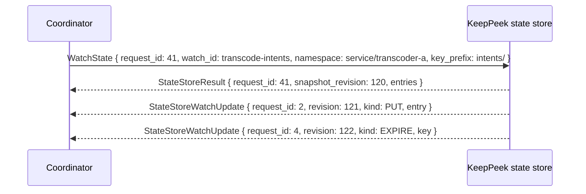

# Shared State Store Scenario

The shared state store is KeepPeek's durable coordination plane. Clients, services, and
coordinators publish small desired-state documents; other authorized participants watch those
documents and use ordinary media commands to make the desired state real.

It is deliberately not a media bus, recording database, credential store, or replacement for
`ServerCapabilities`. State asks for an outcome. Capabilities and publication/subscription results
report whether that outcome is actually available.

## Core model

A state value is one complete `StateEntry` identified by `(namespace, key)`. KeepPeek assigns the
owner identity, revision, timestamps, and expiration. Writers replace complete documents rather
than mutating individual fields, so every watch update is independently usable.

| Concept   | Meaning                                                                                                            |
| --------- | ------------------------------------------------------------------------------------------------------------------ |
| Namespace | Authorization and lifecycle boundary, such as `system/`, `service/`, `group/`, or a private user/device namespace. |
| Key       | Stable path-like name within a namespace. One orchestration intent uses one key.                                   |
| Schema    | Versioned document type, such as `keeppeek.media-intent.v1`.                                                       |
| Revision  | Monotonically increasing namespace revision used for compare-and-set and ordered watches.                          |
| Owner     | Server-issued principal identity permitted to write the entry under namespace policy.                              |
| TTL       | Optional liveness lease. Expiry deletes the entry and is observable as `EXPIRE`.                                   |

State documents are bounded structured data. They must not contain media bytes, JPEGs, access
keys, cookies, passwords, raw SDP, or arbitrary logs. Large or historical data belongs in a
dedicated store; live media belongs in RTP or media-data bindings.

## Namespaces and authorization

KeepPeek applies ACLs per namespace. The initial namespace layout is configuration, not a
client-controlled convention:

| Namespace               | Typical writer                     | Typical readers                   | Use                                                     |
| ----------------------- | ---------------------------------- | --------------------------------- | ------------------------------------------------------- |
| `system/`               | KeepPeek                           | Authorized clients                | Server-owned observed coordination state                |
| `service/<service-id>/` | Approved service principal         | Authorized operators and services | Worker liveness, leases, output intent                  |
| `group/<group-id>/`     | Authorized group members or server | Group members                     | Shared group preferences and non-authoritative UI state |
| `user/<owner-id>/`      | That user/device principal         | Owner and allowed services        | Personal desired subscriptions and local preferences    |

The current pre-1.0 access-key model is broad. Deployments that need distinct write rights must
configure namespace policy server-side until per-key scopes exist. KeepPeek always overwrites any
client-provided identity with the authenticated owner ID in the resulting entry.

## Read, write, and delete

`GetState` returns the complete current entry. `PutState` atomically replaces it. `DeleteState`
removes it. A missing key returns `STATE_STORE_ERROR_CODE_NOT_FOUND`.

Writers use `expected_revision` to avoid lost updates:

| `expected_revision` | Meaning                                                          |
| ------------------- | ---------------------------------------------------------------- |
| Absent              | Blind replacement permitted by namespace policy                  |
| `0`                 | Create only; reject if the key already exists                    |
| Nonzero             | Replace or delete only when it equals the current entry revision |

On a mismatch, KeepPeek returns `STATE_STORE_ERROR_CODE_CONFLICT` and the current revision. The
writer rereads, merges its own domain-specific intent, and retries. A client never retries a
blind write after a conflict because that would discard another writer's state.

An optional nonzero TTL requests a liveness lease. KeepPeek clamps a value above the namespace
maximum and returns the accepted `expires_at_ms` in the entry. A value below the namespace minimum
is rejected with `STATE_STORE_ERROR_CODE_TTL_INVALID`. KeepPeek emits an `EXPIRE` update when an
accepted TTL elapses. Services refresh their own lease with compare-and-set writes; they do not
refresh another owner's entry.

## Watches without a snapshot gap

`WatchState` atomically registers a watch and captures all current matching keys. Its
`StateStoreResult.watch` response contains the complete initial snapshot exactly as it existed at
`snapshot_revision`. Only updates with higher revisions follow that snapshot on the reliable
ordered control channel.



A client installs the snapshot first, then applies updates only in revision order. A revision gap,
control-channel disconnect, rejected update, or local state corruption requires a new watch
snapshot. The client sends `UnwatchState` when possible, creates a replacement watch, and replaces
its cached matching keys only after installing the new snapshot. There is no resume token that lets
a client invent missing state. Broad snapshots are bounded by entry count and byte size; a
rejected broad watch must be narrowed by namespace or key prefix.

`UnwatchState` removes a registered watch. A watch update is an ordinary server-originated control
request and must receive `Ok` or `Error`; acknowledgement confirms receipt by the client, not
successful external work.

## Media intent

`keeppeek.media-intent.v1` is the standard orchestration schema. It represents an intent, not a
binding. The document always names stable source IDs and logical stream IDs, never transient
source-session IDs or RTP MIDs.

```json
{
  "role": "publish",
  "desired": true,
  "source_id": "front-door",
  "media_kind": "video",
  "variant_id": "browser-h264-720p",
  "output_profile": "browser-h264-720p",
  "priority": 100,
  "recording_mode": "disabled"
}
```

The required fields are `role`, `desired`, `source_id`, and `media_kind`. `role` is `publish` or
`subscribe`. A publish intent must include `recording_mode` (`inherit`, `disabled`, or `required`)
and the worker copies it to `StartPublication.recording_mode`; source publication capability and
server policy decide whether that request succeeds. A missing or unknown publish-intent mode is a
worker validation failure; it must not produce a zero-value `StartPublication`, which KeepPeek
rejects with `PUBLICATION_ERROR_CODE_RECORDING_MODE_INVALID`. A subscription intent may name an
exact variant or leave it absent to permit ordinary automatic selection. The schema can include
service-specific declarative configuration under a namespaced `parameters` object, but it never
includes credentials or binary payloads.

The worker flow is deliberately two-stage:

1. A coordinator writes an intent under an authorized service or user namespace.
2. A worker watches the intent and current `ServerCapabilities`.
3. The worker resolves the stable source ID to the current source session and validates the
   requested stream, variant, codec, publication, and recording capabilities.
4. The worker sends ordinary `Subscribe`, `StartPublication`, `StopPublication`, or
   `Unsubscribe` commands.
5. KeepPeek advertises actual variants and returns actual bindings through capabilities and
   command results.
6. The worker may write a separate observed-status entry, but it never overwrites desired intent
   owned by another principal.

This separation prevents stale desired state from granting media access or causing a client to
subscribe to a nonexistent stream. A state document saying “publish browser H.264” does not mean
the variant exists; only a ready `MediaVariantCapability` does.

## Service coordination

A state-store lease prevents duplicate worker ownership without embedding a scheduler into media
protocols. For example, workers attempt a create-only key such as
`service/transcoder-a/leases/front-door-video-browser-h264-720p` with a short TTL. The winning
worker publishes or renews the lease with compare-and-set. Other workers observe it and stay
standby. When the lease expires, a standby can safely attempt a new create-only claim.

The lease determines which service should act. It does not reserve a media variant. The eventual
`StartPublication` remains the authoritative variant ownership check and can still return a
conflict if topology changed.

Computer-vision coordination follows the same pattern: intent assigns a model profile to a stable
source and stream; the worker starts ordinary subscriptions, publishes only validated events, and
reports health separately. Event truth remains in the event catalog and router, not in state
entries.

## Group coordination

Groups use their own authoritative control state. A client may store a preferred group,
local mute layout, or selected audio device in its private state namespace. It must not use shared
state to claim membership, grant permission, or assert that another
participant is speaking. Those facts come only from `GroupState` after a successful join.

This distinction prevents an expired preference or a malicious shared-state write from becoming a
media authorization decision.

## Failure and recovery

- A writer that loses compare-and-set retries after rereading current state.
- A TTL expiry means the owner stopped refreshing; consumers stop acting on that intent unless a
  newer entry replaces it.
- A watcher reconnects by requesting a fresh snapshot and reconciling desired state with current
  capabilities.
- A service failure can leave desired state intact while its observed lease expires, allowing a
  standby to take over.
- An unavailable source session never invalidates stable intent; workers wait for or resolve a new
  source session through `ServerCapabilities`.
- KeepPeek restart restores durable state entries according to their TTL and namespace policy,
  while clients and services reestablish watches.

## Acceptance scenarios

The implementation is complete when these behaviors pass end to end:

1. Two writers cannot overwrite the same orchestration key when compare-and-set revisions differ.
2. A lease expiry reaches every active watcher as one ordered `EXPIRE` update.
3. A watch started during a write receives either the entry in its snapshot or one later update,
   never neither or both at the same revision.
4. A transcoder reacts to a publication intent only after resolving current capabilities and
   successfully owns the actual output variant.
5. A viewer uses a subscription intent to choose a desired variant but waits for its ready
   capability before subscribing.
6. A group client can persist a preferred group without gaining membership or the right to publish.
7. State values exceeding configured bounds, containing disallowed schemas, or written outside
   namespace authorization are rejected.
