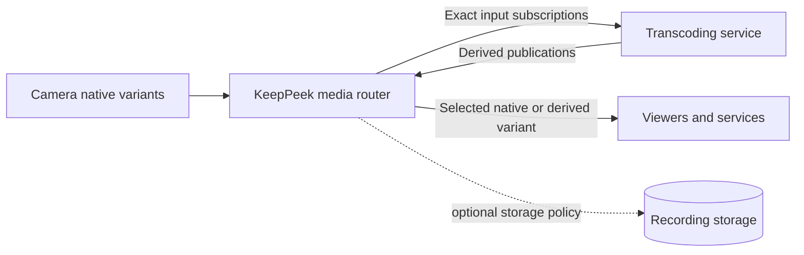
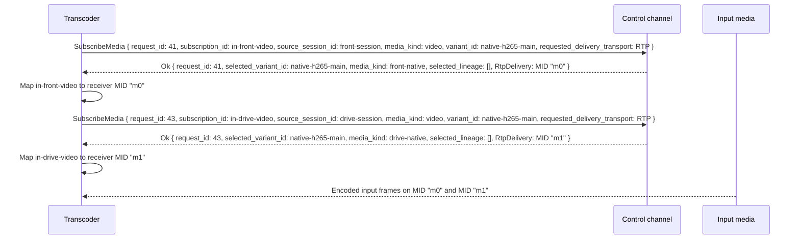
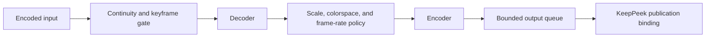
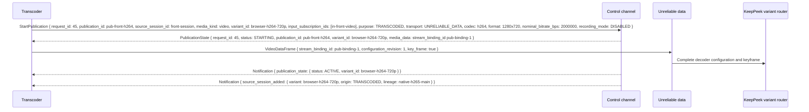
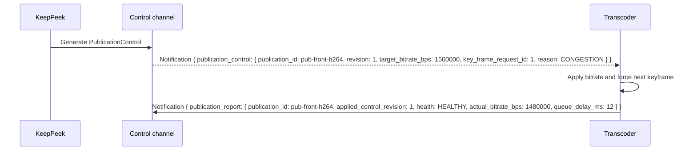

# Transcoding Service Scenario

This scenario defines a headless transcoding service that subscribes to one or more KeepPeek
audio or video streams, decodes them, encodes alternate formats or quality levels, and republishes
the outputs as discoverable variants of the same logical streams.

The service is intended for live compatibility and adaptation, such as converting camera H.265
into browser-compatible H.264, producing a lower-resolution stream for remote viewing, or
creating an alternate audio codec. Offline recording conversion and clip export are separate
workflows.

## API assessment

The earlier API was enough to receive encoded frames and send encoded frames back, but it was not
enough to make the result a safe, usable transcoded stream.

| Existing support                                                                   | Missing before this design                             |
| ---------------------------------------------------------------------------------- | ------------------------------------------------------ |
| Subscribe to multiple logical audio/video streams                                  | Name the output stream and concrete variant            |
| Receive media through RTP or data channels                                         | Discover active native and transcoded variants         |
| Publish one RTP audio/video stream or multiple media-data streams                  | Select an exact variant and codec-compatible transport |
| Carry codec configuration, timestamps, keyframe flags, and fragmented access units | Prove input lineage and reject transcoding loops       |
| Report connection-wide bandwidth                                                   | Own variant IDs and reject competing publishers        |
| Start and stop media publications                                                  | Request bitrate changes, pause/resume, or a keyframe   |
| Return a publication binding                                                       | Report publisher health and applied control revision   |

The variant, lineage, publication-capability, exact-selection, control, and report messages now in
`webrtc.proto` close those protocol gaps. Server and transcoder implementations are still needed;
this document defines their behavior.

## System boundary

KeepPeek remains the source and subscriber router. The transcoder consumes a concrete input
variant and publishes a concrete derived variant. It does not create a second camera identity or
send directly to viewers.

One publication produces one audio or video variant. A service can run many publications and can
group separate audio and video outputs with one source-scoped presentation ID.

## Discover inputs and output policy

The transcoder establishes a normal HTTP/WebRTC session, creates all three data channels, and
offers enough `recvonly` audio and video `StreamId` values in its initial offer for its configured
concurrent RTP inputs. The offerer assigns each `StreamId` an opaque MID; after creating or
applying the offer, the transcoder records the exact `StreamId -> receiver` registry. That offer
is the session's complete RTP capacity. It reads the complete `ServerCapabilities` snapshot before
creating any pipeline.

For each configured source and stream, the service evaluates:

- `MediaVariantCapability` entries for exact input codecs, formats, bitrates, origins, and lineage.
- `MediaPublicationCapability` for accepted output codecs and transports.
- Advertised output dimensions, audio-layout, nominal-bitrate, and active-variant limits.
- Available decoder and encoder hardware.
- Configured output profiles and maximum resource cost.

The service selects an exact input `variant_id`, normally one with origin `NATIVE`. It never uses
an empty variant selection for a derived pipeline because a later automatic choice could switch
the pipeline onto its own output or another derived variant. KeepPeek independently validates the
resolved lineage and rejects cycles.

An output profile has a stable variant ID within the logical stream. Example profiles are:

| Variant ID          | Input                    | Output                   | Intended use                            |
| ------------------- | ------------------------ | ------------------------ | --------------------------------------- |
| `browser-h264-720p` | Native H.265 main        | H.264, 1280×720, 2 Mbps  | Browser compatibility                   |
| `remote-h264-360p`  | Native H.264 or H.265    | H.264, 640×360, 500 Kbps | Constrained remote viewing              |
| `browser-aac`       | Native non-browser audio | AAC with source timeline | Browser audio paired by presentation ID |

Variant IDs are configuration identifiers, not display names or codec strings. Changing codec,
resolution, channel layout, or lineage creates a new variant ID. A target bitrate change within
the same decoder configuration does not.

## Subscribe to input variants

RTP is preferred for inputs when the local decoder supports the negotiated codec. Media-data
delivery is the fallback. The subscription requests an exact variant and receives the selected
variant, source-scoped presentation, and resolved lineage in `SubscriptionResult`.

Separate audio and video subscriptions belonging to one presentation retain their shared input
presentation ID. MID values do not pair them and do not identify their source. The transcoder
maps RTP timestamps or media-data `timestamp_us` values onto one source presentation timeline
before encoding output.

## Transcoding pipeline

Each input has isolated depacketize, decode, filter, and encode state. Encoder execution may be
shared across hardware sessions, but frame identity and timestamps remain source-specific.

Queues are bounded at every stage. A live transcoder drops stale unencoded frames or reduces its
sampling rate instead of accumulating seconds of latency. After input loss, decode resumes at a
valid keyframe. After output loss or an explicit keyframe request, the encoder emits a fresh
random-access frame with the configured decoder parameters.

The output preserves input presentation time. It can change frame cadence, but it does not reset
timestamps to process startup or wall-clock arrival time. Audio resampling and video frame-rate
conversion maintain the same presentation timeline and report drift as degraded health when it
exceeds policy.

## Start a derived publication

The transcoder starts one publication per output variant. It targets the existing source session
and logical stream, declares purpose `TRANSCODED`, and supplies the exact input subscription IDs.
KeepPeek resolves those IDs to lineage and owns the accepted variant ID for the lifetime of the
publication. Only immutable exact-variant subscriptions can be used as inputs; KeepPeek resolves
and cycle-checks their current bindings atomically with publication reservation.

For multiple outputs, media-data publication is the normal path because one WebRTC connection has
only one offered RTP audio send `StreamId` and one offered RTP video send `StreamId`. An RTP output
names the exact send `StreamId` in `StartPublication.rtp_mid`; a media-data output leaves it empty.
Real-time video normally uses `UNRELIABLE_DATA` to avoid reliable-channel head-of-line blocking;
frame fragmentation and keyframe recovery follow the existing media-data rules. Separate
connections are used when many RTP outputs are required.

The first `PublicationState` assigns a binding but does not make the output discoverable. KeepPeek
advertises the variant only after receiving a complete configuration and decodable video
keyframe, or the first valid audio access unit. This prevents viewers from binding to an encoder
that has not started. The publisher receives `ACTIVE` before KeepPeek queues the complete ready
capability snapshots on ordered control channels; other clients discover only the ready variant.

All access-unit fragments use the accepted stream binding, monotonically increasing frame IDs,
preserved timestamps, and configuration revision. A missing unreliable video frame causes
subscriber decoders to wait for the next keyframe. The router can request that keyframe from the
publisher rather than waiting for the normal GOP interval.

## Viewer selection and fanout

After activation, the derived output appears as another concrete variant under the original
logical stream. Its capability includes output codec and format, nominal bitrate, quality rank,
origin `TRANSCODED`, presentation ID, and resolved native or derived lineage.

A viewer can request `variant_id: browser-h264-720p` exactly. A viewer with an empty variant ID
lets KeepPeek select among compatible native and derived variants using negotiated codecs,
transport, and quality. The successful result always returns the selected variant ID; KeepPeek
never silently changes an exact request.

KeepPeek fans one publication out to any number of viewer subscriptions. It can receive the
transcoded media through a data channel and deliver it to viewers through RTP or media-data when
the variant advertises those delivery transports. Each viewer has independent congestion control
and queueing; one slow viewer does not apply its bandwidth estimate directly to the shared
encoder.

When a variant disappears, exact subscriptions stop. Viewers that want fallback issue a new
automatic or exact subscription. This keeps codec changes explicit and prevents a decoder from
receiving a different format on an old binding.

## Publisher control loop

The transcoder declares whether it supports pause/resume, target bitrate, and keyframe requests.
KeepPeek sends only supported controls with a monotonically increasing control revision.

The target bitrate is a shared encoder objective derived from publication policy, server capacity,
and aggregate demand. It is not copied from the weakest viewer's bandwidth estimate. Viewer-level
adaptation can select another variant without forcing every viewer onto that bitrate.

A pause control with `active: false` removes the variant from capabilities and stops its exact
subscriptions after the publisher applies it. Resume returns the publication to `STARTING`; it is
advertised again only after fresh configuration and a keyframe or first audio access unit. This
initial design does not keep viewer subscriptions pending on a hidden variant. The publisher
reports degraded health while it is missing input, falling behind, or unable to meet target
bitrate, and failed health when the variant cannot continue.

## Lineage and loop prevention

The transcoder supplies input subscription IDs, not caller-authored lineage strings. KeepPeek
resolves each active subscription to source session, logical stream, and selected variant. It
returns that lineage in the subscription result, then resolves it again and walks current derived
lineage atomically when accepting the output.

The start is rejected when:

- An input subscription does not belong to the publishing connection.
- An input disappeared or changed source session.
- The output variant already exists under the target stream.
- The output directly or indirectly depends on itself.
- The accepted publication limit for the target stream is reached.

The service also selects only configured input origins, normally `NATIVE`, but server-side cycle
validation is authoritative. Naming conventions alone are not loop prevention.

## Audio and video presentations

Audio and video are separate publications and bindings. A transcoder that changes both assigns
the same nonempty presentation ID and preserves their shared input timeline. Their variant
capabilities expose that ID, allowing a viewer to select a matching audio/video pair.

The comparison key is `(source_session_id, media_kind)`. KeepPeek rejects another owner or
an incompatible input timeline attempting to join that presentation, so equal strings from
different cameras cannot pair accidentally.

A video-only transcode may be paired with native audio only when both capabilities share the same
presentation timeline. If timestamp mapping or drift cannot be guaranteed, the derived video uses
a distinct presentation ID and is not advertised as synchronized with native audio.

This initial design does not add an atomic multi-track subscribe command. A viewer subscribes to
the desired audio and video variants separately and verifies the returned presentation IDs before
starting synchronized playback.

## Variant router behavior

KeepPeek maintains a registry keyed by `(source_session_id, media_kind, variant_id)`. The registry
contains native and published variants, resolved lineage, publication binding, readiness, cached
decoder configuration, latest decodable keyframe, health, and subscriber set.

Publication frames enter the registry once, then fan out through per-subscriber bounded queues.
The router repacketizes for each viewer's accepted RTP or media-data transport without decoding
and re-encoding the variant again. A newly attached subscriber receives configuration and a
decodable keyframe; if no suitable keyframe is cached, the router sends one publisher keyframe
request ID and coalesces additional requests until it arrives. A configured keyframe deadline
fails the affected new subscriptions and can degrade or fail a publisher that does not respond.

Capability snapshots include only variants that can be started or are ready. Publication state
changes and capability revision changes are serialized so a client never observes an `ACTIVE`
variant without its defining capability or a removed variant that continues delivering frames.

Each subscriber queue and bandwidth controller is independent. Queue overflow on unreliable video
drops complete frames and waits for a keyframe when needed. Reliable audio or media-data delivery
uses bounded backpressure and disconnects a subscriber that cannot recover; it never blocks the
publisher or another viewer.

## Lifecycle and ownership

The accepted publication owns its variant ID until stop, failure, source-session replacement, or
connection loss. A second transcoder proposing the same target variant receives
`PUBLICATION_ERROR_CODE_VARIANT_CONFLICT`. Deployments assign each
`(source_id, media_kind, output_profile)` to one replica or use an external lease before connecting.

If the source session or any required input variant disappears, KeepPeek stops the derived
publication and removes its capability. The transcoder rebuilds input subscriptions against the
new source session and starts a new publication. It does not reuse old stream bindings or frame
IDs.

Codec, resolution, sample-rate, channel-layout, decoder-configuration, presentation, or lineage
changes stop the old publication and start a new variant. A bitrate-only encoder adjustment can
remain on the existing binding. `StopPublication` is idempotent and removes output capability
before resources are released.

## Coordination state

A coordinator can write a `keeppeek.media-intent.v1` publication intent and a short worker lease
to the [shared state store](state-store.md). The transcoder watches that desired state, resolves
the stable source ID through current `ServerCapabilities`, and starts or stops the actual variant
with ordinary media commands. The state entry is never proof that the variant exists; only the
ready capability snapshot and publication result confirm it. Recording intent in the state
document must match the explicit `StartPublication.recording_mode` used for the actual output.

## Storage policy

Every transcoded publication declares a nonzero `recording_mode`. The common compatibility
profile uses `DISABLED`: KeepPeek records the native camera variant and avoids unnecessary quality
loss and storage duplication. A browser-ready or bandwidth-reduction output can instead request
`REQUIRED`, but only when the source publication capability allows it. `INHERIT` follows the
source's configured policy. `PublicationState.recording` is the authoritative result.

For `REQUIRED`, the output is not active until its recording writer is ready, and a later storage
failure stops the publication instead of silently continuing live-only. If a recorded derived
variant disappears, storage follows its configured failure policy: stop and report a gap, or
switch at a new segment boundary to another explicitly configured variant. It never splice-switches
codec or decoder configuration inside one recording fragment.

## Failure and recovery

- Input packet loss resets only the affected decoder and requests or waits for a keyframe.
- Decode or encoder failure reports degraded or failed publication health without affecting camera recording.
- Encoder overload drops stale work, reduces output frame rate, or reports queue delay rather than growing latency without bound.
- Lost publication control responses are retried with the same control revision and applied idempotently.
- Lost keyframe controls reuse the same keyframe request ID and produce at most one forced keyframe.
- Source restart invalidates input lineage and removes derived variants before the transcoder rebuilds them.
- Transcoder disconnect removes its variants and stops exact subscriptions; viewers may explicitly resubscribe to fallback variants.
- KeepPeek restart rebuilds native capabilities first; transcoders reconnect and republish derived variants.

## Security and resource controls

The transcoder authenticates with a dedicated named credential. The fixed Administrator/User
policy is enforced before publication commands; per-source, stream, codec, resolution, and bitrate
credential scopes are not implemented. Use a separate credential for each transcoder and revoke it
when the service is removed.

KeepPeek validates publication capability, input ownership, lineage, variant uniqueness, codec and
format, nominal bitrate, quality rank, decoder configuration, frame and fragment sizes, timestamp
monotonicity, frame IDs, and publication channel. The transcoder enforces decoder dimensions,
encoder session limits, GPU memory, per-source queues, aggregate output bitrate, and bounded
diagnostic text.

## Observability

Transcoder metrics include active inputs and outputs, input and output bitrate, decoder resets,
decoded and dropped frames, transcode latency, queue depth and delay, encoder utilization,
keyframe interval and requests, target versus actual bitrate, health, and publication restarts.

KeepPeek metrics include native and derived variants, publication startup latency, lineage and
variant conflicts, control requests and application latency, publisher reports, cached keyframe
age, fanout subscribers and bytes, per-subscriber queue drops, and automatic selection decisions.

Logs correlate source ID, source-session ID, logical stream ID, input and output variant IDs,
publication ID, presentation ID, and control revision without dumping frame payloads or decoder
configuration bytes.

## Acceptance scenarios

The implementation is complete when these behaviors pass end to end:

1. An H.265 camera variant is transcoded to H.264 and appears under the same logical video stream.
2. A viewer that cannot decode H.265 selects the H.264 variant and receives a decodable keyframe.
3. One service subscribes to and republishes variants for several cameras without RTP send-`StreamId` conflicts.
4. Exact variant selection never silently falls back to another codec.
5. A second publisher cannot claim an owned variant ID.
6. Direct and indirect transcoding loops are rejected from resolved lineage.
7. A target-bitrate control changes encoder output without changing decoder configuration.
8. A keyframe request produces one prompt random-access frame and is coalesced across viewers.
9. Matching audio/video variants preserve timestamps and return the same presentation ID.
10. Source restart removes stale derived variants and allows clean publication against the new session.
11. One slow viewer does not block the publisher or another viewer.
12. Stopping a publication removes its capability and exact subscriptions without silently rebinding them.
