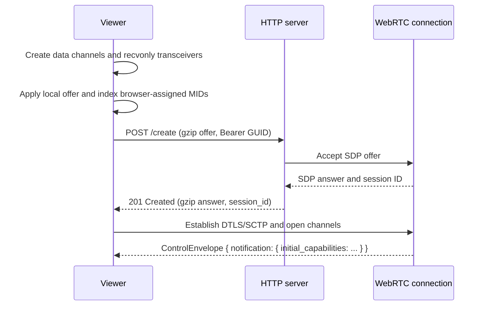
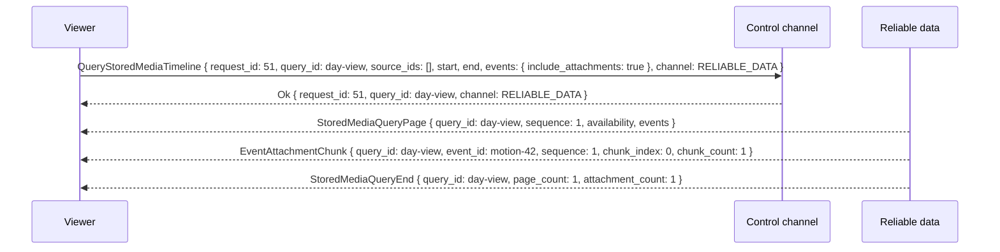
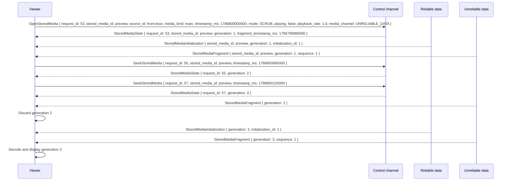
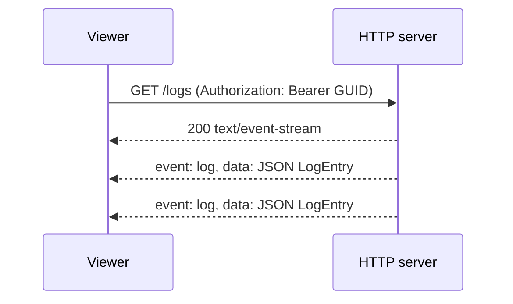
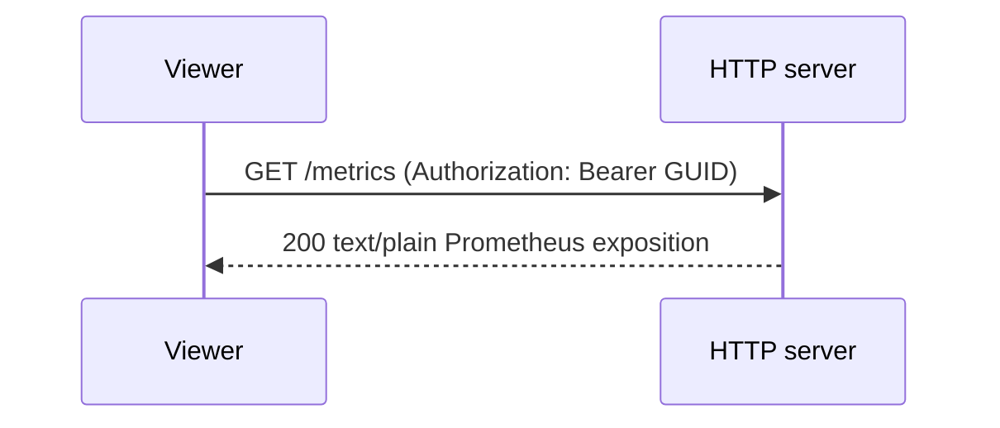
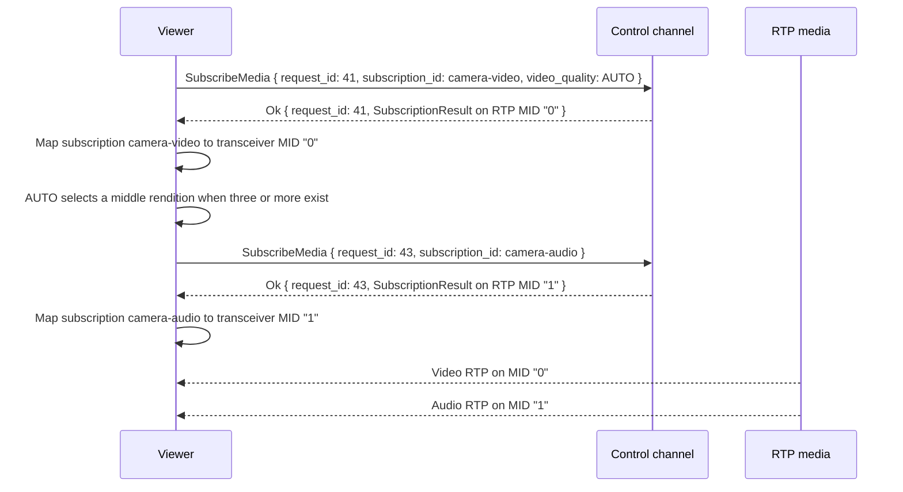
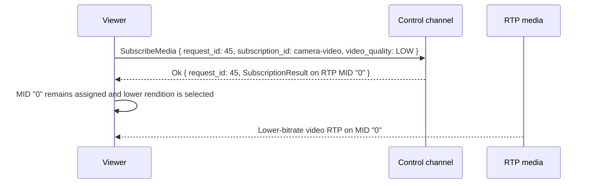
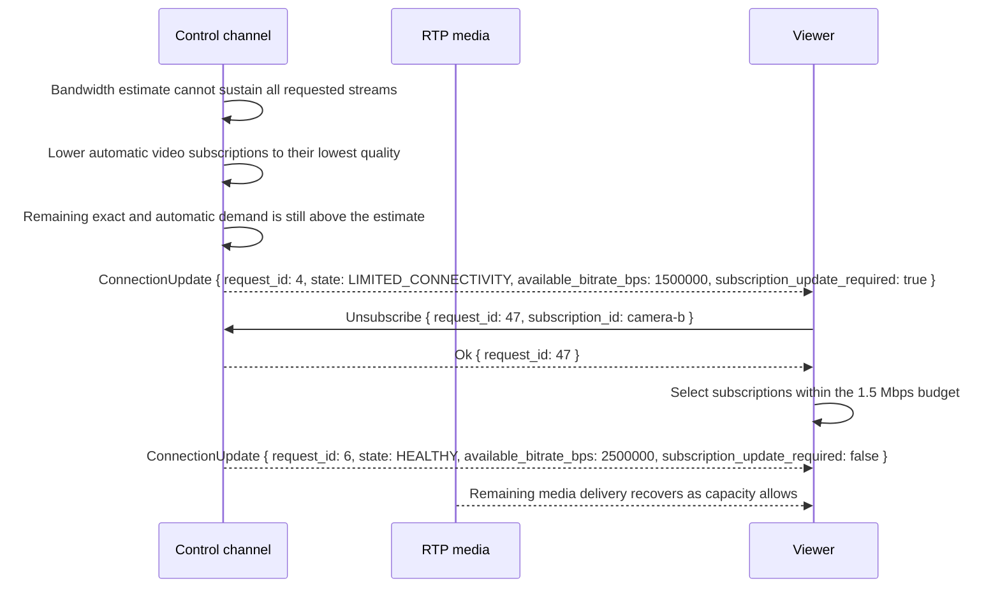

# Viewer Application Scenario

This scenario shows how a viewer establishes a session, learns current source state, subscribes
to streams, searches and scrubs stored media, receives opaque RTP `StreamId` assignments, requests
lower video quality, and observes limited connection health. It can also stream server logs through
the HTTP API when needed for diagnostics and retrieve all server metrics through the HTTP API.

The viewer uses the HTTP API for session creation and the pre-negotiated WebRTC channels for all
subsequent state, subscription, and media behavior. [webrtc.proto](../api/webrtc.proto) and
[webrtc.md](../api/webrtc.md) define the messages referenced here.

## Connect and receive current state

The viewer creates the three required data channels and every `recvonly` audio or video
transceiver it may need. It calls `createOffer`, applies that offer with `setLocalDescription`,
and records each browser-assigned `RTCRtpTransceiver.mid`. It then gzip-compresses a create body
containing the exact `peerConnection.localDescription` SDP and sends it to `POST /create` without
waiting for local ICE candidates. KeepPeek is ICE Lite and always answers that offer. The `201`
JSON body is also gzip-compressed, including `answer.sdp`; the viewer decompresses that whole body
before applying the answer. The offer is the session's complete RTP capacity; there is no later
renegotiation or trickle ICE.



The viewer treats every MID as an opaque string. It does not convert one to a number or infer a
media kind, direction, source, or presentation from its spelling or creation order. A browser
client builds its transport registry after applying the local offer:

```javascript
const transceiversByStreamId = new Map(
  peerConnection
    .getTransceivers()
    .flatMap((transceiver) =>
      transceiver.mid === null ? [] : [[transceiver.mid, transceiver]],
    ),
);
```

The viewer rebuilds this registry for every new `RTCPeerConnection`. Each map key is a `StreamId`
whose value is the exact MID. `StreamId` values are scoped to one session and are not persisted
across reconnects.

`ServerCapabilities` is the complete current source state. The viewer can choose any presentation
or state-management policy. `cameras` is the inventory: each configured camera's identity and
whether it supports PTZ (`ptz.supported` plus the verb flags). The viewer shows a PTZ pad only
when `ptz.supported` is true. Numeric camera health is not in this snapshot; scrape
`GET /metrics`. Live media is still discovered through each `source_session_id`, its audio and
video streams, data payload types, and event types. Each audio or video stream lists its
concrete `variants`, and a video stream's `quality_rank` values determine whether a manual
`HIGH` or `LOW` selection resolves to a distinct rendition.

The same snapshot advertises stored-media sources separately through stable `source_id` values.
Stored-media sources remain discoverable while their cameras are offline. Their capabilities name
the fragmented MP4 streams and timed event or metadata payloads available for timeline queries and
playback.

## Persist and switch dashboards

When `ServerCapabilities.capability_ids` includes `keeppeek.peek-layouts.v1`, the viewer reads and
replaces the `registry` entry in the `keeppeek.peek-layouts` StateStore namespace. The entry uses
the `keeppeek.peek-layout-registry.v1` schema. It contains the active layout ID and an ordered list
of dashboards. Each dashboard contains stable identity, name, audience, Activity Focus preference,
and ordered camera tiles with 12 by 12 positions, spans, and pin state.

KeepPeek stores server-owned dashboards once and stores the active selection per authenticated
principal. `All cameras` is an immutable dashboard that tracks the configured camera inventory.
Administrators create, rename, duplicate, update, import, export, and delete custom dashboards in
Settings. Each custom dashboard grants viewing to everyone or to selected named User credentials;
Administrators always retain access. A User receives only authorized dashboards and can replace
only their active selection. The server stores the registry under `[peek_layouts]` in `config.toml`.
A legacy `peek-layouts.json` is imported once on upgrade and removed after a successful write. The
`config.toml` and restores it after restart.

Every replacement includes the current StateStore revision. A stale replacement returns a typed
`StateStoreError` with the current revision and leaves the stored registry unchanged. The viewer
keeps the unsaved editor draft after a conflict, failed request, or capability loss. A configured
camera that is offline keeps its normal tile. A removed camera keeps a labelled placeholder until
the user removes or remaps it.

An Administrator can export one dashboard or the visible registry as versioned JSON. Export
includes only dashboard fields and credential IDs in explicit audiences; it never includes access
keys or unrelated user state. Import parses the complete document before mutation, reports
conflicting IDs and unsupported fields, and requires an explicit mapping or omission for every
missing camera ID. Imported dashboards start with Administrator-only access until an Administrator
assigns viewers. A validated import uses the same authorization and revisioned replacement as an
editor save.

The web application separates the two live surfaces. Dashboard at `/` shows camera grids and a
floating dashboard selector. Viewer at `/viewer` shows one full-shell camera, a `PEEK / camera`
overlay, and a filmstrip containing every available camera. The Viewer route remembers the last
selected camera on the device and falls back to the first available camera.

## Search, scrub, and play stored media

### Recording timeline view

The recording view is a persistent review workspace, not a list of recording files. The player,
timeline, filters, and selected-event details remain in place while the visible time range
changes. On wide screens the player is the primary region and the timeline is a vertical rail
beside it. On narrow screens the player stays above the same timeline, which becomes a full-width
scroll region. Changing layout does not change the selected time, source, event, or playback
state.

| Region          | Design                                                                                                                                                                |
| --------------- | --------------------------------------------------------------------------------------------------------------------------------------------------------------------- |
| Range toolbar   | Selects date or visible range, source set, event types, and zoom. Previous/next range and zoom use icon buttons with tooltips.                                        |
| Player          | Shows the source at the shared playhead. It remains mounted while queries change so pan and zoom do not interrupt settled playback.                                   |
| Shared timeline | Uses one absolute clock for every source. Indexed availability appears as source-labelled coverage bands; gaps remain visibly empty.                                  |
| Event layer     | Anchors every event at its start time, shows its source and type, and uses its JPEG when available. Nearby events cluster at the current zoom instead of overlapping. |
| Playhead        | Crosses every visible source band and displays the exact timestamp. Dragging previews the source currently selected for playback.                                     |
| Event details   | Shows origin, source, stream, start/end, confidence, zone, and bounding box without hiding the surrounding timeline.                                                  |

The default unified view sends an empty `source_ids` list, meaning every stored-media source.
Selecting cameras narrows later queries without changing the time axis. One source is active in
the player, but event markers from every selected source remain visible. Selecting an event makes
its source active, positions the shared playhead at its start, opens the event details, and starts
a scrub preview. Selecting an availability band seeks that source directly. Selecting a gap does
not jump to another recording; the viewer keeps the requested timestamp and shows that no media
is available there.

The timeline renders all event records before waiting for attachments. Events whose `attachments`
list a JPEG descriptor initially use a stable placeholder, then fill in when the matching
`EventAttachmentChunk` transfer completes. Events without a JPEG retain the placeholder. At
overview zoom levels the viewer may set `include_attachments: false`; at detail zoom it requests
attachments only for the
visible range. Clusters show their event count and expand into an ordered event list or separate
as the viewer zooms in.

The visible viewport is the query boundary. A pan, zoom, source change, or event-filter change
allocates a new query ID and cancels the superseded query. The last complete result remains
rendered until the first page for the new query arrives, avoiding an empty flash. Pages,
attachments,
and completion messages update the view only when their query ID is current. Availability and
event records are merged by stable IDs, so pagination never duplicates visible items.

Pointer movement updates the local playhead immediately. The viewer coalesces network seeks to at
most one in-flight `SeekStoredMedia` plus the newest unsent target; intermediate pointer positions
are replaced rather than queued on `control-channel`. A returned generation becomes current
before its media is rendered. On pointer release or keyboard seek completion, the final target is
sent even when it matches the latest local preview position.

Keyboard focus can move between the range controls, timeline, event clusters, and playhead.
Arrow keys move the playhead by the current minor interval, Shift plus arrow keys move by the major
interval, and Home/End move to the visible range boundaries. Focus and selection are independent:
panning the timeline does not silently change the active source or start playback.

### Load the visible timeline

The viewer first requests indexed availability and all events for its visible timeline. An empty
`events` selection means every event type; `include_attachments` opts into available event
thumbnails.
This query does not open or scan any MP4 file. KeepPeek accepts it on `control-channel`, sends the
event pages before any images, then completes the result with exact page and attachment counts.



To retrieve event information without image bytes, the viewer sends `events: {}`. It receives the
same `Event` records and attachment descriptors, with `attachment_count: 0`.

### Scrub the playhead

While the user drags the timeline, the viewer opens a paused `SCRUB` cursor with media fragments
on `unreliable-data`. Initialization bytes still arrive on `reliable-data`. Each seek increments
the cursor generation, allowing the viewer to discard delayed fragments from superseded seeks.
For readability, the `StoredMediaState` labels below show only fields relevant to each transition;
every wire response is the complete state described in [webrtc.md](../api/webrtc.md).



### Start continuous playback

When the position settles, the viewer closes the replaceable preview cursor and opens a
`PLAYBACK` cursor at the same timestamp on `reliable-data`. It requests event payloads on the
same reliable channel, receives exact MP4 initialization and fragment ranges, and keeps only the
bounded duration accepted in `StoredMediaState.delivery.max_buffer_duration_ms` ahead of the
visible cursor.

This two-cursor handoff avoids ordered-channel backlog during rapid dragging without accepting
loss during normal playback. A client that prefers lower latency over completeness may keep
continuous playback on `unreliable-data`; KeepPeek never changes the requested route implicitly.

A session can keep at most 16 stored-media cursors open, and one server can keep at most 1,024
across all sessions. The server rejects a duplicate cursor ID or an exhausted quota before it
opens storage. Close a replaceable scrub cursor as soon as its playback cursor takes ownership.

## Optional server log stream

The viewer may open the authenticated HTTP SSE endpoint independently of its WebRTC session. The
log stream is server-wide diagnostic output, not a `control-channel` message and not scoped to a
single WebRTC session.



Each SSE `log` event contains a JSON `LogEntry` and uses its sequence number as the SSE event
ID. The viewer can open or close this HTTP stream whenever needed without changing its WebRTC
subscriptions or media delivery.

## Optional server metrics

The viewer may retrieve all server metrics through the authenticated HTTP metrics endpoint. The
response is the server's Prometheus text exposition, including server-observed WebRTC transport
metrics. It is not a `control-channel` message and is not scoped to one viewer session.



The viewer can fetch `/metrics` whenever it needs a current complete server metrics snapshot.
This does not affect WebRTC subscriptions, media delivery, or the optional SSE log stream.

## Subscribe and bind opaque MIDs

The viewer requests each desired audio or video stream with a nonzero request ID. For RTP, the
server selects an unbound `recvonly` `StreamId` of the matching kind with a compatible negotiated
codec and returns its exact MID string in `Ok.subscription_result`. A request that needs another
matching `StreamId` when none remain is rejected; the viewer does not add m-lines after the
session exists.



The example values `"0"` and `"1"` are browser-assigned `StreamId` strings with no numeric
meaning. The viewer looks them up in `transceiversByStreamId`, verifies that the returned
transceiver has the expected receiver kind, and records both `subscription_id -> StreamId` and
`StreamId -> subscription_id`. The server retains the assignment while the subscription remains
active; it does not silently move a stream to another MID.

The same `SubscribeData` request can ask for data payload types. The viewer maps each requested
payload type to `reliable-data` or `unreliable-data`; the accepted routes arrive in
`DataSubscriptionDelivery`.

## Request lower video quality

To override automatic selection, the viewer sends a replace `SubscribeMedia` using the same
`subscription_id`, source session, and stream ID. It sets
`video_quality` to `low` and leaves `variant_id` empty, which resolves to the lowest-ranked
variant advertised for that stream. That replace keeps the existing RTP MID when the transport
is unchanged.



The server may select a lower rendition, lower encoder bitrate, or another available lower-cost
delivery profile. It preserves the delivery binding rather than requiring SDP renegotiation for a
quality change.

## Limited connectivity

When server-side congestion control or bandwidth availability cannot sustain all requested
streams and qualities, the server sends a `ConnectionUpdate` with a newly allocated Request
ID. This is an unsolicited control message because it reflects the connection state rather than a
response to a viewer command.



`LIMITED_CONNECTIVITY` reports a connection-wide constraint rather than naming individual
subscriptions. KeepPeek may first lower only automatic video subscriptions. Exact-variant,
group-profile, and publication-input subscriptions stay on their bindings. If
`subscription_update_required` is `true`, the viewer must remove or replace individual
subscriptions until its requested delivery fits within `available_bitrate_bps`. The viewer can
retrieve `GET /metrics` for the server-observed WebRTC transport metrics that explain the
condition. `HEALTHY` reports recovery.
