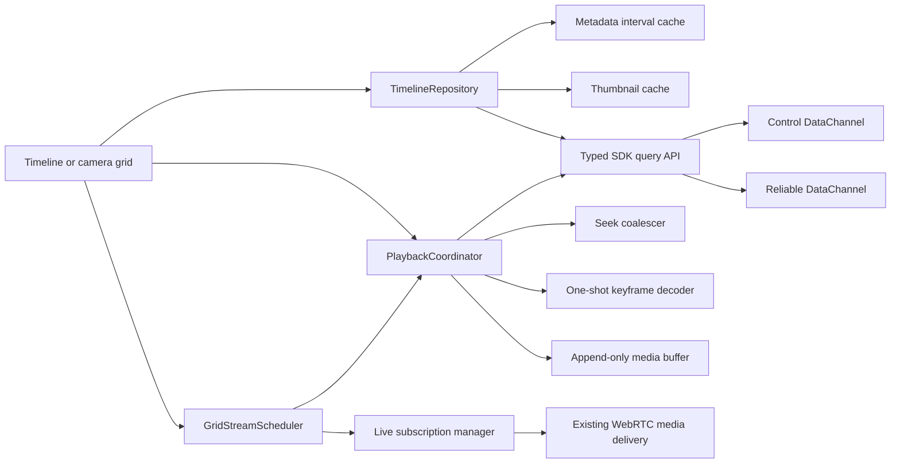
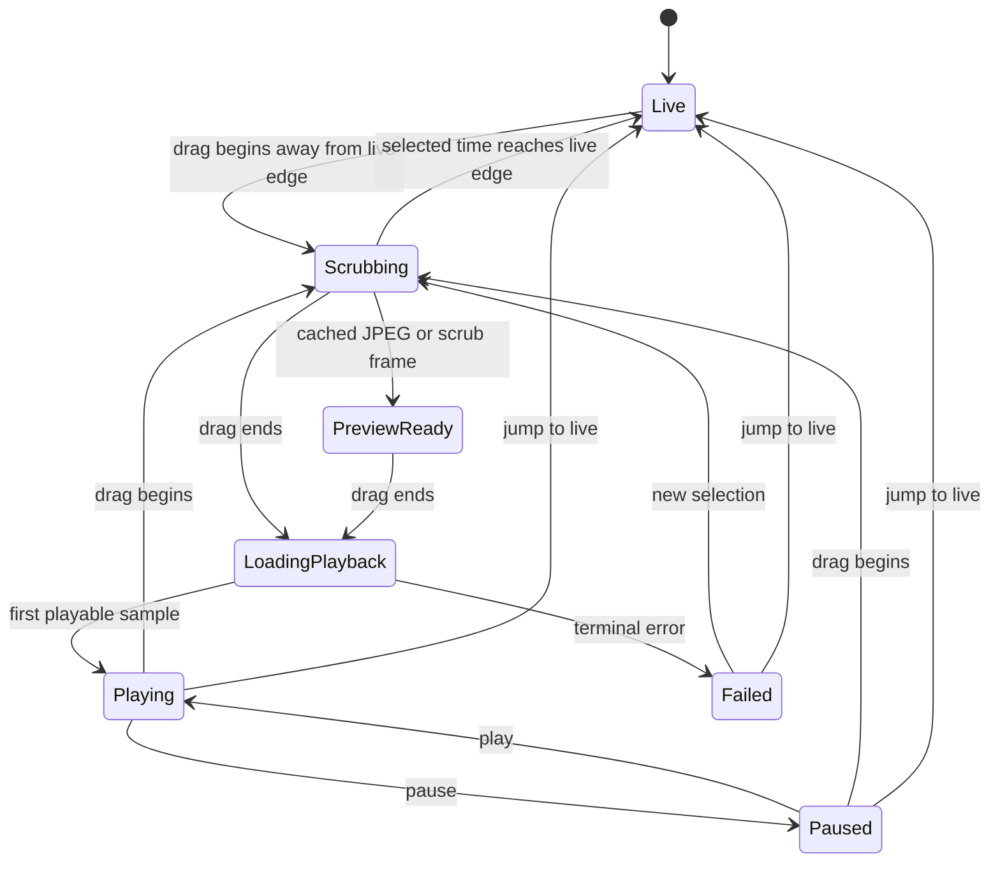

# Scrypted Timeline and Camera Grid Design for KeepPeek

Status: Proposed  
Scope: Rust SDK, C ABI, Android viewer, iOS viewer, and the corresponding server behavior  
Transport constraint: no new HTTP media or metadata endpoints

## 1. Decision summary

KeepPeek should copy the behavior that makes Scrypted playback feel immediate,
not Scrypted's browser transport implementation.

The design has five core decisions:

1. Build timeline ticks locally from time arithmetic. Never download one row or
   one tick per time interval.
2. Query only missing timeline windows, merge paged responses into a cache, and
   render pages as they arrive.
3. Fetch event JPEG attachments only for a sparse set of visible candidates.
   Keep the current frame visible until the new still or video frame is ready.
4. Reuse one stored-media cursor per active camera. During drag, switch that
   cursor to `SCRUB` and coalesce seeks; on release, switch the same cursor to
   `PLAYBACK` instead of closing and reopening it.
5. Give camera-grid subscriptions and decoders to the most valuable visible
   tiles. Keep a frozen last frame for paused tiles and apply a release grace
   period so small scroll movements do not churn subscriptions.

For precise previews at arbitrary recorded times, add a capability-gated
stored-media keyframe message on the reliable DataChannel. It carries codec
configuration plus one independently decodable access unit. Event JPEGs remain
the cheapest first choice, keyframes provide the exact-time fallback, and fMP4
remains the continuous playback format.

The existing protobuf already supports the required operations:

- `QueryStoredMediaTimeline` supports multiple sources, bucketed availability,
  events, and optional event attachments.
- `EventAttachmentChunk` can carry query-scoped JPEG data.
- `OpenStoredMedia`, `SeekStoredMedia`, `SetStoredMediaPlayback`, and
  `RefillStoredMedia` support a persistent, bounded historical cursor.
- `StoredMediaState.generation` and every stored-media segment generation allow
  clients to reject stale data after a seek.

Timeline metadata and JPEG preview need only typed Rust/C ABI exposure and
client orchestration. The keyframe fast path is one small, additive protobuf
extension. Clients discover it through `ServerCapabilities.capability_ids` and
fall back to a one-fragment fMP4 scrub response when it is absent.

## 2. Existing KeepPeek baseline

KeepPeek already has the right transport boundary:

- HTTP creates and deletes a WebRTC session.
- Protobuf control, timeline queries, event data, event attachments, and stored
  fMP4 are carried inside that WebRTC session.
- Live video continues to use the delivery transport negotiated by the existing
  subscription helper. The current helper requests RTP, which is still carried
  by the same WebRTC peer connection.
- This proposal adds no HTTP requests after bootstrap for timeline, thumbnail,
  preview, playback, or camera-grid content.

Relevant implementation anchors:

- `crates/sdk/proto/webrtc.proto`: existing wire contract.
- `crates/sdk/src/session.rs`: session, query, cursor, and channel ownership.
- `crates/sdk/src/api.rs`: typed Rust application models.
- `crates/sdk/src/ffi.rs` and `crates/sdk/include/keeppeek_sdk.h`: mobile ABI.
- `android/keeppeek_viewer/app/src/main/java/com/keeppeek/viewer/data/ViewerViewModel.kt`:
  Android subscription, timeline, and replay ownership.
- `android/keeppeek_viewer/app/src/main/java/com/keeppeek/viewer/ui/live/LiveScreen.kt`:
  Android's existing one-third-visible grid threshold.
- `ios/keeppeek_viewer/KeepPeekViewer/ViewerStore.swift`: iOS session and stream
  ownership.
- `ios/keeppeek_viewer/KeepPeekViewer/LiveDashboardView.swift`: current iOS
  preview startup.

The largest current playback cost is client-side. Both viewers close the old
cursor, open a new cursor, wait for at least three fMP4 fragments, write a
temporary MP4, and only then replace the player item. The seek and refill APIs
exist but are not used by the playback UI.

## 3. Goals

- A timeline can be scrolled indefinitely without allocating an indefinitely
  large list or querying every visible tick.
- Cached event thumbnails appear during a drag without waiting for video.
- A cold historical preview is requested only after the pointer settles briefly.
- Consecutive seeks reuse the same stored-media cursor.
- Playback starts from the selected instant without a blank surface transition.
- Camera-grid work tracks visibility and decoder capacity on both platforms.
- A shared grid playhead can preview and play the same historical epoch across
  multiple cameras.
- All queues, caches, and prefetches have explicit byte or item bounds.
- Android and iOS have the same behavior even where their rendering primitives
  differ.

## 4. Non-goals

- Reproducing Scrypted's Vue components or Engine.IO RPC.
- Adding HLS, MP4, JPEG, or metadata HTTP endpoints.
- Keeping every camera decoded while it is offscreen.
- Requiring every event to have a thumbnail.
- Frame-accurate synchronization across cameras in the first release.
- Replacing the existing WebRTC session or live subscription protocol.

## 5. Target architecture



Ownership rules:

- The Rust SDK owns protobuf, request IDs, channel routing, and C ABI memory.
- `TimelineRepository` owns range coverage, query cancellation, page merging,
  event de-duplication, and thumbnail caching.
- `PlaybackCoordinator` owns the selected epoch, cursor lifecycle, seek
  coalescing, generation changes, player buffering, and live/replay transitions.
- `GridStreamScheduler` owns which cameras may subscribe and decode. Views only
  report visibility, focus, and lifecycle.
- Platform playback sinks own Media3/MediaCodec details on Android and
  AVFoundation details on iOS.

These objects should be long-lived children of `ViewerViewModel` on Android and
`ViewerStore` on iOS. They must not be recreated by a composable or SwiftUI view.

## 6. Transport and priority model

Use the three pre-negotiated channels as they are intended today:

| Traffic | Channel | Policy |
| --- | --- | --- |
| Commands, responses, state | control | Always process first |
| Timeline pages | reliable data | Cancelable and metadata-only by default |
| JPEG attachment chunks | reliable data | Sparse, at most two active fetches |
| Historical keyframes | reliable data | Latest-wins, one active per focused preview |
| Stored fMP4 | reliable data | Refill-controlled, bounded by buffer duration |
| Transient media where advertised | unreliable data | Existing capability-driven behavior |

Live video keeps its existing negotiated media delivery. The important rule is
that the new feature never creates a parallel HTTP path.

The reliable channel is ordered, so an unbounded JPEG or replay prefetch can
cause head-of-line delay. Apply these limits initially:

- Two active attachment queries per viewer.
- One attachment assembly per visible candidate.
- 1 MiB maximum accepted bytes per attachment.
- 8 MiB maximum in-flight attachment bytes.
- One focused keyframe request in flight; later scrub targets replace the
  pending target.
- 4 MiB maximum accepted bytes per encoded keyframe access unit.
- 5 seconds maximum stored-media buffer for interactive playback.
- No playback refill while the player has at least 3 seconds buffered ahead.

Control events already take priority over the bounded RTP event queue in
`SessionEvents`. Stale attachment chunks and stale stored-media generations
must be discarded before allocating their full payload in a platform cache.

## 7. Timeline model

### 7.1 Ticks are a projection

Do not store a row for every historical interval. Store only:

```text
TimelineViewport
  anchorTimeMs
  selectedTimeMs
  tickDurationMs
  tickExtentPx
  scrollOffsetPx
  viewportExtentPx
```

Index zero is the live-edge tick. Increasing indices move into the past:

```text
tickTime(index) = anchorTimeMs - index * tickDurationMs

selectedTimeMs = anchorTimeMs
    - ((scrollOffsetPx + markerOffsetPx) / tickExtentPx) * tickDurationMs
```

Round only when converting the final result to integer milliseconds. This
keeps the playhead stable while zooming.

Render enough ticks for the viewport plus two viewports of overscan on each
side. When the viewport approaches an edge, move the virtual anchor and reuse
the same cells. No network request is caused by creating ticks.

Initial zoom presets:

| Preset | Tick duration | Tick extent | Availability bucket |
| --- | ---: | ---: | ---: |
| Fine | 15 seconds | 12 dp | 15 seconds |
| Normal | 1 minute | 12 dp | 1 minute |
| Coarse | 5 minutes | 12 dp | 5 minutes |

Changing zoom must preserve the selected epoch under the marker. Exact values
can be tuned after profiling without changing the repository API.

### 7.2 Responsive presentation

- Tablet, desktop-sized window, and landscape phone: video fills the main area
  and a vertical timeline rail occupies a fixed-width side region.
- Narrow portrait phone: use the same model in a horizontal ruler below video.
- The marker remains fixed; the ticks move beneath it.
- Timeline layout has stable dimensions and does not resize when thumbnails or
  status labels appear.

This reproduces Scrypted's interaction semantics while remaining usable on both
native phone layouts.

## 8. Timeline repository and lazy window loading

### 8.1 Cache key

```text
TimelineWindowKey
  sourceIdsHash
  alignedStartMs
  alignedEndMs
  availabilityBucketMs
  eventFilterHash
  includeAttachments
```

Maintain an interval set for every source and resolution. Before querying,
subtract cached intervals from the requested prefetch window and request only
the missing intervals.

Window sizes should scale with zoom:

- Fine: visible window plus 30 minutes on both sides.
- Normal: visible window plus 2 hours on both sides.
- Coarse: visible window plus 12 hours on both sides.

Align every boundary to the availability bucket. Adjacent missing intervals are
coalesced before a query is sent.

### 8.2 Page handling

- Apply each page immediately; do not wait for `StoredMediaQueryEnd` to render.
- Merge overlapping or adjacent availability ranges.
- De-duplicate events by `(source_id, event_id, revision)`.
- Preserve page sequence for diagnostics, but do not assume pages arrive sorted.
- Associate every query ID with a repository generation. Ignore pages from an
  older generation after source, zoom, or filter changes.
- Cancel superseded queries with `CancelStoredMediaTimelineQuery`.
- Refresh the live-edge window every 5 seconds while visible.
- Treat old windows as cacheable but revalidate them after reconnect, recording
  deletion, or a server capability revision change.

### 8.3 Cache layers

1. Viewport cache: current metadata and decoded images, no lookup latency.
2. Memory LRU: up to 24 MiB of decoded thumbnails and 10,000 timeline events.
3. Disk cache: up to 128 MiB of compressed JPEGs plus compact metadata.

Disk entries are keyed by source, event ID, event revision, attachment ID, and
size class. A revision change invalidates the image without scanning the cache.
The disk cache must follow the app's existing protected-storage policy and be
cleared on logout or server identity change.

## 9. Sparse thumbnail selection

Timeline metadata is fetched first with `include_attachments = false`. After a
page is merged, choose a sparse, deterministic set of thumbnail candidates.

Candidate order:

1. Doorbell or entry event.
2. Person event.
3. Event with a moving object.
4. Higher confidence.
5. Event representing a denser bucket.
6. Newer event as a final tie-breaker.

The typed API does not expose all of those fields today, but the protobuf
already contains confidence, bounding box, zone, revision, and attachment
descriptors. Expose them rather than adding duplicate fields to the wire schema.

Selection algorithm:

```text
candidates = events in visible range plus half a viewport of overscan
sort candidates by priority

for candidate in candidates:
    x = projected timeline position
    if no selected thumbnail is within minimumThumbnailSpacingPx:
        select candidate
```

Start with `minimumThumbnailSpacingPx = 96 dp`. A wide vertical rail may use two
columns, with spacing enforced independently in each column.

For a selected candidate:

1. Show a decoded memory-cache image if present.
2. Otherwise decode the compressed disk-cache image.
3. Otherwise issue a narrow timeline query around that event with
   `include_attachments = true`.
4. Assemble `EventAttachmentChunk` values by query ID, event ID, attachment ID,
   and chunk index.
5. Decode to a maximum 320-pixel edge and populate both caches.

Do not fetch attachments for every event, for offscreen candidates, or for a
query that has already left the repository generation.

If an event has no usable image, the timeline still shows its marker. Historical
preview falls back to the stored-media scrub cursor and its keyframe preview.

## 10. Playback coordinator

### 10.1 State machine



The video surface has three stacked layers with stable bounds:

1. Last decoded frame or cached event JPEG.
2. Live, one-shot keyframe, or historical player surface.
3. Loading, queued, offline, or error status.

The previous visible layer is removed only after the replacement reports its
first rendered frame. This prevents black flashes.

### 10.2 Cursor reuse

Scrypted sends a paused preview request and then resumes playback. KeepPeek must
express the same behavior using its own protocol:

- Scrypted's `playbackRate: 0` must not be copied literally. KeepPeek's C ABI
  normalizes a non-positive rate to 1.0.
- Use `mode = SCRUB` and `playing = false` while the user drags.
- Use `mode = PLAYBACK`, `playing = true`, and the selected rate when the drag
  commits.

Cursor lifecycle:

1. On the first historical selection, open one cursor with `SCRUB`, paused,
   rate 1.0, and a 5-second maximum buffer.
2. Keep that cursor until the camera changes, the view closes, the session
   reconnects, or a short post-live grace period expires.
3. Seek the existing cursor for later selections.
4. On scrub end, seek the final target if needed and switch the same cursor to
   `PLAYBACK` and playing.
5. On jump to live, reveal the already-warm low-quality live stream, upgrade it
   to high quality, and close the historical cursor after a 2-second grace
   period.

While history is selected, the live subscription may remain warm at low quality
if capacity allows. It must not consume a high-quality or focused decoder slot.

### 10.3 Seek coalescing

Pointer events update the local playhead immediately. Network seeks use a
single-flight latest-wins coalescer:

```text
onDrag(time):
    selectedTime = time
    preview = thumbnailCache.nearest(time)
    pendingSeek = nearestPlayable(time)
    scheduleDispatch(after: 50 ms)

dispatch():
    if seekInFlight:
        return
    target = pendingSeek
    pendingSeek = none
    send seek(target)
    seekInFlight = true

onSeekState(generation):
    seekInFlight = false
    discard media from older generations
    if pendingSeek exists:
        dispatch immediately
```

Rules:

- Do not seek more than once per 50 milliseconds.
- Do not seek again inside the current preview bucket.
- Never queue every drag sample.
- The final drag position bypasses the debounce but still obeys single-flight.
- If the target is in a recording gap, snap to the closest interior instant of
  the nearest availability range, matching current Android behavior.

### 10.4 Keyframes over the DataChannel

Yes, historical keyframes should be sent over the reliable DataChannel. This is
the preferred exact-time preview because it avoids constructing an MP4 and
starting a full player merely to display one frame.

A usable "keyframe" must be an independently decodable random-access access
unit, not only a frame that happened to be marked key. The server contract is:

- H.264: an IDR access unit with the required SPS/PPS available in
  `decoder_config` or included in Annex B form.
- H.265: an IDR/BLA access unit, or another random-access point proven not to
  depend on unavailable leading pictures, with VPS/SPS/PPS available.
- The reported timestamp is the frame actually returned; it may be the nearest
  keyframe at or before the requested epoch.
- Every seek increments the stored-media generation, so a late frame cannot
  replace a newer preview.
- Payloads use the existing frame fragment fields and are reassembled before
  decode.

Use one additive stored-media message that composes existing media types:

```proto
message StoredMediaMessage {
  oneof message {
    StoredMediaInitialization initialization = 1;
    StoredMediaFragment fragment = 2;
    StoredMediaTimedData timed_data = 3;
    StoredMediaKeyFrame key_frame = 4;
  }
}

message StoredMediaKeyFrame {
  string stored_media_id = 1;
  uint64 generation = 2;
  MediaDataConfiguration configuration = 3;
  VideoDataFrame frame = 4;
}
```

`MediaDataConfiguration` already carries codec, dimensions, decoder config,
and configuration revision. `VideoDataFrame` already carries timestamp, decode
time, key-frame status, configuration revision, fragment index/count, and the
encoded payload. The nested stream binding ID is session-local and must match
between the configuration and frame.

Advertise this behavior as `stored-media-keyframe-preview.v1`. When present:

1. An open or seek in `SCRUB` mode emits at most one `StoredMediaKeyFrame` for
   that generation and does not start continuous fMP4 delivery.
2. Android decodes it with a one-shot `MediaCodec` path that shares Annex B and
   codec-configuration parsing with `NativeVideoStream`.
3. iOS decodes it with `VTDecompressionSession` or the existing sample-buffer
   rendering pipeline and retains the resulting pixel buffer as the still.
4. On drag commit, `SetStoredMediaPlayback` changes the same cursor to
   `PLAYBACK`; the server then sends fMP4 initialization and fragments for that
   generation.

Cache compressed keyframes in a small memory LRU keyed by source, stream,
actual frame timestamp, codec, and configuration revision. Do not persist them
to disk initially; event JPEGs are smaller and remain the disk-cache format.
For a multi-camera grid, decode keyframes serially through a bounded one-shot
decoder pool. Never allocate one keyframe decoder per tile.

Preview preference becomes:

1. Memory-cached event JPEG.
2. Disk-cached event JPEG.
3. Memory-cached exact-time keyframe.
4. DataChannel keyframe after the coalesced scrub seek.
5. One-fragment fMP4 scrub fallback for older servers.

### 10.5 Incremental fMP4 playback

Replace the current "wait for three fragments, write a finished temporary file"
path with an append-only, generation-scoped media buffer:

```text
StoredMediaBuffer
  generation
  initializationById
  orderedFragments
  bufferedStart
  bufferedEnd
  byteCount
  waiters
```

- Assemble chunked messages exactly as today.
- Accept one initialization and one keyframe-containing fragment as enough to
  begin a scrub preview.
- Append later fragments without replacing the player item.
- Reject older generations before chunk assembly.
- On a newer generation, wake readers with a seek-reset result, clear partials,
  and install a new source behind the retained still layer.
- Send `RefillStoredMedia` when buffered-ahead drops below 1.5 seconds.
- Stop refilling at a 3-second target and a 5-second hard maximum.
- Audio remains muted in `SCRUB`; enable it only after entering `PLAYBACK`.

Platform sinks:

- Android: a Media3 `DataSource` backed by the append-only buffer and a custom
  media source that can block briefly for the next fragment without blocking
  the main thread.
- iOS: an `AVAssetResourceLoaderDelegate` backed by the same conceptual buffer.
  Fulfill data requests incrementally and cancel them on generation changes.

The existing MP4 normalization stays in the pipeline, but it runs incrementally
on initialization and fragment metadata rather than rebuilding a complete file
for each selection.

## 11. Camera-grid scheduler

### 11.1 Inputs

Every tile reports:

```text
GridTileDemand
  sourceId
  visibleFraction
  distanceFromViewportPx
  focused
  fullscreen
  selectedForAudio
  screenActive
  mode: live | history
```

The scheduler also receives:

- Available WebRTC receive slots.
- Current hardware and software decoder capacity.
- Connection health and available bitrate.
- Whether a tile has a cached still or stored media at the selected time.

### 11.2 Priority

Use a deterministic score:

```text
+1000 fullscreen or focused
 +600 at least one-third visible
 +350 partially visible
 +150 within one viewport of becoming visible
 +100 selected for audio
  +50 rendered during the last one-second grace period
```

Sort by score, then most recently visible, then stable source ID. Grant work in
this order:

1. Subscription slot.
2. Decoder slot.
3. Quality: high only for focused/fullscreen, low for grid tiles.
4. Optional render cap for grid previews.

Tile states are explicit:

```text
Placeholder -> Queued -> Subscribing -> WaitingForKeyFrame -> Playing
Playing -> Frozen -> Queued
Any -> Offline
Any -> Failed
```

`Frozen` retains the last decoded frame but owns neither a decoder nor a live
subscription after the grace period.

### 11.3 Lazy activation rules

- Keep Android's one-third-visible threshold.
- Add equivalent geometry-based visibility reporting on iOS; `LazyVGrid`
  creation alone is not a sufficient visibility signal.
- Prefetch metadata and cached stills for tiles within one viewport.
- Subscribe only when a tile reaches the active priority set.
- Stagger starts in batches of at most three, separated by 40 milliseconds.
- Release a tile one second after it leaves the desired set unless it re-enters.
- Reuse the same `NativeVideoStream` or `KeepPeekVideoStream` when a grid tile
  becomes the detail view. Change quality and surface ownership; do not create a
  duplicate subscription.
- On app background, release decoders and stop replay refill. Keep only metadata
  and compressed thumbnail caches.

### 11.4 Frozen-frame layer

Capture the last successfully rendered frame before detaching a grid surface:

- Android: use the rendering surface's supported copy path on a worker thread.
- iOS: retain a downscaled image from the last rendered pixel buffer.
- Downscale to the tile's display class before caching.
- Keep one frozen frame per camera in a small LRU.

If local capture is unavailable, use the newest cached event JPEG. If neither is
available, use the stable placeholder. A missing still never blocks activation.

## 12. Historical camera grid

Scrypted's grid and playback share one epoch. KeepPeek should expose the same
concept with a `GridPlaybackSession`:

```text
GridPlaybackSession
  mode: live | scrub | playback | paused
  selectedEpochMs
  playbackRate
  focusedSourceId
  activeReplaySources
```

Behavior:

1. Entering history pauses normal grid activation and preserves frozen live
   frames.
2. Query metadata for all visible source IDs in one
   `QueryStoredMediaTimeline`; the protobuf already supports repeated source
   IDs.
3. During drag, show each camera's nearest cached event JPEG. Cameras without a
   recording display `No recording` without opening a cursor.
4. After the drag settles, open or seek historical cursors only for the highest
   priority cameras that fit the replay decoder budget.
5. Remaining visible cameras stay in `Queued` with their still preview.
6. Focusing a queued camera preempts the lowest-priority active replay.
7. Returning live closes historical cursors in a staggered batch and restores
   low-quality live subscriptions before upgrading the focused tile.

Use a common monotonic clock for active historical players:

```text
expectedEpoch = originEpoch + elapsedMonotonic * playbackRate
drift = playerEpoch - expectedEpoch
```

Check drift every 500 milliseconds. Ignore absolute drift below 100 ms; perform
a keyframe-aligned correction above 250 ms. Do not chase small drift by issuing
continuous seeks in v1.

## 13. Typed SDK and C ABI work

Timeline metadata and JPEG attachments require only typed access to fields
already on the wire. The exact-time keyframe path adds the single,
capability-gated message below.

### 13.1 Additive protobuf extension

Add `StoredMediaKeyFrame` to `StoredMediaMessage` as described in Section 10.4
and advertise `stored-media-keyframe-preview.v1` only when the server can honor
the random-access-frame contract. No command is added: existing `SCRUB` open and
seek operations drive keyframe delivery, and existing `SetStoredMediaPlayback`
commits continuous playback.

### 13.2 Rust API

Extend `StoredMediaEvent` with:

- `revision`
- `confidence`
- `bounding_box`
- `zone`
- attachment descriptors

Add a typed `EventAttachmentChunk` session event containing query ID, event ID,
revision, attachment ID/type/content type, ordinal, timestamp, sequence, chunk
index/count, and payload.

Add a typed `StoredMediaKeyFrame` event that preserves the stored-media ID,
generation, media configuration, frame descriptor, and event-owned payload.

Replace the narrow query helper internally with an options model:

```text
StoredMediaTimelineQuery
  sourceIds
  startTimeMs
  endTimeMs
  payloadTypes
  availabilityBucketMs
  eventTypes
  includeEvents
  includeAttachments
  channel
```

Keep the existing single-source helper as a source-compatible wrapper.

### 13.3 C ABI

Add, without renumbering existing values:

- An event kind for event attachment chunks.
- An event kind and descriptor for stored-media keyframes.
- Attachment descriptor and bounding-box structs.
- Getters for enriched stored-media events.
- A payload getter for attachment chunks using the existing event-owned memory
  rule.
- `keeppeek_session_stored_media_query_timeline_ex` for repeated source IDs,
  event filters, and `include_attachments`.

Keep the current query function as a wrapper with one source, all event types,
and no attachments.

### 13.4 Server conformance

Add integration tests for behavior the schema cannot guarantee by itself:

- With keyframe preview capability, a `SCRUB` open or seek increments generation
  and emits exactly one independently decodable keyframe access unit without
  continuous playback.
- Without that capability, `SCRUB` emits initialization plus the nearest
  independently decodable fMP4 fragment.
- A switch from `SCRUB` to `PLAYBACK` reuses the stored-media ID.
- Refill never sends data beyond `max_buffer_duration`.
- Query cancellation stops later pages and attachment chunks.
- Attachment chunks identify the originating query and event revision.
- Multi-source timeline queries partition ranges and events correctly.

Validate H.264 and H.265 frames by starting a fresh decoder from only the
advertised configuration and returned access unit. Merely checking the frame's
key flag is insufficient.

## 14. Platform integration

### 14.1 Android

- Move subscription ranking out of `ViewerViewModel.reconcileSubscriptions`
  into `GridStreamScheduler`; preserve its current grace-release behavior.
- Replace the fixed-range `NativeCameraTimeline` canvas with a virtualized,
  orientation-independent ruler backed by `TimelineRepository`.
- Replace `replayStoredMedia` close/open behavior with `PlaybackCoordinator`.
- Replace `NativeStoredMediaPlayback` temporary completed-file behavior with the
  append-only Media3 source.
- Keep `NativeVideoDecoderPool` as the authority for actual decoder grants and
  feed capacity failures back into the scheduler.
- Add tests for visibility ranking, seek coalescing, interval subtraction,
  generation reset, and one-fragment preview.

### 14.2 iOS

- Move preview ownership from `LiveDashboardView.previewStreams` into a
  scheduler owned by `ViewerStore`.
- Report tile visibility using geometry, not only `onAppear`.
- Replace `ViewerStore.replayStoredMedia` close/open behavior with the shared
  coordinator contract.
- Replace `StoredMediaPlayback`'s quiet interval and complete temporary file
  with the resource-loader-backed append-only buffer.
- Preserve the existing `CameraTimeline` date/position math as test fixtures,
  then extend it to the virtual anchor model.
- Add tests mirroring Android's policy and state-machine cases.

## 15. Failure and reconnect behavior

- A connection loss freezes the last frame, marks active tiles reconnecting,
  cancels queries, and invalidates all open cursor IDs.
- Timeline metadata and compressed thumbnails remain visible while disconnected.
- After new capabilities arrive, revalidate source and stored stream IDs before
  restoring work.
- Restore only the focused historical cursor automatically. Other grid replay
  cursors return to queued and are admitted by the scheduler.
- A missing timestamp snaps once to the nearest known availability. If the
  server rejects that time too, mark the tile `No recording`; do not loop.
- A malformed or oversized attachment is discarded and negatively cached for
  that event revision.
- A malformed fMP4 generation fails only that camera's replay and leaves live
  return available.
- Decoder exhaustion is a queued state, not a terminal camera failure.

## 16. Observability and performance budgets

Add structured events with source ID, query/cursor generation, and duration:

- `TimelineQueryStarted`, `TimelineFirstPage`, `TimelineQueryCompleted`,
  `TimelineQueryCancelled`
- `ThumbnailCacheHitMemory`, `ThumbnailCacheHitDisk`, `ThumbnailFetched`
- `ScrubSeekQueued`, `ScrubSeekSent`, `ScrubPreviewRendered`
- `ReplayFirstFragment`, `ReplayFirstFrame`, `ReplayRefill`
- `GridTileAdmitted`, `GridTileFrozen`, `GridTileEvicted`, `DecoderCapacity`

Initial local-network budgets:

| Metric | Target |
| --- | ---: |
| Cached timeline response to render | under 16 ms |
| Timeline first page | p95 under 250 ms |
| Cached scrub still | under 16 ms |
| Cold scrub still or first video frame | p95 under 600 ms |
| Drag-to-network seek rate | at most 20 per second, normally lower |
| Timeline frame rate | 60 fps with no main-thread query decoding |
| Offscreen release | 1 second grace |
| Decoded thumbnail memory | at most 24 MiB |
| Compressed thumbnail disk cache | at most 128 MiB |

Treat these as release gates on a representative local server with at least 16
cameras and 24 hours of events.

## 17. Rollout plan

### Phase 0: measurements

- Instrument current open-to-first-frame and grid decoder occupancy.
- Add a test server fixture with events, JPEG attachments, recording gaps, and
  multiple cameras.

### Phase 1: typed transport surface

- Expose enriched events, attachment chunks, multi-source queries, filters, and
  `include_attachments` through Rust and CFFI.
- Add the capability-gated stored-media keyframe message and direct-decode C ABI
  event.
- Add wire and ownership tests.
- Make no UI changes yet.

### Phase 2: virtual timeline and metadata cache

- Add `TimelineRepository` on both platforms.
- Render local ticks and partial pages.
- Implement zoom-preserving scroll math and query cancellation.

### Phase 3: still-first scrub and persistent playback

- Add sparse attachment selection and caches.
- Add `PlaybackCoordinator`, seek coalescing, generation rejection, and cursor
  reuse.
- Introduce append-only platform media sources and refill watermarks.

### Phase 4: camera-grid scheduling

- Add the shared scheduling policy and iOS visibility reporting.
- Add frozen frames, staggered activation, focused quality, and decoder feedback.

### Phase 5: historical grid

- Add multi-source metadata windows, shared playhead, replay admission, and
  coarse drift correction.

Each phase is independently releasable behind capability and feature flags.
Old clients continue using existing helpers, and new clients disable attachment
preview when the server does not advertise compatible event attachments.

## 18. Validation matrix

### Unit tests

- Time-to-position and position-to-time round trips at every zoom.
- Zoom keeps the selected epoch under the marker.
- Missing-interval calculation never re-queries cached coverage.
- Range merge handles overlap, adjacency, gaps, and inverted ranges.
- Event merge de-duplicates by revision.
- Sparse thumbnail selection is stable and obeys minimum spacing.
- Attachment assembly handles out-of-order, duplicate, missing, oversized, and
  stale chunks.
- A fresh decoder can render every advertised H.264/H.265 keyframe fixture from
  only its configuration and access unit.
- A stale keyframe generation cannot replace the current preview.
- Seek coalescer keeps one request in flight and sends only the latest pending
  target.
- Stored-media generation changes discard all old partial fragments.
- Refill observes low, target, and hard watermarks.
- Grid scheduler obeys focus, visibility, slot, decoder, and grace rules.
- Grid replay preemption is deterministic.

### Integration tests

- Rapidly drag across one hour and verify the cursor ID does not change.
- Seek while old fragment chunks are delayed and verify no stale frame appears.
- Scroll timeline windows in both directions and verify canceled pages are
  ignored.
- Load a 16-camera grid and verify active decoders never exceed the reported
  budget.
- Scroll cameras just outside and back inside the viewport within one second;
  subscriptions must not churn.
- Enter grid history and verify only admitted cameras open replay cursors.
- Disconnect and reconnect during replay without losing cached timeline data.
- Verify network capture contains no feature-content HTTP requests after session
  bootstrap.

### UI and performance tests

- Portrait and landscape phone layouts.
- Tablet and resizable-window vertical timeline layout.
- Long camera names, offline cameras, recording gaps, and no-thumbnail events.
- Screenshot tests proving tile bounds do not move across placeholder, queued,
  playing, and frozen states.
- 60-fps timeline scroll traces and memory-pressure cache eviction tests.

## 19. Acceptance criteria

The feature is complete when:

- Timeline scrolling is local and remains interactive before metadata arrives.
- Only missing, aligned metadata windows are queried.
- Thumbnails are sparse and fetched only near the viewport.
- A cached still is shown immediately during scrub when available.
- Capability-aware clients decode precise historical keyframes directly from
  the reliable DataChannel without constructing an MP4.
- Repeated historical selections reuse one cursor per active camera.
- `SCRUB` is paused and muted; `PLAYBACK` resumes the same cursor.
- The first usable fMP4 fragment can start preview without waiting for three
  fragments or a completed temporary file.
- Old cursor generations and canceled query pages cannot change visible state.
- Grid subscription and decoder counts never exceed their budgets.
- Offscreen tiles retain a frozen frame and release expensive resources after
  the grace period.
- Android and iOS pass equivalent scheduler, timeline, and coalescer fixtures.
- Timeline, attachments, previews, and playback use no new HTTP content path.

## 20. Open decisions

Resolve these with Phase 0 measurements rather than assumptions:

1. Whether all recording backends can provide an event JPEG. The DataChannel
  keyframe remains the exact-time fallback.
2. Which recording backends can expose a true H.264/H.265 random-access unit;
  others retain the one-fragment fMP4 fallback.
3. The practical replay decoder budget per device class.
4. Whether reliable-channel head-of-line delay justifies another pre-negotiated
   reliable DataChannel in a later protocol revision.
5. Disk-cache retention and encryption requirements for event images.

None of these blocks the virtual timeline, metadata cache, seek coalescer, or
visibility-ranked grid scheduler.