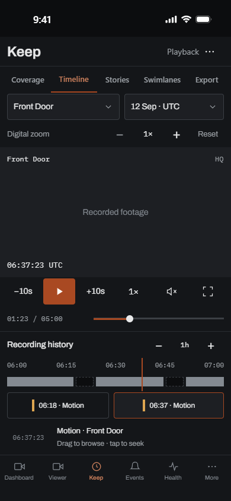

# Current NVR reference

Captured during the 2026-09-12 Alpha audit from
[KeepPeek — NVR Design System & Spec](https://app.paper.design/file/01M0B0VBH78TMTX40GCYYQ37SG/1-0).
The manifest records the exact UTC export time; the audit continued into September 13 UTC.

This bundle contains **36 NVR boards, 56 lossless PNGs at 1×, and the complete 82-token snapshot**.
Boards 01–34 and 45 were refreshed from the live source. Board 46 was added in Paper to address
mobile Keep's crowded command area. The six contract-only boards have JSX without image references.
The shared file contains 82 artboards across several products; those are not 82 NVR requirements.

## New mobile Keep target



The [playback options](references/46-keep-mobile-playback-options.png) and
[camera/date selection](references/46-keep-mobile-camera-date.png) frames specify the expanded
states. The compact implementation follows these proposals and has route, interaction, and
decoded-media regression tests in `ui/e2e/mobile-keep.e2e.ts`. The frames are not approved Loki
baselines or evidence of complete device qualification. The video surface is an intentional
footage placeholder. See [DESIGN-DECISIONS.md](DESIGN-DECISIONS.md)
for preserved functionality, responsive behavior, accessibility, and performance acceptance criteria.

## Provenance and status

`manifest.json` maps every board and scenario to its Paper node, file, dimensions, byte count,
and SHA-256. JSX is the original `get_jsx` response using `inline-styles`, trimmed with a final
newline. PNGs are original Paper `export` results using `format: png`, `scale: 1x`; they are not
JPEG screenshots converted to PNG. `tokens.json` preserves the complete `get_tokens` result.
Token revision is `b35ec365`. All 80 shared historical token values still match the application;
the two additional mask colors belong to Vision. No application theme regeneration was needed.

Reference status describes the design source, not runtime conformance:

| Status       | Meaning                                                                 |
| ------------ | ----------------------------------------------------------------------- |
| `reference`  | Captured design source to compare with supported application behavior.  |
| `historical` | An older frame with an explicit `supersededBy` scenario.                |
| `proposal`   | A new design target awaiting complete runtime and visual qualification. |

The reviewed storage setup, current per-user access states, and configuration ZIP states are
included alongside their original board references. The old storage/access pages and vertical
mobile Keep frame remain traceable as historical references. Capture does not certify every
legacy empty, unavailable, or failure state as an accurate description of today's application.

## Validation and refresh

The normal Bun unit suite automatically includes `src/lib/paper-alpha-reference.spec.ts`.
It checks the required NVR board and scenario set, provenance, unique IDs, confined file paths,
hashes, PNG signatures and dimensions, and shared token values. A focused run is:

```sh
bun test src/lib/paper-alpha-reference.spec.ts
```

These checks detect incomplete or inconsistent checked-in exports. They do not contact Paper,
prove that this snapshot is still the latest live revision, or compare production route pixels.
The existing `paper:check` and Loki harness still use the preserved v34 contract. Their 11 approved
Linux scenarios and 38 candidates have not been reclassified by this audit.

To refresh, open the exact source file through Paper MCP, read `get_basic_info` and `get_tokens`,
and inspect the affected design. Make and visually review changes in Paper before exporting.
Export each affected full board through `get_jsx`, and each registered frame through `export`.
Retain product scope and explicit supersession; update the manifest hashes from the actual bytes.
Format JSON before computing its file hash. Never hand-edit generated JSX or repaint reference PNGs.
Run the integrity tests, then the repository's canonical `check.bat` or `check.sh`.

Production visual acceptance remains a separate task: capture the real route with controlled
data and fonts, inspect the diff, exercise interactions, and explicitly review any Linux baseline
change. See the [audit coverage backlog](../../../../bugs.md#missing-ui-and-automation-coverage)
for missing and unenforced checks.
